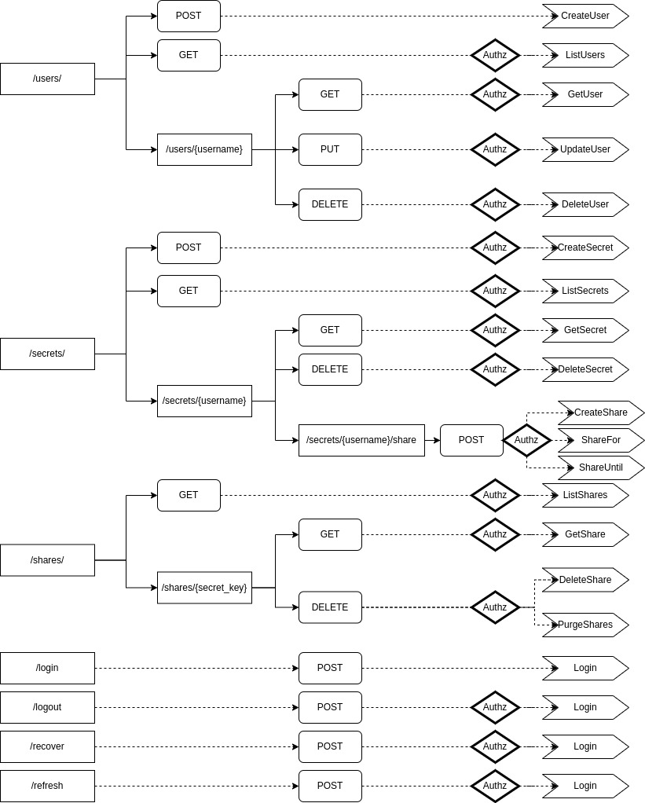

[back](service_implementation.md) | [index](index.md)


### HTTP API implementation 

For HTTP, I will use my own HTTP library on [`zalgonoise/x/ghttp`](https://github.com/zalgonoise/x/tree/master/ghttp). This is not reinventing the wheel in any way as it's using the standard library's HTTP server. The key difference in it is the use of generics to model the request and response data, to (try to) make is easier to design HTTP endpoints in Go.

A `ghttp.Server` is based on a `http.Server`, and will create one if it's not provided. The idea is to supply a set of handlers as endpoints or routes, which point to handler funcs just like in the `http` package.

The handler funcs are composed of a name, parse function and execution function, that compose the actual `http.HandlerFunc` type.

#### Peek into `ghttp`

This will be a short chapter describing the library I am using to contextualize the code in the endpoints chapters

The package will export several types and functions, but the main focus is on the handlers:

```go
// ParseFn is a function that converts a HTTP request into a request object of the caller's choice
type ParseFn[Q any] func(ctx context.Context, r *http.Request) (*Q, error)

// QueryFn is a function that executes an action based on the input context `ctx` and query object `query`,
// and returns a pointer to a Response for the answer type
type ExecFn[Q any, A any] func(ctx context.Context, query *Q) *Response[A]

// MiddlewareFn is a function that wraps a http.HandlerFunc, as HTTP middleware
type MiddlewareFn func(next http.HandlerFunc) http.HandlerFunc

// Do is a generic function that creates a HandlerFunc which will take in a context and a query object, and returns
// a HTTP status, a response message, a response object and an error
func Do[Q any, A any](name string, parseFn ParseFn[Q], queryFn ExecFn[Q, A]) http.HandlerFunc {
	return func(w http.ResponseWriter, r *http.Request) {
		ctx, s := NewCtxAndSpan(r, name)
		defer s.End()

		if queryFn == nil {
			panic("a query function must be specified")
		}

		var query = new(Q)
		var err error

		if parseFn != nil {
			query, err = parseFn(ctx, r)
			if err != nil {
				s.Event("failed to parse the request", attr.String("error", err.Error()))
				NewResponse[A](http.StatusBadRequest, err.Error()).WriteHTTP(ctx, w)
				return
			}
		}

		res := queryFn(ctx, query)
		if res.Status > 399 {
			s.Event("operation error", attr.Int("status", res.Status), attr.String("error", res.Message))
			res.WriteHTTP(ctx, w)
			return
		}

		s.Event("operation successful", attr.Int("status", res.Status))
		res.WriteHTTP(ctx, w)
	}
}
```

- `ParseFn` will read the HTTP request to build a query object (of the caller's choice). If you're creating a user, you can create a handler func that implements the (private) `usersCreateRequest` type, and your ParseFn returns this type after reading the request.

- `ExecFn` will perform the call to the system, to satisfy the caller's request. It's mandatory to have one, even if no-op. The `ExecFn` accepts a query of the same type as the `ParseFn`'s return, and regardless if it's user or not, it will be initialized for the `ExecFn` call. The type parameters it accepts is `A` for the type returned by `ParseFn` and `Q` the desired data response type to include in the response

- `MiddlewareFn` is a simple type to describe HTTP middleware

- `Do` function is the actual `http.HandlerFunc` generator. It takes in a name (`string`) for observability (span name), a `ParseFn[Q]` (nullable), and an `ExecFn[Q, A]` (not-nil).

These types are the main reason why I wrote the `ghttp` library. I personally feel it takes a lot of boilerplate away when using the standard library for HTTP APIs. The other features are used and *nice to have* but not nearly as important as these.

The other `ghttp` features used on this app will be covered on-the-go

#### Designing the endpoints

To map the endpoints I first take a look at the Service interface and try to sketch out what seems the most reasonable (how should paths cascade, the HTTP verbs used, the superficial stuff). Here is the sketch for the paths, mapped to other paths or HTTP verbs, pointing to service methods:



Now, for the HTTP implementation. I've created a new top-level folder called `transport` with a `http` subfolder. Transport can refer to different implementations of the transport layer, and this will be for a HTTP server.

```
.
└─ transport
    └─ http
        ├─ helper.go -- helper functions that are recurrent in HTTP
        ├─ middleware.go -- HTTP middleware, like auth
        ├─ routes.go -- endpoints and mux routing
        ├─ secrets.go -- secrets handler funcs
        ├─ server.go -- HTTP server data structure and interface
        ├─ session.go -- sessions handler funcs
        ├─ shared.go -- shares handler funcs
        └─ users.go -- users handler funcs
```

#### HTTP helpers

Two reusable functions that I kept going back to were `getToken` and `getPath`, which are under `transport/http/helper.go`.

- `getToken` will extract the token from the `*http.Request`, from its header. Returns the token and an OK boolean value

- `getPath` will split the URL path (by its `/`) to extract identifiers

Here are both helper functions:

```go
import (
	"net/http"
	"strings"
)

func getToken(r *http.Request) (string, bool) {
	token := r.Header.Get("Authorization")
	if token != "" {
		t := strings.TrimPrefix(token, "Bearer ")
		if t != "" {
			return t, true
		}
	}
	return "", false
}

func getPath(path string) []string {
	splitPath := strings.Split(path, "/")
	var out = make([]string, 0, len(splitPath))
	for _, item := range splitPath {
		if item != "" && item != " " && item != "\n" && item != "\t" {
			out = append(out, item)
		}
	}
	return out
}
```


#### Defining the server

In `transport/http/server.go` I declare a data structure with a `*ghttp.Server` and the Service interface:

```go
type server struct {
	s    service.Service
	HTTP *ghttp.Server
}
```

From this point I can start desiging the actual handler funcs before even worrying about the endpoints structure.

#### `server.usersCreate`

This HandlerFunc will take care of POST requests against the `/users/` endpoint; which will call the `service.CreateUser` method. The `ParseFn` for this handler will read the request body to extract a username, name and password. I will use a private struct for this. The `ExecFn` will use this object to perform the `service.CreateUser` call:

1. Starting with the struct describing a users create request; JSON tags included:

```go
func (s *server) usersCreate() http.HandlerFunc {
	type usersCreateRequest struct {
		Name     string `json:"name,omitempty"`
		Username string `json:"username,omitempty"`
		Password string `json:"password,omitempty"`
	}
	// (...)
}
```

2. Then, extracting this data from the `*http.Request`:

```go
	var parseFn = func(ctx context.Context, r *http.Request) (*usersCreateRequest, error) {
		return ghttp.ReadBody[usersCreateRequest](ctx, r)
	}
```

The call to `ghttp.ReadBody` is a generic function in the `ghttp` package to unmarshal the request's body into an object of the input's kind. In this case, a `usersCreateRequest`. For context, this is what `ghttp.ReadBody[T any]` looks like:

```go
var (
	// ErrInvalidBody is an error that is raised when reading the HTTP request body
	ErrInvalidBody = errors.New("invalid body")
	// ErrInvalidJSON is an error that is raised when parsing the HTTP request as JSON
	ErrInvalidJSON = errors.New("body contains invalid JSON")
)

// ReadBody reads the data in the Body of *http.Request `r` as a bytes buffer,
// and attempts to decode it into an object of type T by creating a new pointer of
// this type and decoding the buffer into it
//
// Returns a pointer to the object T and an error
func ReadBody[T any](ctx context.Context, r *http.Request) (*T, error) {
	ctx, s := spanner.Start(ctx, "http.readBody")
	defer s.End()
	s.Add(attr.String("for_type", fmt.Sprintf("%T", *new(T))))

	b, err := io.ReadAll(r.Body)
	if err != nil {
		s.Event("error reading body", attr.New("error", err.Error()))
		return nil, fmt.Errorf("%w: %v", ErrInvalidBody, err)
	}
	item := new(T)
	err = Enc(ctx).Decode(b, item)
	if err != nil {
		s.Event("error decoding buffer", attr.New("error", err.Error()), attr.String("buffer", string(b)))
		return nil, fmt.Errorf("%w: %v", ErrInvalidJSON, err)
	}
	s.Event("decoded request body", attr.Ptr("item", item))
	return item, nil
}
```

The encoder call (`Enc(context.Context)`) will try to extract an existing JSON encoder from the input context (if configured), otherwise defaults to a [`goccy/go-json`](https://github.com/goccy/go-json) encoder; a fantastic (and fast) JSON package.


3. Time to process the user's request. First, take a look at the `ExecFn` signature for this endpoint:

```go
var execFn = func(ctx context.Context, q *usersCreateRequest) *ghttp.Response[user.User] {}
```

What is `*ghttp.Response[T any]`? Great question. It'll (try to) simplify the approach to writing HTTP responses:

```go
// Responder writes an object to a http.ResponseWriter as a HTTP response
type Responder interface {
	// WriteHTTP writes the contents of the object to the http.ResponseWriter `w`
	WriteHTTP(ctx context.Context, w http.ResponseWriter)
}

type Response[T any] struct {
	Status  int               `json:"-"`
	Message string            `json:"message,omitempty"`
	Data    *T                `json:"data,omitempty"`
	Headers map[string]string `json:"-"`
}

// NewResponse creates a generic HTTP response, initialized with a status and body message
func NewResponse[T any](status int, msg string) *Response[T] {
	return &Response[T]{
		Status:  status,
		Message: msg,
		Headers: make(map[string]string),
	}
}
```

It also contains methods like `WithData(*T)` and `WithHeaders(map[string]string)` that allow chaining additional content into the response (for an inline return). The `Response[T any]` type supports an HTTP error approach just as well.

4. To work on the `execFn`, it's important to validate the result of the `parseFn` (if the object is `nil`):

```go
	var execFn = func(ctx context.Context, q *usersCreateRequest) *ghttp.Response[user.User] {
		if q == nil {
			return ghttp.NewResponse[user.User](http.StatusBadRequest, "invalid request")
		}
	// (...)
	}
```

5. Then, just push it to the service! If there are any issues with the actual input (empty values, invalid ones), it will be returned as an error. These errors will be checked on to return the appropriate HTTP code and message. If all goes well, return a 200 status code and the user object. The user object (`user.User`) already contains the JSON tags necessary to also hide the hash and salt values:

```go
	var execFn = func(ctx context.Context, q *usersCreateRequest) *ghttp.Response[user.User] {
	// (...)
		dbuser, err := s.s.CreateUser(ctx, q.Username, q.Password, q.Name)
		if err != nil {
			if errors.Is(service.ErrAlreadyExistsUser, err) {
				return ghttp.NewResponse[user.User](http.StatusConflict, err.Error())
			}
			return ghttp.NewResponse[user.User](http.StatusInternalServerError, err.Error())
		}
		return ghttp.NewResponse[user.User](http.StatusOK, "user created successfully").WithData(dbuser)
	// (...)
	}
```

6. With both `parseFn` and `execFn` ready, just return a `ghttp.Do` call: 

```go
	return ghttp.Do("UsersCreate", parseFn, execFn)
```

And that's it for this `HandlerFunc`! Here is the entire thing:

```go
func (s *server) usersCreate() http.HandlerFunc {
	type usersCreateRequest struct {
		Name     string `json:"name,omitempty"`
		Username string `json:"username,omitempty"`
		Password string `json:"password,omitempty"`
	}
	var parseFn = func(ctx context.Context, r *http.Request) (*usersCreateRequest, error) {
		return ghttp.ReadBody[usersCreateRequest](ctx, r)
	}

	var execFn = func(ctx context.Context, q *usersCreateRequest) *ghttp.Response[user.User] {
		if q == nil {
			return ghttp.NewResponse[user.User](http.StatusBadRequest, "invalid request")
		}

		dbuser, err := s.s.CreateUser(ctx, q.Username, q.Password, q.Name)
		if err != nil {
			if errors.Is(service.ErrAlreadyExistsUser, err) {
				return ghttp.NewResponse[user.User](http.StatusConflict, err.Error())
			}
			return ghttp.NewResponse[user.User](http.StatusInternalServerError, err.Error())
		}
		return ghttp.NewResponse[user.User](http.StatusOK, "user created successfully").WithData(dbuser)
	}

	return ghttp.Do("UsersCreate", parseFn, execFn)
}
```


#### `server.usersGet`

While `usersCreate` does not require authentication, this endpoint will -- but since I am still sketching out the `HandlerFunc`s I can disregard that for now and treat all endpoints as *post-auth* when applicable (or, thinking that this will be reachable only by authorized users).

When fetching a specific user, users will call `GET /users/username`. Since the service also just cares about the username parameter, I will extract it from the URL path in the `*http.Request`. This was one of the reasons why the `ghttp.ParseFn` accepts the entire `*http.Request` object and not just the body or something else. We could check on headers, path, user-agent, etc.

1. Starting with the `ParseFn`; it will get the username from the URL path, by trimming the `/users/` part of the path -- returning an error if the remainder is an empty string:

```go
	var parseFn = func(ctx context.Context, r *http.Request) (*string, error) {
		prefix := "/users/"
		q := r.URL.Path[len(prefix):]

		if q == "" {
			return nil, errors.New("no username provided")
		}

		return &q, nil
	}
```

2. The `ExecFn` will evaluate if the username in the request is nil or empty, and perform a `service.GetUser` call with that username. Again, validation is done on the service layer. The returned HTTP responses can be for a 404 (not found), or a 500 for other errors. Otherwise the response will be an OK response (200) with the user object attached.

```go
	var execFn = func(ctx context.Context, q *string) *ghttp.Response[user.User] {
		if q == nil || *q == "" {
			return ghttp.NewResponse[user.User](http.StatusBadRequest, "invalid username")
		}

		dbuser, err := s.s.GetUser(ctx, *q)
		if err != nil {
			if errors.Is(sqlite.ErrNotFoundUser, err) {
				return ghttp.NewResponse[user.User](http.StatusNotFound, err.Error())
			}
			return ghttp.NewResponse[user.User](http.StatusInternalServerError, err.Error())
		}

		return ghttp.NewResponse[user.User](http.StatusOK, "user fetched successfully").WithData(dbuser)
	}
```

3. Lastly, simply return a `ghttp.Do` call with the above functions:

```go
	return ghttp.Do("UsersGet", parseFn, execFn)
```

Here's the entire thing:


```go
func (s *server) usersGet() http.HandlerFunc {
	var parseFn = func(ctx context.Context, r *http.Request) (*string, error) {
		prefix := "/users/"
		q := r.URL.Path[len(prefix):]

		if q == "" {
			return nil, errors.New("no username provided")
		}

		return &q, nil
	}

	var execFn = func(ctx context.Context, q *string) *ghttp.Response[user.User] {
		if q == nil || *q == "" {
			return ghttp.NewResponse[user.User](http.StatusBadRequest, "invalid username")
		}

		dbuser, err := s.s.GetUser(ctx, *q)
		if err != nil {
			if errors.Is(sqlite.ErrNotFoundUser, err) {
				return ghttp.NewResponse[user.User](http.StatusNotFound, err.Error())
			}
			return ghttp.NewResponse[user.User](http.StatusInternalServerError, err.Error())
		}

		return ghttp.NewResponse[user.User](http.StatusOK, "user fetched successfully").WithData(dbuser)
	}

	return ghttp.Do("UsersGet", parseFn, execFn)
}
```


#### `server.usersList`

The `list` operation does not require any parameters, so in this handler, the `ParseFn` will be nil (there are no parameters to extract). The `ExecFn` fetches the list of users and sets it as the response data (if successful), as-is:

```go
func (s *server) usersList() http.HandlerFunc {
	var execFn = func(ctx context.Context, q *any) *ghttp.Response[[]*user.User] {
		dbuser, err := s.s.ListUsers(ctx)
		if err != nil {
			return ghttp.NewResponse[[]*user.User](http.StatusInternalServerError, err.Error())
		}

		return ghttp.NewResponse[[]*user.User](http.StatusOK, "user fetched successfully").WithData(&dbuser)
	}

	return ghttp.Do("UsersList", nil, execFn)
}
```

#### `server.usersUpdate`

For the update action, a couple of checks need to take place. Consider that the HTTP path will contain the target username (`/users/username`), so this username needs to match the user in the JWT; then it's a matter of passing the request through the service's `UpdateUser` method:

1. Starting by defining a private type for the request. The username is present so it can be used, but it's not a field that the user will populate (this comes from the JWT and from the URL path):

```go
	type usersUpdateRequest struct {
		Name     string `json:"name,omitempty"`
		Username string `json:"-"`
	}
```

2. For the `ParseFn`, I want to extract the username from the URL path, and read the request's body for the changes in the user (in this case the user's Name field). I can set the username from the path on the `usersUpdateRequest` object:

```go
	var parseFn = func(ctx context.Context, r *http.Request) (*usersUpdateRequest, error) {
		prefix := "/users/"
		username := r.URL.Path[len(prefix):]

		if username == "" {
			return nil, errors.New("no username provided")
		}

		u, err := ghttp.ReadBody[usersUpdateRequest](ctx, r)
		if err != nil {
			return nil, err
		}
		u.Username = username

		// (...)
	}
```

3. To ensure that user A is not trying to update user B's data, I verify that the caller is the same as the target user:


```go
	var parseFn = func(ctx context.Context, r *http.Request) (*usersUpdateRequest, error) {
	// (...)
		if caller, ok := authz.GetCaller(r); ok && caller == username {
			return u, nil
		}
		return nil, authz.ErrInvalidUser
	}
```

4. The `ExecFn` verifies that the object is not nil; and issues the `service.UpdateUser` call. Then issues a `GetUser` call to return the new version of the user to the caller:

```go
	var execFn = func(ctx context.Context, q *usersUpdateRequest) *ghttp.Response[user.User] {
		if q == nil {
			return ghttp.NewResponse[user.User](http.StatusBadRequest, "invalid request")
		}

		u := &user.User{
			Username: q.Username,
		}

		err := s.s.UpdateUser(ctx, q.Username, u)
		if err != nil {
			return ghttp.NewResponse[user.User](http.StatusInternalServerError, err.Error())
		}

		dbUser, err := s.s.GetUser(ctx, q.Username)
		if err != nil {
			return ghttp.NewResponse[user.User](http.StatusInternalServerError, err.Error())
		}

		return ghttp.NewResponse[user.User](http.StatusOK, "user updated successfully").WithData(dbUser)
	}
```

5. Lastly, the remainder of the function's body is returning a `ghttp.Do` call:

```go
	return ghttp.Do("UsersUpdate", parseFn, execFn)
```

Here's the entire handler:

```go
func (s *server) usersUpdate() http.HandlerFunc {
	type usersUpdateRequest struct {
		Name     string `json:"name,omitempty"`
		Username string `json:"-"`
	}

	var parseFn = func(ctx context.Context, r *http.Request) (*usersUpdateRequest, error) {
		prefix := "/users/"
		username := r.URL.Path[len(prefix):]

		if username == "" {
			return nil, errors.New("no username provided")
		}

		u, err := ghttp.ReadBody[usersUpdateRequest](ctx, r)
		if err != nil {
			return nil, err
		}
		u.Username = username

		if caller, ok := authz.GetCaller(r); ok && caller == username {
			return u, nil
		}
		return nil, authz.ErrInvalidUser
	}

	var execFn = func(ctx context.Context, q *usersUpdateRequest) *ghttp.Response[user.User] {
		if q == nil {
			return ghttp.NewResponse[user.User](http.StatusBadRequest, "invalid request")
		}

		u := &user.User{
			Username: q.Username,
		}

		err := s.s.UpdateUser(ctx, q.Username, u)
		if err != nil {
			return ghttp.NewResponse[user.User](http.StatusInternalServerError, err.Error())
		}

		return ghttp.NewResponse[user.User](http.StatusOK, "user updated successfully").WithData(u)
	}

	return ghttp.Do("UsersUpdate", parseFn, execFn)
}
```


#### `server.usersDelete`

The `DELETE` call will be very similar to the `GET` one; as only the target's username is needed (and is taken from the URL path):

1. For the `ParseFn` I will take the username from the URL path and compare it to the caller's username (so that user A isn't able to delete user B):

```go
	var parseFn = func(ctx context.Context, r *http.Request) (*string, error) {
		prefix := "/users/"
		username := r.URL.Path[len(prefix):]

		if username == "" {
			return nil, errors.New("no username provided")
		}

		if caller, ok := authz.GetCaller(r); ok && caller == username {
			return &username, nil
		}
		return nil, authz.ErrInvalidUser
	}
```

2. The `ExecFn` ensures that the username from the `ParseFn` is not nil or empty, and issues the `service.DeleteUser` call:

```go
	var execFn = func(ctx context.Context, q *string) *ghttp.Response[user.User] {
		if q == nil || *q == "" {
			return ghttp.NewResponse[user.User](http.StatusBadRequest, "invalid username")
		}

		err := s.s.DeleteUser(ctx, *q)
		if err != nil {
			if errors.Is(sqlite.ErrNotFoundUser, err) {
				return ghttp.NewResponse[user.User](http.StatusNotFound, err.Error())
			}
			return ghttp.NewResponse[user.User](http.StatusInternalServerError, err.Error())
		}

		return ghttp.NewResponse[user.User](http.StatusOK, "user deleted successfully")
	}
```

3. Lastly, the function just returns a call to `ghttp.Do`:

```go
	return ghttp.Do("UsersDelete", parseFn, execFn)
```

Here's the entire function:

```go
func (s *server) usersDelete() http.HandlerFunc {
	var parseFn = func(ctx context.Context, r *http.Request) (*string, error) {
		prefix := "/users/"
		username := r.URL.Path[len(prefix):]

		if username == "" {
			return nil, errors.New("no username provided")
		}

		if caller, ok := authz.GetCaller(r); ok && caller == username {
			return &username, nil
		}
		return nil, authz.ErrInvalidUser
	}

	var execFn = func(ctx context.Context, q *string) *ghttp.Response[user.User] {
		if q == nil || *q == "" {
			return ghttp.NewResponse[user.User](http.StatusBadRequest, "invalid username")
		}

		err := s.s.DeleteUser(ctx, *q)
		if err != nil {
			if errors.Is(sqlite.ErrNotFoundUser, err) {
				return ghttp.NewResponse[user.User](http.StatusNotFound, err.Error())
			}
			return ghttp.NewResponse[user.User](http.StatusInternalServerError, err.Error())
		}

		return ghttp.NewResponse[user.User](http.StatusOK, "user deleted successfully")
	}

	return ghttp.Do("UsersDelete", parseFn, execFn)
}
```


#### `server.secretsCreate`

The remaining endpoints will be very similar. For this function's `ParseFn`, the key and value are read from the request's body, and the user's username is extracted from the JWT. As for the `ExecFn`, like the ones before it, checks for the request object, then passes the request onto the service. It also calls `service.GetSecret` so the entry is returned to the user. Here's `server.secretsCreate`:

```go

func (s *server) secretsCreate() http.HandlerFunc {
	type secretsCreateRequest struct {
		Username string `json:"-"`
		Key      string `json:"key,omitempty"`
		Value    string `json:"value,omitempty"`
	}
	var parseFn = func(ctx context.Context, r *http.Request) (*secretsCreateRequest, error) {
		secr, err := ghttp.ReadBody[secretsCreateRequest](ctx, r)
		if err != nil {
			return nil, err
		}
		if u, ok := authz.GetCaller(r); ok {
			secr.Username = u
			return secr, nil
		}
		return nil, authz.ErrInvalidUser
	}

	var execFn = func(ctx context.Context, q *secretsCreateRequest) *ghttp.Response[secret.Secret] {
		if q == nil {
			return ghttp.NewResponse[secret.Secret](http.StatusBadRequest, "invalid request")
		}

		err := s.s.CreateSecret(ctx, q.Username, q.Key, []byte(q.Value))
		if err != nil {
			return ghttp.NewResponse[secret.Secret](http.StatusInternalServerError, err.Error())
		}

		secr, err := s.s.GetSecret(ctx, q.Username, q.Key)
		if err != nil {
			return ghttp.NewResponse[secret.Secret](http.StatusInternalServerError, err.Error())
		}
		return ghttp.NewResponse[secret.Secret](http.StatusOK, "secret created successfully").WithData(secr)
	}

	return ghttp.Do("SecretsCreate", parseFn, execFn)
}
```

#### `server.secretsGet`

Under the same context, the `GET` operation will only extract the sercret's key from the URL path while the username is still taken from the JWT:

```go
func (s *server) secretsGet() http.HandlerFunc {
	type secretsGetRequest struct {
		Username string `json:"-"`
		Key      string `json:"-"`
	}
	var parseFn = func(ctx context.Context, r *http.Request) (*secretsGetRequest, error) {
		splitPath := getPath(r.URL.Path)
		key := splitPath[1]

		if u, ok := authz.GetCaller(r); ok {
			return &secretsGetRequest{
				Username: u,
				Key:      key,
			}, nil
		}
		return nil, authz.ErrInvalidUser
	}

	var execFn = func(ctx context.Context, q *secretsGetRequest) *ghttp.Response[secret.Secret] {
		if q == nil {
			return ghttp.NewResponse[secret.Secret](http.StatusBadRequest, "invalid request")
		}

		dbsecr, err := s.s.GetSecret(ctx, q.Username, q.Key)
		if err != nil {
			if errors.Is(sqlite.ErrNotFoundSecret, err) {
				return ghttp.NewResponse[secret.Secret](http.StatusNotFound, err.Error())
			}
			return ghttp.NewResponse[secret.Secret](http.StatusInternalServerError, err.Error())
		}

		return ghttp.NewResponse[secret.Secret](http.StatusOK, "secret fetched successfully").WithData(dbsecr)
	}

	return ghttp.Do("SecretsGet", parseFn, execFn)
}
```

#### `server.secretsList`

Just like the `secretsGet` call, `secretsList` will only retrieve the username from the JWT to list all of the caller's secrets:

```go
func (s *server) secretsList() http.HandlerFunc {
	var parseFn = func(ctx context.Context, r *http.Request) (*string, error) {
		if u, ok := authz.GetCaller(r); ok {
			return &u, nil
		}
		return nil, authz.ErrInvalidUser
	}

	var execFn = func(ctx context.Context, q *string) *ghttp.Response[[]*secret.Secret] {
		if q == nil || *q == "" {
			return ghttp.NewResponse[[]*secret.Secret](http.StatusBadRequest, "invalid username")
		}

		dbsecr, err := s.s.ListSecrets(ctx, *q)
		if err != nil {
			return ghttp.NewResponse[[]*secret.Secret](http.StatusInternalServerError, err.Error())
		}

		return ghttp.NewResponse[[]*secret.Secret](http.StatusOK, "secrets listed successfully").WithData(&dbsecr)
	}

	return ghttp.Do("SecretsList", parseFn, execFn)
}
```

#### `server.secretsDelete`

Still looking at the `DELETE` operation like a `GET` operation, the key is taken from the URL path and the username from the JWT. Then, the service takes care of the secret's removal:

```go
func (s *server) secretsDelete() http.HandlerFunc {
	type secretsDeleteRequest struct {
		Username string `json:"-"`
		Key      string `json:"-"`
	}
	var parseFn = func(ctx context.Context, r *http.Request) (*secretsDeleteRequest, error) {
		splitPath := getPath(r.URL.Path)
		key := splitPath[1]

		if u, ok := authz.GetCaller(r); ok {
			return &secretsDeleteRequest{
				Username: u,
				Key:      key,
			}, nil
		}
		return nil, authz.ErrInvalidUser
	}

	var execFn = func(ctx context.Context, q *secretsDeleteRequest) *ghttp.Response[secret.Secret] {
		if q == nil {
			return ghttp.NewResponse[secret.Secret](http.StatusBadRequest, "invalid request")
		}

		err := s.s.DeleteSecret(ctx, q.Username, q.Key)
		if err != nil {
			return ghttp.NewResponse[secret.Secret](http.StatusInternalServerError, err.Error())
		}

		return ghttp.NewResponse[secret.Secret](http.StatusOK, "secret deleted successfully")
	}

	return ghttp.Do("SecretsDelete", parseFn, execFn)
}
```


#### `server.sharesCreate`

A quick note before diving into this handler, note how the `sharesCreate` endpoint points to `/secrets/{secretKey}/share`, as opposed to the rest of the `/shares/` endpoints.

1. Like before, starting by defining a private type for the request. The owner's username and secret's key are derived from the JWT and URL path respectively. The `Until` and `For` fields are nullable to allow for calling the right service method.

```go
	type sharesCreateRequest struct {
		Owner   string         `json:"-"`
		Key     string         `json:"-"`
		Targets []string       `json:"targets,omitempty"`
		Until   *time.Time     `json:"until,omitempty"`
		For     *time.Duration `json:"for,omitempty"`
	}
```

2. For the `ParseFn`, I need to read the body and get the remaining parameters from the JWT and URL path:

```go
	var parseFn = func(ctx context.Context, r *http.Request) (*sharesCreateRequest, error) {
		req, err := ghttp.ReadBody[sharesCreateRequest](ctx, r)
		if err != nil {
			return nil, err
		}
		caller, ok := authz.GetCaller(r)

		if !ok {
			return nil, errors.New("invalid username")
		}

		req.Owner = caller
		req.Key = getPath(r.URL.Path)[1]
		return req, nil
	}
```

3. The `ExecFn` will execute the appropriate `service` call to share the secret. For this I look into which field was populated, defaulting to the `CreateShare` method when no duration or time is defined:

```go
	var execFn = func(ctx context.Context, q *sharesCreateRequest) *ghttp.Response[shared.Share] {
		if q == nil {
			span.Event("empty object error")
			return ghttp.NewResponse[shared.Share](http.StatusBadRequest, "empty request")
		}

		var (
			newShare *shared.Share
			err      error
		)

		if q.Until != nil {
			newShare, err = s.s.ShareUntil(ctx, q.Owner, q.Key, *q.Until, q.Targets...)
		} else if q.For != nil {
			newShare, err = s.s.ShareFor(ctx, q.Owner, q.Key, *q.For, q.Targets...)
		} else {
			newShare, err = s.s.CreateShare(ctx, q.Owner, q.Key, q.Targets...)
		}

		if err != nil {
			return ghttp.NewResponse[shared.Share](http.StatusInternalServerError, err.Error())
		}
		return ghttp.NewResponse[shared.Share](http.StatusOK, "secret shared successfully").WithData(newShare)
	}
```

4. Lastly, returning a `ghttp.Do` call:

```go
	return ghttp.Do("SharesCreate", parseFn, execFn)
```

Here's the entire function:

```go
func (s *server) sharesCreate() http.HandlerFunc {
	type sharesCreateRequest struct {
		Owner   string         `json:"-"`
		Key     string         `json:"-"`
		Targets []string       `json:"targets,omitempty"`
		Until   *time.Time     `json:"until,omitempty"`
		For     *time.Duration `json:"for,omitempty"`
	}
	var parseFn = func(ctx context.Context, r *http.Request) (*sharesCreateRequest, error) {
		req, err := ghttp.ReadBody[sharesCreateRequest](ctx, r)
		if err != nil {
			return nil, err
		}
		caller, ok := authz.GetCaller(r)
		if !ok {
			return nil, errors.New("invalid username")
		}

		req.Owner = caller
		req.Key = getPath(r.URL.Path)[1]
		return req, nil
	}

	var execFn = func(ctx context.Context, q *sharesCreateRequest) *ghttp.Response[shared.Share] {
		ctx, span := spanner.Start(ctx, "SharesCreate")
		span.Add(attr.New("req", q))

		if q == nil {
			span.Event("empty object error")
			return ghttp.NewResponse[shared.Share](http.StatusBadRequest, "empty request")
		}

		var (
			newShare *shared.Share
			err      error
		)

		if q.Until != nil {
			newShare, err = s.s.ShareUntil(ctx, q.Owner, q.Key, *q.Until, q.Targets...)
		} else if q.For != nil {
			newShare, err = s.s.ShareFor(ctx, q.Owner, q.Key, *q.For, q.Targets...)
		} else {
			newShare, err = s.s.CreateShare(ctx, q.Owner, q.Key, q.Targets...)
		}

		if err != nil {
			return ghttp.NewResponse[shared.Share](http.StatusInternalServerError, err.Error())
		}
		span.Event("operation successful", attr.New("share", newShare))
		return ghttp.NewResponse[shared.Share](http.StatusOK, "secret shared successfully").WithData(newShare)
	}

	return ghttp.Do("SharesCreate", parseFn, execFn)
}
```

#### `server.sharesGet`

For the `GET` operation, no parameters are retrieved from the request body. The username will come from the JWT and the secret key will come from the URL path:

```go
func (s *server) sharesGet() http.HandlerFunc {
	type sharesGetRequest struct {
		Owner string
		Key   string
	}
	var parseFn = func(ctx context.Context, r *http.Request) (*sharesGetRequest, error) {
		req := new(sharesGetRequest)
		caller, ok := authz.GetCaller(r)
		if !ok {
			return nil, errors.New("invalid username")
		}

		req.Owner = caller
		req.Key = getPath(r.URL.Path)[1]
		return req, nil
	}

	var execFn = func(ctx context.Context, q *sharesGetRequest) *ghttp.Response[[]*shared.Share] {
		if q == nil {
			span.Event("empty object error")
			return ghttp.NewResponse[[]*shared.Share](http.StatusBadRequest, "empty request")
		}

		shares, err := s.s.GetShare(ctx, q.Owner, q.Key)
		if err != nil {
			return ghttp.NewResponse[[]*shared.Share](http.StatusInternalServerError, err.Error())
		}
		return ghttp.NewResponse[[]*shared.Share](http.StatusOK, "shared secret fetched successfully").WithData(&shares)
	}

	return ghttp.Do("SharesGet", parseFn, execFn)
}
```

#### `server.sharesList`

A `GET` operation without a secret key is a list operation, so same as the above but simpler:

```go
func (s *server) sharesList() http.HandlerFunc {
	var parseFn = func(ctx context.Context, r *http.Request) (*string, error) {
		if caller, ok := authz.GetCaller(r); ok {
			return &caller, nil
		}
		return nil, errors.New("invalid username")
	}

	var execFn = func(ctx context.Context, q *string) *ghttp.Response[[]*shared.Share] {
		ctx, span := spanner.Start(ctx, "SharesList")
		span.Add(attr.New("req", q))

		if q == nil {
			span.Event("empty object error")
			return ghttp.NewResponse[[]*shared.Share](http.StatusBadRequest, "empty request")
		}

		shares, err := s.s.ListShares(ctx, *q)
		if err != nil {
			return ghttp.NewResponse[[]*shared.Share](http.StatusInternalServerError, err.Error())
		}
		span.Event("operation successful", attr.New("share", shares))
		return ghttp.NewResponse[[]*shared.Share](http.StatusOK, "shared secrets listed successfully").WithData(&shares)
	}

	return ghttp.Do("SharesList", parseFn, execFn)
}
```

#### `server.sharesDelete`

The `DELETE` operation serves for `service.DeleteShare` and `service.PurgeShares` alike; depending on whether the caller specifies a (list of)
target(s) or not.

```go

func (s *server) sharesDelete() http.HandlerFunc {
	type sharesDeleteRequest struct {
		Owner   string   `json:"-"`
		Key     string   `json:"-"`
		Targets []string `json:"targets,omitempty"`
	}
	var parseFn = func(ctx context.Context, r *http.Request) (*sharesDeleteRequest, error) {
		req, err := ghttp.ReadBody[sharesDeleteRequest](ctx, r)
		if err != nil {
			req = new(sharesDeleteRequest)
		}
		caller, ok := authz.GetCaller(r)
		if !ok {
			return nil, errors.New("invalid username")
		}

		req.Owner = caller
		req.Key = getPath(r.URL.Path)[1]
		return req, nil
	}

	var execFn = func(ctx context.Context, q *sharesDeleteRequest) *ghttp.Response[shared.Share] {
		ctx, span := spanner.Start(ctx, "SharesDelete")
		span.Add(attr.New("req", q))

		if q == nil {
			span.Event("empty object error")
			return ghttp.NewResponse[shared.Share](http.StatusBadRequest, "empty request")
		}

		var err error

		if len(q.Targets) > 0 {
			err = s.s.DeleteShare(ctx, q.Owner, q.Key, q.Targets...)
		} else {
			err = s.s.PurgeShares(ctx, q.Owner, q.Key)
		}

		if err != nil {
			return ghttp.NewResponse[shared.Share](http.StatusInternalServerError, err.Error())
		}
		span.Event("operation successful")
		return ghttp.NewResponse[shared.Share](http.StatusOK, "secret share removed successfully")
	}

	return ghttp.Do("SharesDelete", parseFn, execFn)
}

```

#### `server.login`

Now for the authentication endpoints! Starting with the most important of all: `login`. Taking it step by step

1. Defining the private type for the request:

```go
	type loginRequest struct {
		Username string `json:"username,omitempty"`
		Password string `json:"password,omitempty"`
	}
```

2. Then, the `ParseFn`. This part will leverage the `ghttp.ReadBody` function entirely:

```go
	var parseFn = func(ctx context.Context, r *http.Request) (*loginRequest, error) {
		return ghttp.ReadBody[loginRequest](ctx, r)
	}
```

3. The `ExecFn` is going to issue this request to the service, and look into the error received (if it's not found or invalid credentials) to return the appropriate error and status code. If all goes well, a `*user.Session` is returned to the user:

```go
	var execFn = func(ctx context.Context, q *loginRequest) *ghttp.Response[user.Session] {
		if q == nil {
			return ghttp.NewResponse[user.Session](http.StatusBadRequest, "invalid request")
		}

		dbsession, err := s.s.Login(ctx, q.Username, q.Password)
		if err != nil {
			if errors.Is(sqlite.ErrNotFoundUser, err) {
				return ghttp.NewResponse[user.Session](http.StatusNotFound, err.Error())
			}
			if errors.Is(service.ErrIncorrectPassword, err) {
				return ghttp.NewResponse[user.Session](http.StatusBadRequest, err.Error())
			}
			return ghttp.NewResponse[user.Session](http.StatusInternalServerError, err.Error())
		}

		return ghttp.NewResponse[user.Session](http.StatusOK, "user logged in successfully").WithData(dbsession)
	}
```

4. Lastly, return a `ghttp.Do` call:

```go
	return ghttp.Do("Login", parseFn, execFn)
```

The entire method looks like:

```go
func (s *server) login() http.HandlerFunc {
	type loginRequest struct {
		Username string `json:"username,omitempty"`
		Password string `json:"password,omitempty"`
	}

	var parseFn = func(ctx context.Context, r *http.Request) (*loginRequest, error) {
		return ghttp.ReadBody[loginRequest](ctx, r)
	}

	var execFn = func(ctx context.Context, q *loginRequest) *ghttp.Response[user.Session] {
		if q == nil {
			return ghttp.NewResponse[user.Session](http.StatusBadRequest, "invalid request")
		}

		dbsession, err := s.s.Login(ctx, q.Username, q.Password)
		if err != nil {
			if errors.Is(sqlite.ErrNotFoundUser, err) {
				return ghttp.NewResponse[user.Session](http.StatusNotFound, err.Error())
			}
			if errors.Is(service.ErrIncorrectPassword, err) {
				return ghttp.NewResponse[user.Session](http.StatusBadRequest, err.Error())
			}
			return ghttp.NewResponse[user.Session](http.StatusInternalServerError, err.Error())
		}

		return ghttp.NewResponse[user.Session](http.StatusOK, "user logged in successfully").WithData(dbsession)
	}

	return ghttp.Do("Login", parseFn, execFn)
}
```

#### `server.logout`

The `logout` endpoint just reads the caller's username from the JWT on the `ParseFn` and issues a `service.Logout` call on the `ExecFn`:

```go
func (s *server) logout() http.HandlerFunc {
	var parseFn = func(ctx context.Context, r *http.Request) (*string, error) {
		caller, ok := authz.GetCaller(r)
		if ok {
			return &caller, nil
		}
		return nil, errors.New("failed to read password or token in request")
	}

	var execFn = func(ctx context.Context, q *string) *ghttp.Response[user.Session] {
		if q == nil || *q == "" {
			return ghttp.NewResponse[user.Session](http.StatusBadRequest, "invalid request")
		}

		err := s.s.Logout(ctx, *q)
		if err != nil {
			if errors.Is(sqlite.ErrNotFoundUser, err) {
				return ghttp.NewResponse[user.Session](http.StatusNotFound, err.Error())
			}
			return ghttp.NewResponse[user.Session](http.StatusInternalServerError, err.Error())
		}

		return ghttp.NewResponse[user.Session](http.StatusOK, "user logged out successfully")
	}

	return ghttp.Do("Logout", parseFn, execFn)
}
```

#### `server.changePassword`

A password change request must be similar to a login request, as in, the user will submit the current password despite their (valid) JWT. It will also accept the new password that will be used in the corresponding `service.ChangePassword` call.

1. Starting by defining a private type for the request:

```go
	type changePasswordRequest struct {
		Username    string `json:"-"`
		Password    string `json:"password,omitempty"`
		NewPassword string `json:"new_password,omitempty"`
	}
```

2. Then write a `ParseFn` that reads the body and gets the username from the JWT:

```go
	var parseFn = func(ctx context.Context, r *http.Request) (*changePasswordRequest, error) {
		req, err := ghttp.ReadBody[changePasswordRequest](ctx, r)
		if err != nil {
			return nil, err
		}

		if caller, ok := authz.GetCaller(r); ok {
			req.Username = caller
			return req, nil
		}
		return nil, authz.ErrInvalidUser
	}
```

3. Then, the `ExecFn` issues the `service.ChangePassword` call:

```go
	var execFn = func(ctx context.Context, q *changePasswordRequest) *ghttp.Response[user.Session] {
		if q == nil {
			return ghttp.NewResponse[user.Session](http.StatusBadRequest, "invalid request")
		}

		err := s.s.ChangePassword(ctx, q.Username, q.Password, q.NewPassword)
		if err != nil {
			if errors.Is(sqlite.ErrNotFoundUser, err) {
				return ghttp.NewResponse[user.Session](http.StatusNotFound, err.Error())
			}
			if errors.Is(service.ErrIncorrectPassword, err) {
				return ghttp.NewResponse[user.Session](http.StatusBadRequest, err.Error())
			}
			return ghttp.NewResponse[user.Session](http.StatusInternalServerError, err.Error())
		}

		return ghttp.NewResponse[user.Session](http.StatusOK, "password changed successfully")
	}
```

4. And returning a `ghttp.Do` call:

```go
	return ghttp.Do("ChangePassword", parseFn, execFn)
```

Here's the entire function:

```go
func (s *server) changePassword() http.HandlerFunc {
	type changePasswordRequest struct {
		Username    string `json:"-"`
		Password    string `json:"password,omitempty"`
		NewPassword string `json:"new_password,omitempty"`
	}

	var parseFn = func(ctx context.Context, r *http.Request) (*changePasswordRequest, error) {
		req, err := ghttp.ReadBody[changePasswordRequest](ctx, r)
		if err != nil {
			return nil, err
		}

		if caller, ok := authz.GetCaller(r); ok {
			req.Username = caller
			return req, nil
		}
		return nil, authz.ErrInvalidUser
	}

	var execFn = func(ctx context.Context, q *changePasswordRequest) *ghttp.Response[user.Session] {
		if q == nil {
			return ghttp.NewResponse[user.Session](http.StatusBadRequest, "invalid request")
		}

		err := s.s.ChangePassword(ctx, q.Username, q.Password, q.NewPassword)
		if err != nil {
			if errors.Is(sqlite.ErrNotFoundUser, err) {
				return ghttp.NewResponse[user.Session](http.StatusNotFound, err.Error())
			}
			if errors.Is(service.ErrIncorrectPassword, err) {
				return ghttp.NewResponse[user.Session](http.StatusBadRequest, err.Error())
			}
			return ghttp.NewResponse[user.Session](http.StatusInternalServerError, err.Error())
		}

		return ghttp.NewResponse[user.Session](http.StatusOK, "password changed successfully")
	}

	return ghttp.Do("ChangePassword", parseFn, execFn)
}
```

#### `server.refresh`

The data for the refresh request is retrieved in the `ParseFn` from the JWT and the user's request body (to ensure the usernames match, and the caller is not just trying to renew a valid JWT they stumbled upon). In the `ExecFn`, the service calls its `Refresh` method:


```go
func (s *server) refresh() http.HandlerFunc {
	type refreshRequest struct {
		Username string `json:"username,omitempty"`
		Token    string `json:"-"`
	}
	var parseFn = func(ctx context.Context, r *http.Request) (*refreshRequest, error) {
		q, err := ghttp.ReadBody[refreshRequest](ctx, r)
		if err != nil {
			return nil, err
		}
		if token, ok := getToken(r); ok {
			q.Token = token
		}
		if caller, ok := authz.GetCaller(r); ok && caller == q.Username {
			return q, nil
		}

		return nil, authz.ErrInvalidUser
	}

	var execFn = func(ctx context.Context, q *refreshRequest) *ghttp.Response[user.Session] {
		if q == nil {
			return ghttp.NewResponse[user.Session](http.StatusBadRequest, "invalid request")
		}

		token, err := s.s.Refresh(ctx, q.Username, q.Token)
		if err != nil {
			if errors.Is(sqlite.ErrNotFoundUser, err) {
				return ghttp.NewResponse[user.Session](http.StatusNotFound, err.Error())
			}
			if errors.Is(service.ErrIncorrectPassword, err) {
				return ghttp.NewResponse[user.Session](http.StatusBadRequest, err.Error())
			}
			return ghttp.NewResponse[user.Session](http.StatusInternalServerError, err.Error())
		}

		return ghttp.NewResponse[user.Session](http.StatusOK, "token refreshed successfully").WithData(token)
	}

	return ghttp.Do("Refresh", parseFn, execFn)
}
```

Awesome! All endpoints are wired up to the service. I really enjoy this part where we just start connecting packages and modules together. Time to wire up the endpoints with a multiplexer, for all the different paths to be evaluated as intended.


#### Adding auth middleware

In the `transport/http/middleware.go` file, I will include the authorization middleware, as a server method, `server.WithAuth`. The method will retrieve the token from the request, and parse it. If it's valid, then the caller's identity (their username) is set as a context value through the `authz.SignRequest` function.

If the token is missing or invalid, a not found error is returned. This is a very simple approach to middleware, whether it is for auth, logging, metrics, traces, anything that involves processing a request *before* it hits the service:


```go
import (
	"net/http"

	"github.com/zalgonoise/x/ghttp"
	"github.com/zalgonoise/x/secr/authz"
)

// WithAuth is middleware to validate JWT in request headers, for sensitive endpoints
func (s *server) WithAuth() ghttp.MiddlewareFn {
	return func(next http.HandlerFunc) http.HandlerFunc {
		return func(w http.ResponseWriter, r *http.Request) {
			if token, ok := getToken(r); ok {
				u, err := s.s.ParseToken(r.Context(), token)
				if err == nil {
					// wrap caller info in context
					next(w, authz.SignRequest(u.Username, r))
					return
				}
			}

			http.Error(w, "not found", http.StatusNotFound)
		}
	}
}

```


#### Defining the routes

The `ghttp` package adds a couple of tools to handle these just as well, with a `ghttp.Endpoints` type and lists of `ghttp.Handler`. Let me cover those types first:

```go
// NewMux creates a http mux based off of a set of Handlers that share the
// same path, but present different HandlerFuncs for different HTTP methods
//
// Middleware funcs are applied to the HandlerFunc, in the Routes map, in the mux.
func NewRouter(handlers ...Handler) http.Handler {
	if len(handlers) == 0 {
		return nil
	}
	p := handlers[0].Path
	m := &router{
		Path:   p,
		Routes: make(map[string]http.HandlerFunc),
	}

	for _, h := range handlers {
		if h.Path != p {
			continue
		}
		var fn = h.Fn
		for i := len(h.Middleware) - 1; i >= 0; i-- {
			fn = h.Middleware[i](fn)
		}

		m.Routes[h.Method] = fn
	}
	return m
}

// Handler is a basic path-to-HandlerFunc pair
type Handler struct {
	Method     string
	Path       string
	Fn         http.HandlerFunc
	Middleware []MiddlewareFn
}

// NewHandler joins a path with a HandlerFunc, returning a Handler
func NewHandler(method, path string, fn http.HandlerFunc, middleware ...MiddlewareFn) Handler {
	return Handler{
		Method:     method,
		Path:       path,
		Fn:         fn,
		Middleware: middleware,
	}
}
```

And...

```go
// Endpoints maps URL paths to a list of Handlers
type Endpoints map[string][]Handler

// NewEndpoints initializes an Endpoints object
func NewEndpoints() Endpoints {
	return make(map[string][]Handler)
}

// Set adds the handlers to the Endpoints map
func (e Endpoints) Set(handlers ...Handler) {
	for _, h := range handlers {
		e[h.Path] = append(e[h.Path], h)
	}
}
```

With these, I will write methods for different routes (users, secrets, shares and sessions) which will cascade into other `http.HandlerFunc` if needed.

The simplest is sessions'. This method simply returns a list of `ghttp.Handler` configured with the (top-level) endpoints for sessions. I will use `http` package's constants for the HTTP methods. As for auth, just like the HTTP endpoints schema points out, all endpoints besides `login` and `usersCreate` require auth:

```go
func (s *server) sessionsHandler() []ghttp.Handler {
	return []ghttp.Handler{
		{
			Method: http.MethodPost,
			Path:   "/login",
			Fn:     s.login(),
		},
		{
			Method: http.MethodPost,
			Path:   "/logout",
			Fn:     s.logout(),
			Middleware: []ghttp.MiddlewareFn{
				s.WithAuth(),
			},
		},
		{
			Method: http.MethodPost,
			Path:   "/recover",
			Fn:     s.changePassword(),
			Middleware: []ghttp.MiddlewareFn{
				s.WithAuth(),
			},
		},
		{
			Method: http.MethodPost,
			Path:   "/refresh",
			Fn:     s.refresh(),
			Middleware: []ghttp.MiddlewareFn{
				s.WithAuth(),
			},
		},
	}
}
```

Simple, right? But it will get more complex. For instance for users. There are actions that will hit `/users/` (create, list) while others will hit `/users/{username}`. For this type of routing, I will just cascade the `http.HandlerFunc` into another, so that I can evaluate the URL path before calling a handler:

```go
const userPath = "users"

func (s *server) usersHandler() []ghttp.Handler {
	p := "/users/"
	return []ghttp.Handler{
		{
			Method: http.MethodPost,
			Path:   p,
			Fn:     s.usersCreate(),
		},
		{
			Method: http.MethodGet,
			Path:   p,
			Fn:     s.usersGetRoute(),
			Middleware: []ghttp.MiddlewareFn{
				s.WithAuth(),
			},
		},
		{
			Method: http.MethodDelete,
			Path:   p,
			Fn:     s.usersDelete(),
			Middleware: []ghttp.MiddlewareFn{
				s.WithAuth(),
			},
		},
		{
			Method: http.MethodPut,
			Path:   p,
			Fn:     s.usersUpdate(),
			Middleware: []ghttp.MiddlewareFn{
				s.WithAuth(),
			},
		},
	}
}

func (s *server) usersGetRoute() http.HandlerFunc {
	return func(w http.ResponseWriter, r *http.Request) {
		splitPath := getPath(r.URL.Path)
		switch len(splitPath) {
		case 1:
			if splitPath[0] == userPath {
				s.usersList()(w, r)
				return
			}
		case 2:
			if splitPath[0] == userPath {
				s.usersGet()(w, r)
				return
			}
		default:
			http.Error(w, "not found", http.StatusNotFound)
		}
	}
}
```

The `usersGetRoute` method simply splits the URL path and evaluates whether it's specifying a username or not.

It becomes very similar in the other routes, even in the secrets route which involves `/secrets/{secretKey}/share`:

```go
const secrPath = "secrets"
const shareAction = "share"

func (s *server) secretsHandler() []ghttp.Handler {
	p := "/secrets/"
	return []ghttp.Handler{
		{
			Method: http.MethodGet,
			Path:   p,
			Fn:     s.secretsGetRoute(),
			Middleware: []ghttp.MiddlewareFn{
				s.WithAuth(),
			},
		},
		{
			Method: http.MethodPost,
			Path:   p,
			Fn:     s.secretsCreateRoute(),
			Middleware: []ghttp.MiddlewareFn{
				s.WithAuth(),
			},
		},
		{
			Method: http.MethodDelete,
			Path:   p,
			Fn:     s.secretsDelete(),
			Middleware: []ghttp.MiddlewareFn{
				s.WithAuth(),
			},
		},
	}
}

func (s *server) secretsGetRoute() http.HandlerFunc {
	return func(w http.ResponseWriter, r *http.Request) {
		splitPath := getPath(r.URL.Path)
		switch len(splitPath) {
		case 1:
			if splitPath[0] == secrPath {
				s.secretsList()(w, r)
				return
			}
		case 2:
			if splitPath[0] == secrPath {
				s.secretsGet()(w, r)
				return
			}
		default:
			http.Error(w, "not found", http.StatusNotFound)
		}
	}
}

func (s *server) secretsCreateRoute() http.HandlerFunc {
	return func(w http.ResponseWriter, r *http.Request) {
		splitPath := getPath(r.URL.Path)
		switch len(splitPath) {
		case 1:
			if splitPath[0] == secrPath {
				s.secretsCreate()(w, r)
				return
			}
		case 3:
			if splitPath[0] == secrPath && splitPath[2] == shareAction {
				s.sharesCreate()(w, r)
				return
			}
		default:
			http.Error(w, "not found", http.StatusNotFound)
		}
	}
}
```

In this route, not only there's a (sub-)route for the `GET` operation (for list and get), and for the `POST` operation (for `CreateSecret` and `CreateShare`).

As for the shares, it has less endpoints, but the same route on the `GET` method:

```go
const sharePath = "shares"

func (s *server) sharesHandler() []ghttp.Handler {
	p := "/shares/"
	return []ghttp.Handler{
		{
			Method: http.MethodGet,
			Path:   p,
			Fn:     s.sharesGetRoute(),
			Middleware: []ghttp.MiddlewareFn{
				s.WithAuth(),
			},
		},
		{
			Method: http.MethodDelete,
			Path:   p,
			Fn:     s.sharesDelete(),
			Middleware: []ghttp.MiddlewareFn{
				s.WithAuth(),
			},
		},
	}
}

func (s *server) sharesGetRoute() http.HandlerFunc {
	return func(w http.ResponseWriter, r *http.Request) {
		splitPath := getPath(r.URL.Path)
		switch len(splitPath) {
		case 1:
			if splitPath[0] == sharePath {
				s.sharesList()(w, r)
				return
			}
		case 2:
			if splitPath[0] == sharePath {
				s.sharesGet()(w, r)
				return
			}
		default:
			http.Error(w, "not found", http.StatusNotFound)
		}
	}
}
```

Having all the routes, I can create a `ghttp.Endpoints` object with them. I will set it as an `endpoints` method for server:

```go
func (s *server) endpoints() ghttp.Endpoints {
	e := ghttp.NewEndpoints()
	e.Set(s.usersHandler()...)
	e.Set(s.secretsHandler()...)
	e.Set(s.sharesHandler()...)
	e.Set(s.sessionsHandler()...)
	return e
}
```

...And this method is used to configure a new `ghttp.Server`, since it takes a port and a `ghttp.Endpoints` object. So the `NewServer` function in this app will take in the port and the service, only:

```go
// NewServer creates a new HTTP server from the input port `port` and service `s`
func NewServer(port int, s service.Service) Server {
	srv := &server{s: s}
	srv.HTTP = ghttp.NewServer(port, srv.endpoints())
	return srv
}
```

Let's take a look at `ghttp.NewServer`:

```go
const defaultPort = 8080

type Server struct {
	*http.Server
}

// NewServer spawns a default HTTP server on port `port`, configured with endpoints `endpoints`
func NewServer(port int, endpoints Endpoints) *Server {
	if port <= 0 {
		port = defaultPort
	}
	mux := http.NewServeMux()
	srv := &http.Server{
		Addr: fmt.Sprintf(":%v", port),
	}
	return WithServerAndMux(srv, mux, endpoints)
}

// WithServerAndMux wraps existing *http.Server and a mux, with the input endpoints `endpoints`.
// The input `mux` has to implement the HandleFunc(string, func(http.ResponseWriter, *http.Request))
// method
//
// The input server `srv`'s Handler will be replaced with the input mux `mux`
func WithServerAndMux(
	srv *http.Server,
	mux interface {
		HandleFunc(string, func(http.ResponseWriter, *http.Request))
	},
	endpoints Endpoints,
) *Server {
	if srv == nil {
		return WithMux(defaultPort, mux, endpoints)
	}
	if srv.Addr == "" {
		srv.Addr = fmt.Sprintf(":%v", defaultPort)
	}
	for path, handlers := range endpoints {
		r := NewRouter(handlers...)
		mux.HandleFunc(path, r.ServeHTTP)
	}
	srv.Handler = mux.(http.Handler)

	return &Server{srv}
}
```

Since it's just using the standard library's `http.ServeMux`, all it's doing is configuring each path and handler in the `ghttp.Endpoints` as a `ghttp.router` which is configurable in the `http.ServeMux` as a `http.Handler`.

#### Server interface

To actually use the HTTP server, I need to be able to switch it on and off (at least). For this, I define a Server interface (what is returned from `NewServer`) with these methods:

```go
// Server describes the general actions the HTTP server will expose
type Server interface {
	// Start will initialize the HTTP server, returning an error. This is a blocking call.
	Start(ctx context.Context) error
	// Stop will gracefully shut-down the HTTP server, returning an error
	Stop(ctx context.Context) error
}
```

These can be used for any kind of server, not exclusively HTTP (it could be moved to transport at a later point).

To implement this interface, I will use the `http.Server.ListenAndServe` and the `http.Server.Shutdown`	methods. Context is always present for observability, later:


```go
// Start will initialize the HTTP server, returning an error. This is a blocking call.
func (s *server) Start(ctx context.Context) error {
	return s.HTTP.ListenAndServe()
}

// Stop will gracefully shut-down the HTTP server, returning an error
func (s *server) Stop(ctx context.Context) error {
	return s.HTTP.Shutdown(ctx)
}
```

HTTP is done! Oh wow!


[next](factories.md)