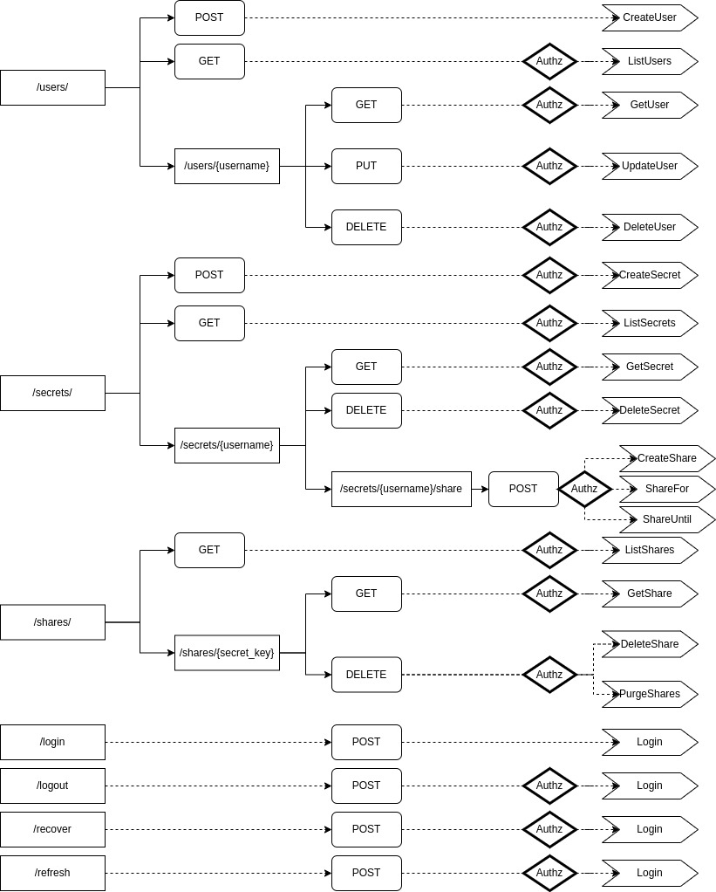

## Concept

This document will cover the process of building a secrets / password store web application, in Go. The main goals and features of the app are the following:

- exposing a key-value store for secrets (confidential data), where the keys are of type `string` and the values are of type `[]byte` (slice of bytes / byte array).
- basic IAM support, with multiple users being able to use the service independently and privately. Users login with a username+password combination
- ability to share secrets among users, optionally scoped for a certain period of time.

This document will cover the entire process of designing, building and deploying the Go backend for this app. This document was written with Go currently on version 1.19, on January 2023.

__________________

## Design 

This will be a monolith code-base with a touch of Domain-Driven Design (DDD) principles, to allow a readable structure and isolated responsibilities among the different packages. As a whole, the project's organization will focus on:

1. Separating transport, service and repositories. Each layer will have their own set of responsibilities.
2. Decoupling the implementations, so that they can be easily refactored and / or re-implemented with a different solution / technology stack.
3. Joining the different modules is deferred to the factory package. This allows a bigger focus on the package that we're working on focusing on inputs and returns.
4. No `pkg`, nor `util`, nor `helpers`, nor `models`; at least for the app's logic. This is done on the corresponding module.

### App structure

The entities in this model are simple, there are users who create secrets, and these secrets can be accessed by either the owner or other users if the secret is shared. The diagram below showcases this model:


Of course, the app will have a few other services to support authentication, authorization and encryption, for example. But these services are not the core-purpose of the app.

### Entities

Like the diagram above implies, at least two entities are necessary: User and Secret.

These entities determine the structure of the handled data.  

#### User

```go
package user

// User is a person (or entity) that uses the application to store
// secrets. They will have a unique username.
type User struct {
	ID        uint64    `json:"id"`
	Username  string    `json:"username"`
	Name      string    `json:"name"`
	Hash      string    `json:"-"`
	Salt      string    `json:"-"`
	CreatedAt time.Time `json:"created_at,omitempty"`
	UpdatedAt time.Time `json:"updated_at,omitempty"`
}
```

> A user object will store the user's ID and basic information, a hash of their (salted) password and the salt; as well as created / updated timestamps

#### Secret

```go
package secret

// Secret is a key-value pair where they Key is string type and Value
// is a slice of bytes. Secrets are encrypted then stored with a user-scoped
// private key
type Secret struct {
	ID        uint64    `json:"id"`
	Key       string    `json:"key"`
	Value     string    `json:"value"`
	CreatedAt time.Time `json:"created_at"`
}
```

> A secret object will hold its key-value data, as well as a timestamp value for when it was created

#### Shared

```go
package shared

// DefaultShareDuration sets a maximum of 30 days for shared secrets with no defined time limit
const DefaultShareDuration = time.Hour * 24 * 30

// Shared is metadata for a secret that a user (the owner) shares with a set of users
// optionally within a limited period of time
type Share struct {
	ID        uint64     `json:"id"`
	SecretKey string     `json:"secret_key"`
	Owner     string     `json:"owner"`
	Target    []string   `json:"shared_with"`
	Until     *time.Time `json:"until,omitempty"`
	CreatedAt time.Time  `json:"created_at"`
}
```

> Shared secrets will be objects containing a Secret's key, it's owner's username, and shares (slice of strings representing usernames). Optionally, a shared secret can be scoped for a period of time (a nullable value). For this application, I also define the default share duration (1 month) in case it's not defined by the caller.


### Database design

Storing this data could be easily done in a simple manner, in a relational database. This database would contain at least 3 tables, for users, secrets and shared_secrets. However, this specific implementation will use two types of databases:

1. A **SQLite database** to serve as a relational database for the users and secrets / shares metadata.
2. A **Bolt database** to serve as a key-value store, holding the sensitive information for the user's secrets, the user's private encryption key and any other type of sensitive information.

Please note below how do the entities and model above translate to an RDB table structure, for this project:

#### `users` table

col. name | type | PK | FK
:--:|:--:|:--:|:--:
`id` | INTEGER | Yes |
`username` | VARCHAR(50) | |
`name` | TEXT | |
`hash` | TEXT | |
`salt` | TEXT | |
`created_at` | TIMESTAMP | |
`updated_at` | TIMESTAMP | |

> *Users data will consist on the basic information they will supply when creating a user account (initially username, password and a name); however the database will not store the password -- but a salt generated when the account was created and the hash of the password with the salt appended to it*

#### `secrets` table

col. name | type | PK | FK
:--:|:--:|:--:|:--:
`id` | INTEGER | Yes |
`user_id` | INTEGER | | `users (id)`
`name` | VARCHAR(250) | |
`created_at` | TIMESTAMP | |

> *Secrets data will consist exclusively in secret metadata and its key (as "name"); the actual secret's value is stored in Bolt, encrypted with a key that is exclusive to the user (generated by the service when the user is created)*

#### `shared_secrets` table

col. name | type | PK | FK
:--:|:--:|:--:|:--:
`id` | INTEGER | Yes |
`owner_id` | INTEGER | | `users (id)`
`secret_id` | INTEGER | | `secrets (id)`
`shared_with` | INTEGER | | `users (id)`
`until` | TIMESTAMP | |
`created_at` | TIMESTAMP | |

> *Shared secrets table will hold the metadata about the share; such as from-to user IDs, the secret's ID and a time limit if set. If the secret is shared with multiple users, there will be multiple entries simliar to each other, with different `shared_with` values*

### Actions and operations

This application will require a CRUD implementation for both users and secrets, as well as added actions to share the secrets with one (or more) user(s).

As for the users repository, it will expose a complete set of CRUD operations (with `list`); but secrets will not contain an update operation -- its `create` operation will be designed to overwrite the secret if it already exists.

The shared repository will contain methods to share a secret with users -- optionally until a period in time, or for a certain duration. The removal of an expired shared secret is done when reading it; so if a user lists their secrets which currently include an expired shared secret, it will be removed before the read / list response is returned to the caller.

### Security

Initially, the users will login using a dedicated endpoint, using a username + password combination. The call returns a JWT if their credentials are valid, and the caller can use the JWT as an Authorization HTTP header calling users and secrets endpoints. JWT expire within one hour of being created.

Creating a user does not require authentication.

When a user is created, the service will create an encryption private key in the Bolt database that will be used to encrypt the user's secrets' values. Also, when created, a random 128-byte-long salt value is generated and appended to the user's password; and the resulting value is hashed. The SQLite database will store this salt and hash values, base64-encoded, and not the user's plaintext password.

A user can only access their own resources. A secret shared by user A with user B is perceived as a (new) secret owned by user B in a read operation; which will contain an expiry. However, the actual owner is in control of this secret -- as shared secrets are read-write only for the actual owner. Shared secrets have a different key in the format of `username:secretkey`.

While there is a reserved username (`root`) despite not having a roles / privileges model; the Bolt database will still store user secrets in buckets identified by the user's (internal) ID, and not their username. User secrets are encrypted with AES, using a 32-byte key generated and stored when the user is first created. Like passwords, secrets will not be stored in plaintext (beyond the database's own encryption).

### Product Format

The final application will be initially distributed as a web application, as a HTTP API. It could potentially have a CLI client that communicates with a configured secrets store server via HTTP (performing the same HTTP calls, but from a CLI app).

While there are no plans for an actual frontend with a UI, the simplest approach to doing so would be with a Flutter / Dart project which is simple and distributable on a number of platforms.

_______________

## Implementation

Having a general structure planned ahead is essential to organize the codebase before any code is written. Having the context on what we want from the above, it's easier to sketch out the entities and repositories for this application:

### The `user` package

This package will be a top-level folder in the project named `user`, with:

```
.
└─ user
    ├─ repository.go -- lists the actions supported by the repository
    └─ user.go -- describes the user entity
```

#### `user.go` - defining entities

Just like the snippet a few blocks above, this file is very straight-forward and will contain the user entity, which describes the basic elements of a user. Additionally it will already include the Session type, which is an authenticated user (user with a session token); since this is also within the realm of the *users*. 

While the entities expose the JSON tags which will be used later on in the HTTP responses, note how both the `Hash` and `Salt` fields are omitted.

```go
package user

import (
	"time"
)

// RootUsername is a reserved username for the admin deploying the application
const RootUsername = "root"

// User is a person (or entity) that uses the application to store
// secrets. They will have a unique username.
type User struct {
	ID        uint64    `json:"id"`
	Username  string    `json:"username"`
	Name      string    `json:"name"`
	Hash      string    `json:"-"`
	Salt      string    `json:"-"`
	CreatedAt time.Time `json:"created_at,omitempty"`
	UpdatedAt time.Time `json:"updated_at,omitempty"`
}

// Session is an authorized user, accompanied by a JWT
type Session struct {
	User  `json:"user"`
	Token string `json:"token"`
}
```

#### `repository.go` - defining the actions

The users repository will contain a set of actions which will target the `users` SQL table described in the Design chapter. This means that it does not contain methods related to login; only CRUD operations against actual users:

```go
package user

import "context"

// Repository describes the actions exposed by the users store
type Repository interface {
	// Create will create a user `u`, returning its ID and an error
	Create(ctx context.Context, u *User) (uint64, error)
	// Get returns the user identified by `username`, and an error
	Get(ctx context.Context, username string) (*User, error)
	// List returns all the users, and an error
	List(ctx context.Context) ([]*User, error)
	// Update will update the user `username` with its updated version `updated`. Returns an error
	Update(ctx context.Context, username string, updated *User) error
	// Delete removes the user identified by `username`, returning an error
	Delete(ctx context.Context, username string) error
}
```

> All repository methods accept a context as a first argument to allow retrieving more observability information, as covered further down this document.

#### Users recap

In a nutshell this is the domain abstraction of the data stored in the database. It allows for the persistence layer (the databases) to have different implementations -- while also deferring the responsibility of persisting those objects to a different module.

The domain entity and repository interface state what this object (the user) is and what we can do with it.

The exposed methods are pretty much CRUD operations (create-read-update-delete) with a list operation (which is basically a batch read).
____________

### The `secret` package

This package will be a top-level folder in the project named `secret`, with:

```
.
└─ secret
    ├─ repository.go -- lists the actions supported by the repository
    └─ secret.go -- describes the secret entity
```

#### `secret.go` - defining entities

Very similar to the user; the Secret type will contain the basic elements of a Secret. Note how a (basic) secret does not reference a user in it:

```go
package secret

import (
	"time"
)

// Secret is a key-value pair where they Key is string type and Value
// is a slice of bytes. Secrets are encrypted then stored with a user-scoped
// private key
type Secret struct {
	ID        uint64    `json:"id"`
	Key       string    `json:"key"`
	Value     string    `json:"value"`
	CreatedAt time.Time `json:"created_at"`
}
```


#### `repository.go` - defining the actions 

The `secret.Repository` will expose CRUD operations against the `secrets` SQL table, similar to `users.Repository` -- however it does not expose an Update method; as secrets' values are simply overwritten if the key already exists:

```go
package secret

import (
	"context"
)

// Repository describes the actions exposed by the secrets store
type Repository interface {
	// Create will create (or overwrite) the secret identified by `s.Key`, for user `username`,
	// returning its ID and an error
	Create(ctx context.Context, username string, s *Secret) (uint64, error)
	// Get fetches a secret identified by `key` for user `username`. Returns a secret and an error
	Get(ctx context.Context, username string, key string) (*Secret, error)
	// List returns all secrets belonging to user `username`, and an error
	List(ctx context.Context, username string) ([]*Secret, error)
	// Delete removes the secret identified by `key`, for user `username`. Returns an error
	Delete(ctx context.Context, username string, key string) error
}
```

> All repository methods accept a context as a first argument to allow retrieving more observability information, as covered further down this document.

#### Secrets recap

Very similar [to the User](#users-recap).

_______

### The `shared` package


This package will be a top-level folder in the project named `shared`, with:

```
.
└─ shared
    ├─ repository.go -- lists the actions supported by the repository
    └─ shared.go -- describes the secret entity
```

#### `shared.go` - defining entities

A Share type will represent a shared secret, holding the secret key, the username of the owner, and a list of target usernames that the secret is shared with. Optionally the object can include an `Until` value to scope the access of the secret until a certain point in time. This is a nullable field, but there is a default value whenever it is not populated (of 1 month).

A shared secret is usually returned in a list, even in a GET (read / list) operation.

```go
package shared

import (
	"time"
)

// DefaultShareDuration sets a maximum of 30 days for shared secrets with no defined time limit
const DefaultShareDuration = time.Hour * 24 * 30

// Shared is metadata for a secret that a user (the owner) shares with a set of users
// optionally within a limited period of time
type Share struct {
	ID        uint64     `json:"id"`
	SecretKey string     `json:"secret_key"`
	Owner     string     `json:"owner"`
	Target    []string   `json:"shared_with"`
	Until     *time.Time `json:"until,omitempty"`
	CreatedAt time.Time  `json:"created_at"`
}

```

#### `repository.go` - defining the actions

The `shared.Repository` is just as simple as the secrets': a set of CRUD operations without Update. The persistence layer (which implements the repository) will be solely responsible of saving the shared secrets state. Any features to this implementation (sharing for a duration of time, sharing until a point in time) will be handled by the service layer.

There are also two versions of the List operation, one for the shared secrets' owner, and one for the shared secrets' target user.

```go
package shared

import (
	"context"
)

// Repository describes the actions exposed by the shared secrets store
type Repository interface {
	// Create shares the secret identified by `secretName`, owned by `owner`, with
	// user `target`. Returns its ID and an error
	Create(ctx context.Context, s *Share) (uint64, error)
	// Get fetches the secret's share metadata for a given owner's username and secret key
	Get(ctx context.Context, owner, secretName string) ([]*Share, error)
	// List fetches all shared secrets for a given owner's username
	List(ctx context.Context, owner string) ([]*Share, error)
	// ListTarget is similar to List, but returns secrets that are shared with a target user
	ListTarget(ctx context.Context, target string) ([]*Share, error)
	// Delete removes the user `target` from the secret share
	Delete(ctx context.Context, s *Share) error
}
```


> All repository methods accept a context as a first argument to allow retrieving more observability information, as covered further down this document.

#### Shared recap

Very similar [to the User](#users-recap); but even simpler (and with two "list" operations) -- one lists the owner's shared secrets, while the other (`ListTarget`) lists the secrets that are shared with a certain target user.

___________

### The `keys` package

This package will be a top-level folder in the project named `keys` -- this will be a basic interface to the Bolt instance (as a key-value store), with:

```
.
└─ keys
    ├─ key.go -- contains constants used in the keys context, and helper functions
    └─ repository.go -- lists the actions supported by the repository
```


#### `key.go` - defining constants and identifiers

The key-value store is, as the name implies a database storing a value represented by a key. Bolt allows to nest these key-value pairs (a key that contains more key-value pairs) with buckets. 

A bucket can also be nested (buckets inside buckets). 

This use-case will be super simple where the service stores the user's secrets in a bucket identified by their ID (and a special prefix). This way, secrets are exclusive to a certain user, and other business-logic content can still be stored -- provided it is prefixed / named differently.

An alternative would be to have a bucket for secrets, that will store buckets for users, that will store key-value pairs for their secrets. To avoid this level of nesting, I've opted to go for the first approach.

Also -- as user secrets are encrypted with a unique key (which is generated on user creation), the key will also be stored in the user's bucket, under a unique key (`unique_identifier`).

Lastly, active JWT are stored in Bolt as well, under the user's bucket, with a unique key (`active-token`).

These constants are declared in this file, however it will be a secrets validator that will ensure that user-input secrets do not contain this key. More about validation further down this document.


```go
package keys

import "fmt"

const (
	UniqueID = "unique_identifier"
	TokenKey = "active-token"
)

// UserBucket formats the input user ID as a user bucket identifier (`uid:###`)
func UserBucket(id uint64) string {
	return fmt.Sprintf("uid:%d", id)
}
```


#### `repository.go` - defining the actions

The keys repository interface will be an *updateless CRUD* (CRD?); it also contains a `Purge()` method to destroy a bucket's contents completely.

```go
package keys

import "context"

// Repository describes the action exposed by the keys store
type Repository interface {
	// Set creates or overwrites a secret identified by `k` with value `v`, in
	// bucket `bucket`. Returns an error
	Set(ctx context.Context, bucket, k string, v []byte) error
	// Get fetches the secret identified by `k` in the bucket `bucket`,
	// returning a slice of bytes for the value and an error
	Get(ctx context.Context, bucket, k string) ([]byte, error)
	// Delete removes the secret identified by `k` in bucket `bucket`, returning an error
	Delete(ctx context.Context, bucket, k string) error
	// Purge removes all the secrets in the bucket `bucket`, returning an error
	Purge(ctx context.Context, bucket string) error
}
```

> All repository methods accept a context as a first argument to allow retrieving more observability information, as covered further down this document.

#### Keys recap

This section will be even simpler than the entities referred before, as it only handles actions against the (Bolt DB) key-value store. Since the data will always be a slice of bytes, there is no point in incrementing it much more than this; as it will be seen as a *plugin* in some packages to handle this type of (confidential content) storage.

___________

### Bolt DB implementation

The Bolt DB implementation will be placed in a top-level folder within the project, named `bolt`. This will be a very clean implementation considering how Bolt makes it simple to work with transactions -- meaning that you're able to issue a batch of operations to the database and rollback if an error is raised.

```
.
└─ bolt
    ├─ bolt.go -- exposes function(s) to initialize a Bolt DB instance
    └─ keys.go -- implements the keys.Repository interface
```

#### Initializing a Bolt DB instance

Initializing a Bolt DB instance simply takes a path to a file. This function is simply calling `bbolt.Open()`, but its signature will be common with the SQLite implementation (later in this document); which is useful for the factory functions -- it keeps a similar structure and signature:

```go
package bolt

import (
	"go.etcd.io/bbolt"
)

// Open will initialize a Bolt DB based on the `.db` file in `path`,
// returning a pointer to a bbolt.DB and an error
func Open(path string) (*bbolt.DB, error) {
	return bbolt.Open(path, 0600, nil)
}
```

#### Implementing `keys.Repository`

The keys repository will be very simple both thanks to Bolt's API and user experience -- but also because of the low complexity this feature has in the project. This repository is like a side-car to the rest of the application, as a means to isolate sensitive information in a key-value database.

Usually I start by laying down the type to represent this implementation, the methods that I need to implement and a function to initialize this type:

```go
package bolt

import (
	"context"

	"github.com/zalgonoise/x/secr/keys"
	"go.etcd.io/bbolt"
)

type keysRepository struct {
	db *bbolt.DB
}

// NewKeysRepository creates a keys.Repository from the Bolt DB `db`
func NewKeysRepository(db *bbolt.DB) keys.Repository {
	return &keysRepository{db}
}

// Get fetches the secret identified by `k` in the bucket `bucket`,
// returning a slice of bytes for the value and an error
func (ukr *keysRepository) Get(ctx context.Context, bucket, k string) ([]byte, error) {
	return nil, nil
}

// Set creates or overwrites a secret identified by `k` with value `v`, in
// bucket `bucket`. Returns an error
func (ukr *keysRepository) Set(ctx context.Context, bucket, k string, v []byte) error {
	return nil
}

// Delete removes the secret identified by `k` in bucket `bucket`, returning an error
func (ukr *keysRepository) Delete(ctx context.Context, bucket, k string) error {
	return nil
}

// Purge removes all the secrets in the bucket `bucket`, returning an error
func (ukr *keysRepository) Purge(ctx context.Context, bucket string) error {
	return nil
}
```

From here, it's much easier to isolate the task at hand and writing the logic. This is usually the format for my `unimplemented.go` files, if existing.

#### Implementing `keysRepository.Get`

Like mentioned before, the Bolt instance will contain buckets (for users, as an example) that will contain key-value pairs in them (for secrets). A `Get` call to this repository will be most likely for fetching secrets but it could also be to fetch the user's encryption key, and the user's active JWT. 

To ensure that the bucket and key are valid, this implementation will verify if the input strings are empty (otherwise it would be checked on the service level). Then, a read request is sent to the DB (with [`bbolt.View`](https://pkg.go.dev/go.etcd.io/bbolt#DB.View)), to read a key from an (assumed to be existing) bucket. The transaction will fail if the bucket does not exist.

```go
// Get fetches the secret identified by `k` in the bucket `bucket`,
// returning a slice of bytes for the value and an error
func (ukr *keysRepository) Get(ctx context.Context, bucket, k string) ([]byte, error) {
	if bucket == "" {
		return nil, ErrEmptyBucket
	}
	if k == "" {
		return nil, ErrEmptyKey
	}

	var v []byte

	err := ukr.db.View(func(tx *bbolt.Tx) error {
		b := tx.Bucket([]byte(bucket))
		if b == nil {
			return ErrEmptyBucket
		}
		v = b.Get([]byte(k))
		return nil
	})
	if err != nil {
		if errors.Is(err, ErrEmptyBucket) {
			return nil, err
		}
		return nil, fmt.Errorf("%w: %v", ErrDBError, err)
	}

	return v, nil
}
```

#### Implementing `keysRepository.Set`

Like `Get`; this call checks for empty values in the input. The `Set` call is a DB-write, thus using the [`bbolt.Update`](https://pkg.go.dev/go.etcd.io/bbolt#DB.Update) method. Since this call will be prepared to create new buckets and key-value pairs, it calls the [`tx.CreateBucketIfNotExists`](https://pkg.go.dev/go.etcd.io/bbolt#Tx.CreateBucketIfNotExists) method, accordingly.

The transaction returns an error if it fails when fetching / creating the bucket, or when storing the key-value pair.

```go
// Set creates or overwrites a secret identified by `k` with value `v`, in
// bucket `bucket`. Returns an error
func (ukr *keysRepository) Set(ctx context.Context, bucket, k string, v []byte) error {
	if bucket == "" {
		return ErrEmptyBucket
	}
	if k == "" {
		return ErrEmptyKey
	}
	if len(v) == 0 {
		return ErrEmptyValue
	}

	err := ukr.db.Update(func(tx *bbolt.Tx) error {
		b, err := tx.CreateBucketIfNotExists([]byte(bucket))
		if err != nil {
			return fmt.Errorf("failed to get / create bucket: %v", err)
		}

		err = b.Put([]byte(k), []byte(v))
		if err != nil {
			return fmt.Errorf("failed to set key-value: %v", err)
		}

		return nil
	})
	if err != nil {
		return fmt.Errorf("%w: %v", ErrDBError, err)
	}
	return nil
}
```


#### Implementing `keysRepository.Delete` and `keysRepository.Purge`

Both `Delete` and `Purge` calls are very similar, in the sense that the former removes a key-value pair while the latter removes the bucket entirely. These will be write operations, similar to the `Set` call, in which the `bbolt.Update` is called.

```go

// Delete removes the secret identified by `k` in bucket `bucket`, returning an error
func (ukr *keysRepository) Delete(ctx context.Context, bucket, k string) error {
	if bucket == "" {
		return ErrEmptyBucket
	}
	if k == "" {
		return ErrEmptyKey
	}

	err := ukr.db.Update(func(tx *bbolt.Tx) error {
		b := tx.Bucket([]byte(bucket))
		if b == nil {
			return ErrEmptyBucket
		}

		err := b.Delete([]byte(k))
		if err != nil {
			return fmt.Errorf("failed to delete key %s in the bucket %s: %v", k, bucket, err)
		}
		return nil
	})

	if err != nil {
		if errors.Is(err, ErrEmptyBucket) {
			return err
		}
		return fmt.Errorf("%w: %v", ErrDBError, err)
	}
	return nil
}
```

Even simpler, `Purge` doesn't even fetch the bucket:

```go
// Purge removes all the secrets in the bucket `bucket`, returning an error
func (ukr *keysRepository) Purge(ctx context.Context, bucket string) error {
	if bucket == "" {
		return ErrEmptyBucket
	}

	err := ukr.db.Update(func(tx *bbolt.Tx) error {
		err := tx.DeleteBucket([]byte(bucket))
		if err != nil {
			return fmt.Errorf("failed to delete the bucket %s: %v", bucket, err)
		}
		return nil
	})

	if err != nil {
		return fmt.Errorf("%w: %v", ErrDBError, err)
	}
	return nil
}
```

#### Defining errors and updating `import`s

Since the methods refer some error types that seem to be part of this package, they need to be defined; these are super simple errors to identify the issue better with, for example, `errors.Is()`.

```go
import (
	"context"
	"errors"
	"fmt"

	"github.com/zalgonoise/x/secr/keys"
	"go.etcd.io/bbolt"
)

var (
	ErrDBError     = errors.New("database error")
	ErrNotFoundKey = errors.New("couldn't find the key")
	ErrEmptyKey    = errors.New("key cannot be empty")
	ErrEmptyValue  = errors.New("username cannot be empty")
	ErrEmptyBucket = errors.New("empty bucket")
	ErrForbidden   = errors.New("unable to modify this resource")
)
```

#### BoltDB recap

This is the shortest and cleanest repository implementations in this application and for the same reason it was presented first. This design model will allow the level of abstraction as you see above, where the Bolt DB implementation only cares about what is being stored / read from Bolt DB.

The important take-aways from this one is that:

1. This is a feature that only the service layer will use / have access to.
2. Trying to stick to the necessary actions for the transaction to go through (on the persistence layer)
3. Even initializing the database file (creating it, loading it) is being deferred to a different package

___________

### SQLite implementation

The SQLite DB implementation will be placed in a top-level folder within the project, named `sqlite`. This folder will contain a `sqlite.go` file to initialize the DB instance, and 3 files for the 3 repositories it implements. Besides these, it will also have a `helper.go` file to aid with reusable functions, and a migrations folder for database migrations.

Note that this implementation is not leveraging [`migrate`](https://github.com/golang-migrate/migrate) which is an awesome library to manage SQL migrations in Go.

The `helper.go` file exposes types that are used to narrow-down the methods used for a particular action (usually the `Context` variants of SQL method calls).

```
.
└─ sqlite
    ├─ migrations
    │    └─ 1672703190_initial_up.sql -- initial migration to create the database tables
    ├─ helper.go -- contains reusable functions and types used for SQLite transactions  
    ├─ secrets.go -- implements the secret.Repository interface
    ├─ shared.go -- implements the shared.Repository interface 
    ├─ sqlite.go -- exposes function(s) to initialize a SQLite DB instance
    └─ users.go -- implements the user.Repository interface
```

#### Defining the initial migration

The initial migration file will create the tables as described in the [Database Design section](#database-design), with the `IF NOT EXISTS` clause.

This is the chance to define the unique fields which weren't yet set at first, to limit the relations between the objects within a set of boundaries. Take a look at the migration query first:

```sql
CREATE TABLE IF NOT EXISTS users (
    id INTEGER PRIMARY KEY AUTOINCREMENT,
    username VARCHAR(50) NOT NULL UNIQUE,
    name TEXT NOT NULL,
    hash TEXT NOT NULL,
    salt TEXT NOT NULL,
    created_at TIMESTAMP NOT NULL DEFAULT CURRENT_TIMESTAMP,
    updated_at TIMESTAMP NOT NULL DEFAULT CURRENT_TIMESTAMP
);

CREATE TABLE IF NOT EXISTS secrets (
    id INTEGER PRIMARY KEY AUTOINCREMENT,
    user_id INTEGER NOT NULL,
    name VARCHAR(250) NOT NULL,
    created_at TIMESTAMP NOT NULL DEFAULT CURRENT_TIMESTAMP,
    
    FOREIGN KEY (user_id) REFERENCES users (id),
    UNIQUE(user_id, name)
);

CREATE TABLE IF NOT EXISTS shared_secrets (
    id INTEGER PRIMARY KEY AUTOINCREMENT,
    owner_id INTEGER NOT NULL,
    secret_id INTEGER NOT NULL,
    shared_with INTEGER NOT NULL,
    until TIMESTAMP,
    created_at TIMESTAMP NOT NULL DEFAULT CURRENT_TIMESTAMP,
    
    FOREIGN KEY (owner_id) REFERENCES users (id),
    FOREIGN KEY (secret_id) REFERENCES secrets (id),
    FOREIGN KEY (shared_with) REFERENCES users (id),
    UNIQUE(secret_id, shared_with)
);
```

The migration above sets the following `UNIQUE` constraints:
- `secrets`: secrets have unique keys per user. Means that the database does not allow `joe` to store a secret with key `access` when `access` already exists. The entry needs to be removed before added again
- `shared_secrets`: secrets are unique per (target) user when shared. Means that the database does not allow sharing a secret with key `access` with user `joe` if such a share already exists (scoped with time for example). The entry needs to be removed before added again

As for `FOREIGN KEY` constraints:
- `secrets`: its `user_id` field will reference the `users.id` field
- `shared_secrets`: its `owner_id` field will reference the `users.id` field
- `shared_secrets`: its `secret_id` field will reference the `secrets.id` field
- `shared_secrets`: its `shared_with` field will reference the `users.id` field

As for the unique constraints, the service layer is responsible for fetching the data before mutating it -- so if a user tries to overwrite a secret (which is allowed), the service will first fetch it; delete it; then create it.

#### Initializing a SQLite DB instance

Initializing a SQLite DB instance simply takes a path to a file. This function is calling `sql.Open()`, and running the initial migration as set into `initialMigration` using `go:embed`

This implementation uses [`mattn/go-sqlite3`](https://github.com/mattn/go-sqlite3) as a SQLite driver.

```go
package sqlite

import (
	"database/sql"

	_ "embed"

	_ "github.com/mattn/go-sqlite3"
)

//go:embed migrations/1672703190_initial_up.sql
var initialMigration string

// Open will initialize a SQLite DB based on the `.sql` file in `path`,
// returning a pointer to a sql.DB and an error
//
// It executes the initial migration, as well.
func Open(path string) (*sql.DB, error) {
	db, err := sql.Open("sqlite3", path)
	if err != nil {
		return nil, err
	}

	_, err = db.Exec(initialMigration)
	if err != nil {
		return nil, err
	}
	return db, nil
}
```

#### Defining helper functions

Of course, most of these come up when you follow the same pattern more than once, be it in the same projects or over time. Some of these functions are added to the file as the logic in it is reusable across repository implementations, or simply to avoid clogging up the implemenation files. This isn't a file I start with when designing a SQL-based persistence layer, but often emerges over time when I do.

Continuing with the contents of this file since they are referenced through the implementations, for better context later:

**SQL Querier types**

```go
import (
	"context"
	"database/sql"
)

// Scanner describes an object that scans values into destination pointers
type Scanner interface {
	Scan(dest ...interface{}) error
}

// RowQuerier describes an object that queries a single row in a SQL database
type RowQuerier interface {
	QueryRowContext(ctx context.Context, query string, args ...interface{}) *sql.Row
}

// RowsQuerier describes an object that queries multiple rows in a SQL database
type RowsQuerier interface {
	QueryContext(ctx context.Context, query string, args ...interface{}) (*sql.Rows, error)
}

// Executer describes an object that executes a mutation in a SQL database
type Executer interface {
	ExecContext(ctx context.Context, query string, args ...interface{}) (sql.Result, error)
}

// Querier encapsulates a RowQuerier, RowsQuerier and Executer implementations
type Querier interface {
	RowQuerier
	RowsQuerier
	Executer
}
```

These types narrow down the methods used when interacting with the database, often picking their `Context` method variants; often used as input parameters and returns, in functions and methods.


**SQL-type converters**

```go
import (
	"database/sql"
	"time"

	"golang.org/x/exp/constraints"
)

// ToSQLString converts the input string into a sql.NullString
func ToSQLString(s string) sql.NullString {
	return sql.NullString{String: s, Valid: s != ""}
}

// ToSQLInt64 converts the generic integer into a sql.NullInt64
func ToSQLInt64[T constraints.Integer](v T) sql.NullInt64 {
	return sql.NullInt64{Int64: int64(v), Valid: v >= 0}
}

// ToSQLTime converts the input time into a sql.NullTime
func ToSQLTime(t time.Time) sql.NullTime {
	return sql.NullTime{Time: t, Valid: t != time.Time{} && t.Unix() != 0}
}
```

These `ToSQLXxx()` functions are often used to convert primitive types (and `time.Time`) into its `sql.NullXxx` variant. This is especially useful to quickly convert types for queries.

**IsEntityFound functions**

```go
import (
	"database/sql"
	"fmt"
)

// IsUserFound returns an error if the entity is not found
func IsUserFound(res sql.Result) error {
	n, err := res.RowsAffected()
	if err != nil {
		return fmt.Errorf("%w: %v", ErrDBError, err)
	}
	if n == 0 {
		return ErrNotFoundUser
	}
	return nil
}

// IsSecretFound returns an error if the entity is not found
func IsSecretFound(res sql.Result) error {
	n, err := res.RowsAffected()
	if err != nil {
		return fmt.Errorf("%w: %v", ErrDBError, err)
	}
	if n == 0 {
		return ErrNotFoundSecret
	}
	return nil
}

// IsShareFound returns an error if the entity is not found
func IsShareFound(res sql.Result) error {
	n, err := res.RowsAffected()
	if err != nil {
		return fmt.Errorf("%w: %v", ErrDBError, err)
	}
	if n == 0 {
		return ErrNotFoundShare
	}
	return nil
}
```

The `IsXxxFound()` functions are wrappers for `sql.ExecContext()` returns, to verify if the issue was a target where the entry didn't exist, returning an appropriate error for the action.

Note that this application does not implement any custom error type nor is it templating entities for usage in this type of errors -- otherwise it could be done in one-go with a generic function (that accepts an entity type) or with a different error handling pattern. I chose to simply re-write the same function three times since they're used very little in the implementations, and didn't seem like a solid reason to implement custom errors for this app.


#### Implementing `user.Repository`

A SQL implementation will need a data structure that is specific to the database, with the appropriate `sql.NullXxx` types and with the same structure as the table schema.

It will also contain a type to implement the repository and function to initialize said type. Lastly, it contains a few helper methods to convert between the database data structure and the domain one, as well as functions / methods to read the rows' contents.

Here is the first layout of the `sqlite/users.go` file:

```go
package sqlite

import (
	"context"
	"database/sql"

	"github.com/zalgonoise/x/secr/user"
)

type dbUser struct {
	ID        sql.NullInt64
	Username  sql.NullString
	Name      sql.NullString
	Hash      sql.NullString
	Salt      sql.NullString
	CreatedAt sql.NullTime
	UpdatedAt sql.NullTime
}

var _ user.Repository = &userRepository{nil}

type userRepository struct {
	db *sql.DB
}

// NewUserRepository creates a user.Repository from the SQL DB `db`
func NewUserRepository(db *sql.DB) user.Repository {
	return &userRepository{db}
}

// Create will create a user `u`, returning its ID and an error
func (ur *userRepository) Create(ctx context.Context, u *user.User) (uint64, error) {
	return 0, nil
}

// Get returns the user identified by `username`, and an error
func (ur *userRepository) Get(ctx context.Context, username string) (*user.User, error) {
	return nil, nil
}

// List returns all the users, and an error
func (ur *userRepository) List(ctx context.Context) ([]*user.User, error) {
	return nil, nil
}

// Update will update the user `username` with its updated version `updated`. Returns an error
func (ur *userRepository) Update(ctx context.Context, username string, updated *user.User) error {
	return nil
}

// Delete removes the user identified by `username`, returning an error
func (ur *userRepository) Delete(ctx context.Context, username string) error {
	return nil
}

func (u *dbUser) toDomainEntity() *user.User {
	return &user.User{
		ID:        uint64(u.ID.Int64),
		Username:  u.Username.String,
		Name:      u.Name.String,
		Hash:      u.Hash.String,
		Salt:      u.Salt.String,
		CreatedAt: u.CreatedAt.Time,
		UpdatedAt: u.UpdatedAt.Time,
	}
}

func newDBUser(u *user.User) *dbUser {
	return &dbUser{
		Username: ToSQLString(u.Username),
		Name:     ToSQLString(u.Name),
		Hash:     ToSQLString(u.Hash),
		Salt:     ToSQLString(u.Salt),
	}
}

```

This is a very similar preparation to the one done in Bolt DB's [`keys.Repository` implementation](#implementing-keysrepository). The only difference is that for SQL I start by defining the `dbUser` struct, as a database entity. Since these types need to be interchangeable, I expand on that too by writing a `newDBXxx()` function and a `(x dbXxx) toDomainEntity() Xxx` method.

#### Implementing `userRepository.Create`

This call will push the input `*user.User` into the database, by converting it into a `dbUser` and writing its fields to the `users` table.

It will return an error if the transaction fails, or if the last inserted ID errors or is zero.


```go
// Create will create a user `u`, returning its ID and an error
func (ur *userRepository) Create(ctx context.Context, u *user.User) (uint64, error) {
	dbu := newDBUser(u)
	res, err := ur.db.ExecContext(ctx, `
INSERT INTO users (username, name, hash, salt)
VALUES (?, ?, ?, ?)
`, dbu.Username, dbu.Name, dbu.Hash, dbu.Salt)

	if err != nil {
		return 0, fmt.Errorf("%w: failed to create user %s: %v", ErrDBError, u.Username, err)
	}

	id, err := res.LastInsertId()
	if err != nil {
		return 0, fmt.Errorf("%w: failed to create user %s: %v", ErrDBError, u.Username, err)
	}
	if id == 0 {
		return 0, fmt.Errorf("%w: user was not created %s", ErrDBError, u.Username)
	}
	return uint64(id), nil
}
```


#### Implementing `userRepository.Get`

The `Get` method is very simple in nature, in the sense that it fetches a user identified by username `username`. This is a `SELECT` operation in SQL filtering by the username field in the users table.

On this method, it's not important to create a new `dbUser` object, since the `ToSQLString()` function can be called directly on the input `username` parameter.

From this query, the resulting row is being passed to a `scanUser` method which extracts the user from the `sql.Row`.

> Note -- for SQL folks that are not familiar with Go: the question marks `?` in the queries represent a template, where the query will receive some data instead of that question mark token.
>
> The following function argument here, `ToSQLString(username)` converts a primitive `string` type into sql.NullString (a compatible type), which is parsed as `(...) WHERE u.username = 'myusername';`

```go
// Get returns the user identified by `username`, and an error
func (ur *userRepository) Get(ctx context.Context, username string) (*user.User, error) {
	row := ur.db.QueryRowContext(ctx, `
SELECT u.id, u.username, u.name, u.hash, u.salt, u.created_at, u.updated_at
FROM users AS u
WHERE u.username = ?
	`, ToSQLString(username))

	user, err := ur.scanUser(row)
	if err != nil {
		return nil, err
	}
	return user, nil
}

// (...)

func (ur *userRepository) scanUser(r Scanner) (u *user.User, err error) {
	if r == nil {
		return nil, fmt.Errorf("%w: failed to find this user", ErrNotFoundUser)
	}
	dbu := new(dbUser)
	err = r.Scan(
		&dbu.ID,
		&dbu.Username,
		&dbu.Name,
		&dbu.Hash,
		&dbu.Salt,
		&dbu.CreatedAt,
		&dbu.UpdatedAt,
	)
	if err != nil {
		if errors.Is(sql.ErrNoRows, err) {
			return nil, ErrNotFoundUser
		}
		return nil, fmt.Errorf("%w: failed to scan DB row: %v", ErrDBError, err)
	}
	return dbu.toDomainEntity(), nil
}
```

The `scanUser` method will be reused, thus being a separate method, and basically leverages the `Scan` method to extract the row fields into one or more target pointers.

The function returns a user (already converted to a domain entity, as `*user.User`) and an error -- be it a *Not Found* error or a generic DB error.

#### Implementing `userRepository.List`

The `List` method is even simpler than `Get`, since it will just collect all users in the database.

If the query is successful, the rows are passed onto the `scanUsers` method (below) which is sort of like a batch `scanUser` method.

```go
// List returns all the users, and an error
func (ur *userRepository) List(ctx context.Context) ([]*user.User, error) {
	rows, err := ur.db.QueryContext(ctx, `
SELECT u.id, u.username, u.name, u.created_at, u.updated_at
FROM users AS u
	`)
	if err != nil {
		return nil, fmt.Errorf("%w: failed to list users: %v", ErrDBError, err)
	}

	users, err := ur.scanUsers(rows)
	if err != nil {
		return nil, fmt.Errorf("%w: failed to list users: %v", ErrDBError, err)
	}
	return users, nil
}

// (...)


func (ur *userRepository) scanUsers(rs *sql.Rows) ([]*user.User, error) {
	var users = []*user.User{}

	defer rs.Close()
	for rs.Next() {
		u, err := ur.scanUser(rs)
		if err != nil {
			return nil, fmt.Errorf("failed to scan row: %v", err)
		}
		users = append(users, u)
	}
	return users, nil
}
```

`scanUsers` is a simple method that navigates through all rows in the input cursor, while extracting each user from each row, appending it to the `users` slice.


#### Implementing `userRepository.Update`

The `Update` operation is only intended to target the user's name changes and password changes.

This isn't a dynamic operation where only the set values are updated, so the caller (in this case the service) is responsible for assuring that the name and hash data in the `updated *user.User` is not empty.

Both fields are updated in the database, and an error is returned if the user is not found, or on a database error.

```go
// Update will update the user `username` with its updated version `updated`. Returns an error
func (ur *userRepository) Update(ctx context.Context, username string, updated *user.User) error {
	dbu := newDBUser(updated)
	res, err := ur.db.ExecContext(ctx, `
UPDATE users
SET name = ?, hash = ?
WHERE u.username = ?
`, dbu.Name, dbu.Hash, ToSQLString(username))

	if err != nil {
		return fmt.Errorf("%w: failed to update user %s: %v", ErrDBError, username, err)
	}

	err = IsUserFound(res)
	if err != nil {
		return err
	}
	return nil
}
```

#### Implementing `userRepository.Delete`

The `Delete` operation will remove a user by their username. It has a very similar flow as in the `Update` operation in the sense that it executes an update on the database and can return an error if the user is not found, or on a database error.

```go
// Delete removes the user identified by `username`, returning an error
func (ur *userRepository) Delete(ctx context.Context, username string) error {
	res, err := ur.db.ExecContext(ctx, `
	DELETE FROM users WHERE username = ?
	`, ToSQLString(username))

	if err != nil {
		return fmt.Errorf("%w: failed to delete user %s: %v", ErrDBError, username, err)
	}

	err = IsUserFound(res)
	if err != nil {
		return err
	}

	return nil
}
```


#### Defining errors and updating `import`s

```go
import (
	"context"
	"database/sql"
	"errors"
	"fmt"

	"github.com/zalgonoise/x/secr/user"
)

var (
	ErrDBError      = errors.New("database error")
	ErrNotFoundUser = errors.New("user not found")
)
```


#### Implementing `secret.Repository`

Let's mimick the flow for writing the `user.Repository` implementation.

Just for context, the secrets repository stores secrets metadata, not the secret's values. That will be the service's responsibility to also call the `keys.Repository` for the same values.

Here is the first layout of the `sqlite/secrets.go` file:

```go
package sqlite

import (
	"context"
	"database/sql"

	"github.com/zalgonoise/x/secr/secret"
)


type dbSecret struct {
	ID        sql.NullInt64
	Name      sql.NullString
	CreatedAt sql.NullTime
}

var _ secret.Repository = &secretRepository{nil}

type secretRepository struct {
	db *sql.DB
}

// NewSecretRepository creates a secret.Repository from the SQL DB `db`
func NewSecretRepository(db *sql.DB) secret.Repository {
	return &secretRepository{db}
}

// Create will create (or overwrite) the secret identified by `s.Key`, for user `username`,
// returning an error
func (sr *secretRepository) Create(ctx context.Context, username string, s *secret.Secret) (uint64, error) {
	return 0, nil
}

// Get fetches a secret identified by `key` for user `username`. Returns a secret and an error
func (sr *secretRepository) Get(ctx context.Context, username string, key string) (*secret.Secret, error) {
	return nil, nil
}

// List returns all secrets belonging to user `username`, and an error
func (sr *secretRepository) List(ctx context.Context, username string) ([]*secret.Secret, error) {
	return nil, nil
}

// Delete removes the secret identified by `key`, for user `username`. Returns an error
func (sr *secretRepository) Delete(ctx context.Context, username string, key string) error {
	return nil
}

func (s *dbSecret) toDomainEntity() *secret.Secret {
	return &secret.Secret{
		ID:        uint64(s.ID.Int64),
		Key:       s.Name.String,
		CreatedAt: s.CreatedAt.Time,
	}
}

func newDBSecret(s *secret.Secret) *dbSecret {
	return &dbSecret{
		Name: ToSQLString(s.Key),
	}
}
```

Since I know it will be needed, I will now sketch out the `scanSecret()` and `scanSecrets()` methods in advance:

```go
func (sr *secretRepository) scanSecret(r Scanner) (s *secret.Secret, err error) {
	if r == nil {
		return nil, fmt.Errorf("%w: failed to find this secret", ErrNotFoundSecret)
	}
	dbs := new(dbSecret)
	err = r.Scan(
		&dbs.ID,
		&dbs.Name,
		&dbs.CreatedAt,
	)
	if err != nil {
		if errors.Is(sql.ErrNoRows, err) {
			return nil, ErrNotFoundSecret
		}
		return nil, fmt.Errorf("%w: failed to scan DB row: %v", ErrDBError, err)
	}
	return dbs.toDomainEntity(), nil
}

func (sr *secretRepository) scanSecrets(rs *sql.Rows) ([]*secret.Secret, error) {
	var secrets = []*secret.Secret{}

	defer rs.Close()
	for rs.Next() {
		s, err := sr.scanSecret(rs)
		if err != nil {
			return nil, fmt.Errorf("failed to scan row: %v", err)
		}
		secrets = append(secrets, s)
	}
	return secrets, nil
}
```


#### Implementing `secretRepository.Create`

Knowing that the `secrets` table references the `users` table for the `users.id` value, the SQL queries raise a tiny bit in complexity. Other than that, it's the same flow as seen in the `userRepository.Create` implementation. The same is seen in the other methods, too:

```go
// Create will create (or overwrite) the secret identified by `s.Key`, for user `username`,
// returning an error
func (sr *secretRepository) Create(ctx context.Context, username string, s *secret.Secret) (uint64, error) {
	dbs := newDBSecret(s)
	res, err := sr.db.ExecContext(ctx, `
INSERT INTO secrets (user_id, name)
VALUES (
	(SELECT u.id FROM users AS u WHERE u.username = ?), 
	?)
`, ToSQLString(username), dbs.Name)

	if err != nil {
		return 0, fmt.Errorf("%w: failed to create secret %s: %v", ErrDBError, s.Key, err)
	}

	id, err := res.LastInsertId()
	if err != nil {
		return 0, fmt.Errorf("%w: failed to create secret %s: %v", ErrDBError, s.Key, err)
	}
	if id == 0 {
		return 0, fmt.Errorf("%w: secret was not created %s", ErrDBError, s.Key)
	}

	return uint64(id), nil
}
```


#### Implementing `secretRepository.Get`

Same flow as the `userRepository.Get` implementation. I am joining the user's table to scope the query to the correct `secrets.user_id`:

```go
// Get fetches a secret identified by `key` for user `username`. Returns a secret and an error
func (sr *secretRepository) Get(ctx context.Context, username string, key string) (*secret.Secret, error) {
	row := sr.db.QueryRowContext(ctx, `
SELECT s.id, s.name, s.created_at
FROM secrets AS s
	JOIN users AS u ON u.id = s.user_id
WHERE u.username = ?
	AND s.name = ?
	`, ToSQLString(username), ToSQLString(key))

	s, err := sr.scanSecret(row)
	if err != nil {
		return nil, err
	}
	return s, nil
}
```

#### Implementing `secretRepository.List`

Exactly like the `Get` method, but only filters by `users.username`:

```go
// List returns all secrets belonging to user `username`, and an error
func (sr *secretRepository) List(ctx context.Context, username string) ([]*secret.Secret, error) {
	rows, err := sr.db.QueryContext(ctx, `
SELECT s.id, s.name, s.created_at
FROM secrets AS s
	JOIN users AS u ON u.id = s.user_id
WHERE u.username = ?
		`, ToSQLString(username))

	if err != nil {
		return nil, fmt.Errorf("%w: failed to list secrets: %v", ErrDBError, err)
	}

	secrets, err := sr.scanSecrets(rows)
	if err != nil {
		return nil, fmt.Errorf("%w: failed to list secrets: %v", ErrDBError, err)
	}

	return secrets, nil
}
```

#### Implementing `secretRepository.Delete`

The `Delete` operation will remove the entry where the ID matches the following query, as SQLite has some limitations (that are a pain when you're used to MySQL / MariaDB). Besides this, it's a regular DB-write:

```go
// Delete removes the secret identified by `key`, for user `username`. Returns an error
func (sr *secretRepository) Delete(ctx context.Context, username string, key string) error {
	res, err := sr.db.ExecContext(ctx, `
	DELETE FROM secrets WHERE id = (
		SELECT s.id FROM secrets AS s
			JOIN users AS u ON u.id = s.user_id
		WHERE u.username = ? 
			AND s.name = ?
	)
	`, ToSQLString(username), ToSQLString(key))

	if err != nil {
		return fmt.Errorf("%w: failed to delete secret %s: %v", ErrDBError, key, err)
	}

	err = IsSecretFound(res)
	if err != nil {
		return err
	}

	return nil
}
```


#### Defining errors and updating `import`s

```go
import (
	"context"
	"database/sql"
	"errors"
	"fmt"

	"github.com/zalgonoise/x/secr/secret"
)

var (
	ErrNotFoundSecret = errors.New("secret not found")
)
```

#### Implementing `shared.Repository`

Just like the `secret.Repository` implementation, but where the SQL queries kick it up a notch. And also the domain-to-database object conversions.

Mostly because this is dealing with the following characteristics:
- the domain entity describes the targets as a list of strings (their usernames). The database entity describes the target as a single string. Means that when creating a share that has multiple targets, it will break down the (domain) share into several (db) shares and process them individually.
- merging the resulting `dbShare` list into one or more domain shares requires processing them, evaluating if the `until` time value is the same for each target to aggregate them together (within the same key-owner object).

Here is the first layout of the `sqlite/shared.go` file:

```go
package sqlite

import (
	"context"
	"database/sql"
	"errors"
	"fmt"

	"github.com/zalgonoise/x/secr/shared"
)

var (
	ErrNotFoundShare = errors.New("shared secret not found")
)

var _ shared.Repository = &sharedRepository{nil}

type dbShare struct {
	ID        sql.NullInt64
	Secret    sql.NullString
	Owner     sql.NullString
	Target    sql.NullString
	Until     sql.NullTime
	CreatedAt sql.NullTime
}

type sharedRepository struct {
	db *sql.DB
}

// NewSharedRepository creates a shared.Repository from the SQL DB `db`
func NewSharedRepository(db *sql.DB) shared.Repository {
	return &sharedRepository{db}
}

// Create shares the secret identified by `secretName`, owned by `owner`, with
// user `target`. Returns an error
func (sr *sharedRepository) Create(ctx context.Context, sh *shared.Share) (uint64, error) {
	return nil, nil
}

// Get fetches the secret's share metadata for a given username and secret key
func (sr *sharedRepository) Get(ctx context.Context, username, secretName string) ([]*shared.Share, error) {
	return nil, nil
}

func (sr *sharedRepository) List(ctx context.Context, username string) ([]*shared.Share, error) {
	return nil, nil
}

// ListTarget is similar to List, but returns secrets that are shared with a target user
func (sr *sharedRepository) ListTarget(ctx context.Context, target string) ([]*shared.Share, error) {
	return nil, nil
}

// Delete removes the user `target` from the secret share
func (sr *sharedRepository) Delete(ctx context.Context, sh *shared.Share) error {
	return nil
}
```

Let's start with the basic converter functions, for `dbShare`:

```go
func newDBShare(s *shared.Share) []*dbShare {
	var sqlT sql.NullTime
	switch s.Until {
	case nil:
		sqlT = ToSQLTime(time.Now().Add(shared.DefaultShareDuration))
	default:
		sqlT = ToSQLTime(*s.Until)
	}

	shares := make([]*dbShare, 0, len(s.Target))

	for _, t := range s.Target {
		shares = append(shares, &dbShare{
			Owner:  ToSQLString(s.Owner),
			Secret: ToSQLString(s.SecretKey),
			Target: ToSQLString(t),
			Until:  sqlT,
		})
	}
	return shares
}
```

Breaking this down: 

- Since the `*shared.Share.Until` value is nullable, the function checks on it. If it is in fact `nil` (it shouldn't as covered by the service, but worth checking), set the `until` time to now plus the default duration.
- Create a list of `*dbShare` the same size as the targets in the input share.
- Iterate through each target in the share appending a new `dbShare` to the list containing the owner, secret key and target.

For the other way around (say, listing all secrets I've shared with other users), the logic is slightly different as it's important to check if the secrets can be merged into a domain share or not. For this, they must match the same secret key and owner, as well as `until` time:

```go
func toDomainShare(shares ...*dbShare) []*shared.Share {
	if len(shares) == 0 {
		return nil
	}

	s := make([]*shared.Share, 0, len(shares))
	s = append(s, &shared.Share{
		ID:        uint64(shares[0].ID.Int64),
		SecretKey: shares[0].Secret.String,
		Owner:     shares[0].Owner.String,
		Target:    []string{shares[0].Target.String},
		Until:     &shares[0].Until.Time,
		CreatedAt: shares[0].CreatedAt.Time,
	})

	if len(shares) == 1 {
		return s
	}

inputLoop:
	for i := 1; i < len(shares); i++ {
		for _, sh := range s {
			if shares[i].Owner.String == sh.Owner &&
				shares[i].Secret.String == sh.SecretKey &&
				sh.Until.Unix() == shares[i].Until.Time.Unix() {
				for _, t := range sh.Target {
					if t == shares[i].Target.String {
						continue
					}
					sh.Target = append(sh.Target, shares[i].Target.String)
					continue inputLoop
				}
			}
		}
		s = append(s, &shared.Share{
			ID:        uint64(shares[i].ID.Int64),
			SecretKey: shares[i].Secret.String,
			Owner:     shares[i].Owner.String,
			Target:    []string{shares[i].Target.String},
			Until:     &shares[i].Until.Time,
			CreatedAt: shares[i].CreatedAt.Time,
		})
	}

	return s
}
```

Breaking this function down:
- It uses a variadic parameter to accept any number of `*dbShare`, making it useful all use-cases (short-circuiting out when no shares are passed in as arguments).
- It initializes the returned list of `*shared.Share` with the first element in the input `*dbShare`, appending it to the returned list.
- Then, it loops over the remainder of the input (starting on index 1) where:
  - it loops through each item already collected.
  - checks if it matches owner, secret key **and** `until` time
  - if passes all three checks, appends the target to the matched object
  - otherwise, creates a new `*shared.Share` object that is appended to the output list.

> `inputLoop:` is named loop in Go. This means that you can specify control flow on a specific loop by name. [See an article on this topic](https://www.ardanlabs.com/blog/2013/11/label-breaks-in-go.html)


Having these ready, it's time to write the scanner methods, similar to the previous implementations. The major difference on this one is the converter to domain entity is not a method but a function, since we're handling a list of shares:

```go
func (sr *sharedRepository) scanShare(r Scanner) (dbs *dbShare, err error) {
	if r == nil {
		return nil, fmt.Errorf("%w: failed to find this share", ErrNotFoundShare)
	}
	dbs = new(dbShare)
	err = r.Scan(
		&dbs.ID,
		&dbs.Secret,
		&dbs.Owner,
		&dbs.Target,
		&dbs.Until,
		&dbs.CreatedAt,
	)
	if err != nil {
		if errors.Is(sql.ErrNoRows, err) {
			return nil, ErrNotFoundShare
		}
		return nil, fmt.Errorf("%w: failed to scan DB row: %v", ErrDBError, err)
	}
	return dbs, nil
}

func (sr *sharedRepository) scanShares(rs *sql.Rows) ([]*shared.Share, error) {
	var shares []*dbShare

	defer rs.Close()
	for rs.Next() {
		dbs, err := sr.scanShare(rs)
		if err != nil {
			return nil, fmt.Errorf("failed to scan row: %v", err)
		}
		shares = append(shares, dbs)
	}

	return toDomainShare(shares...), nil
}
```

#### Implementing `sharedRepository.Create`

Taking into account the other implementations, this will be the most complex one.

Shares are created usually in batches, and (for any reason) the implementation should be ready to handle errors in a transaction.

For this, the `Create` (and `Delete`) methods will use a `*sql.Tx`. The `tx.Rollback()` method is deferred in case an error is raised.

With this out of the way, it's a matter of iterating through the `[]*dbShare` (extracted from the input `*shared.Share`) and inserting the share in the DB. As for the share ID, only the last ID is returned (it's only used for reference, and not in any practical way).

```go
// Create shares the secret identified by `secretName`, owned by `owner`, with
// user `target`. Returns an error
func (sr *sharedRepository) Create(ctx context.Context, sh *shared.Share) (uint64, error) {
	shares := newDBShare(sh)
	tx, err := sr.db.Begin()
	if err != nil {
		return 0, fmt.Errorf("failed to begin transaction: %v", err)
	}

	defer tx.Rollback()

	var lastID uint64

	for _, dbs := range shares {
		res, err := tx.ExecContext(ctx, `
		INSERT INTO shared_secrets (owner_id, secret_id, shared_with, until)
		VALUES (
			(SELECT id FROM users WHERE username = ?),
			(SELECT id FROM secrets WHERE name = ?),
			(SELECT id FROM users WHERE username = ?),
			?
		)
		`, dbs.Owner, dbs.Secret, dbs.Target, dbs.Until)

		if err != nil {
			return 0, err
		}
		id, err := res.LastInsertId()
		if err != nil {
			return 0, err
		}
		lastID = uint64(id)
	}

	err = tx.Commit()
	if err != nil {
		return 0, fmt.Errorf("failed to create shared secret: %v", err)
	}
	return lastID, nil
}
```


#### Implementing `sharedRepository.Get`

`Get` is nothing fancy besides having a longer SQL query. The query itself joins the `users` table twice for the owner and the target(s) and the `secrets` table for the secret key. 

As the signature implies, it filters by the owner's name in `users.username` and the secret's key in `secrets.name`.

```go
// Get fetches the secret's share metadata for a given username and secret key
func (sr *sharedRepository) Get(ctx context.Context, username, secretName string) ([]*shared.Share, error) {
	rows, err := sr.db.QueryContext(ctx, `
SELECT s.id, x.name, o.username, t.username, s.until, s.created_at
FROM shared_secrets AS s
	JOIN users AS o ON o.id = s.owner_id
	JOIN users AS t ON t.id = s.shared_with
	JOIN secrets AS x ON x.id = s.secret_id
WHERE o.username = ?
	AND x.name = ?
`, ToSQLString(username), ToSQLString(secretName))

	if err != nil {
		return nil, fmt.Errorf("%w: failed to list shared secrets: %v", ErrDBError, err)
	}

	shares, err := sr.scanShares(rows)
	if err != nil {
		return nil, fmt.Errorf("%w: failed to list shared secrets: %v", ErrDBError, err)
	}
	return shares, nil
}
```


#### Implementing `sharedRepository.List`

Exactly the same as `Get`, but only has a filter for the owner's username.

```go
func (sr *sharedRepository) List(ctx context.Context, username string) ([]*shared.Share, error) {
	rows, err := sr.db.QueryContext(ctx, `
SELECT s.id, x.name, o.username, t.username, s.until, s.created_at
FROM shared_secrets AS s
	JOIN users AS o ON o.id = s.owner_id
	JOIN users AS t ON t.id = s.shared_with
	JOIN secrets AS x ON x.id = s.secret_id
WHERE o.username = ?
`, ToSQLString(username))

	if err != nil {
		return nil, fmt.Errorf("%w: failed to list shared secrets: %v", ErrDBError, err)
	}

	shares, err := sr.scanShares(rows)
	if err != nil {
		return nil, fmt.Errorf("%w: failed to list shared secrets: %v", ErrDBError, err)
	}
	return shares, nil
}
```


#### Implementing `sharedRepository.ListTarget`

Exactly the same as `List`, but its filter is for the **target**'s username.

```go
// ListTarget is similar to List, but returns secrets that are shared with a target user
func (sr *sharedRepository) ListTarget(ctx context.Context, target string) ([]*shared.Share, error) {
	rows, err := sr.db.QueryContext(ctx, `
	SELECT s.id, x.name, o.username, t.username, s.until, s.created_at
	FROM shared_secrets AS s
		JOIN users AS o ON o.id = s.owner_id
		JOIN users AS t ON t.id = s.shared_with
		JOIN secrets AS x ON x.id = s.secret_id
	WHERE t.username = ?
	`, ToSQLString(target))

	if err != nil {
		return nil, fmt.Errorf("%w: failed to list shared secrets: %v", ErrDBError, err)
	}

	shares, err := sr.scanShares(rows)
	if err != nil {
		return nil, fmt.Errorf("%w: failed to list shared secrets: %v", ErrDBError, err)
	}
	return shares, nil
}
```


#### Implementing `sharedRepository.Delete`

The `Delete` call is similar to the `Create` operation, in the sense that it will break down the input `*shared.Share` into (possibly multiple) `*dbShare`, and within a SQL transaction it will delete the corresponding share.


```go
// Delete removes the user `target` from the secret share
func (sr *sharedRepository) Delete(ctx context.Context, sh *shared.Share) error {
	dbs := newDBShare(sh)
	tx, err := sr.db.Begin()
	if err != nil {
		return fmt.Errorf("failed to begin transaction: %v", err)
	}

	// defer rollback in case an error occurs
	defer tx.Rollback()

	for _, share := range dbs {
		res, err := tx.ExecContext(ctx, `
DELETE FROM shared_secrets WHERE id = (
SELECT s.id FROM shared_secrets AS s
	JOIN users AS o ON o.id = s.owner_id
	JOIN users AS t ON t.id = s.shared_with
	JOIN secrets AS x ON x.id = s.secret_id
WHERE o.username = ?
	AND x.name = ?
	AND t.username = ?
)`,
			share.Owner, share.Secret, share.Target)

		if err != nil {
			return fmt.Errorf("%w: %v", ErrDBError, err)
		}
		err = IsShareFound(res)
		if err != nil {
			return err
		}
	}

	err = tx.Commit()
	if err != nil {
		return fmt.Errorf("%w: shared secret was not deleted: %v", ErrDBError, err)
	}
	return nil
}
```


#### Defining errors and updating `import`s


```go
import (
	"context"
	"database/sql"
	"errors"
	"fmt"
	"time"

	"github.com/zalgonoise/x/secr/shared"
)

var (
	ErrNotFoundShare = errors.New("shared secret not found")
)
```

___________

### Service preparation

The service layer will have access to the repositories and is the part of the application that will handle the business logic, the flow of the calls, and the validation for the requests.

Besides users and secrets and shares, the service will also handle the authorization and authentication features, which haven't yet been discussed.

For the moment, this is the current state of the service structure (knowing that there isn't yet a service here, but the modules that it will have access to).

```
─ service
   ├─ user.Repository
   ├─ secret.Repository
   ├─ shared.Repository
   └─ keys.Repository
```

To handle authentication and authorization, two specific packages will be added:

- `crypt`: handles general cryptography-related actions for this application
- `authz`: handles authorization, issuing and parsing JWT

Let's prepare those first:

#### Cryptography

There are cryptographic actions to plan ahead, for authentication and authorization:

- User passwords will be salted and hashed. For this we will need a random source for creating the 128-byte salt.
- When users are created, a unique 32-byte key is created, which is used to AES-encrypt their secrets. This key needs to be generated from a random source. An AES encrypt / decrypter object will be useful too.
- If there is no JWT signing key present, one needs to be generated. A 256-byte key needs to be created from a random source.

So, this will be mapped under `crypt/crypt.go`. 

```
.
└─ crypt
    └─ crypt.go
```


Starting with the `Cryptographer` and `EcryptDecrypter` interfaces: 

```go
package crypt

// Cryptographer describes the set of cryptographic actions required by the app
type Cryptographer interface {
	// NewSalt generates a new random salt value, of 128 bytes in size
	NewSalt() [128]byte
	// New256Key generates a new random key value, of 256 bytes in size
	New256Key() [256]byte
	// New32Key generates a new random key value, of 256 bytes in size
	New32Key() [32]byte
	// NewCipher generates a new AES cipher based on the input key
	NewCipher(key []byte) EncryptDecrypter
	// Random reads random bytes into the input byte slice
	Random(buffer []byte)
}

// EncrypterDecrypter is a general purpose encryption interface that supports
// an Encrypt and a Decrypt method
type EncryptDecrypter interface {
	// Encrypt will encrypt the input bytes `v` with the EncryptDecrypter key,
	// returning the ciphertext of `v` as a byte slice, and an error
	Encrypt(v []byte) ([]byte, error)

	// Decrypt will decipher the input bytes `v` with the EncryptDecrypter key,
	// returning the plaintext of `v` as a byte slice, and an error
	Decrypt(v []byte) ([]byte, error)
}
```

The `EncryptDecrypter` interface will only have one implementation (for AES), so implementing that, below. This will be a private type that exposes the two methods (`Encrypt` and `Decrypt`). The struct is initialized with a key, and is able to encrypt and decrypt interchangeably, provided it has access to the same key (as in, I shouldn't need the exact same `EncryptDecrypter` to decipher the input text). This implementation allows the `Cryptographer` object to create a new `EncryptDecrypter` from its `NewCipher` method, that takes in the AES cipher key:

```go
type aesEncrypter struct {
	key []byte
}

// Encrypt will encrypt the input bytes `v` with the EncryptDecrypter key,
// returning the ciphertext of `v` as a byte slice, and an error
func (enc aesEncrypter) Encrypt(plaintext []byte) ([]byte, error) {
	c, err := aes.NewCipher(enc.key)
	if err != nil {
		return nil, err
	}

	gcm, err := cipher.NewGCM(c)
	if err != nil {
		return nil, err
	}

	nonce := make([]byte, gcm.NonceSize())
	cryptog.Random(nonce)

	return gcm.Seal(nonce, nonce, plaintext, nil), nil
}

// Decrypt will decipher the input bytes `v` with the EncryptDecrypter key,
// returning the plaintext of `v` as a byte slice, and an error
func (enc aesEncrypter) Decrypt(ciphertext []byte) ([]byte, error) {
	c, err := aes.NewCipher(enc.key)
	if err != nil {
		return nil, err
	}

	gcm, err := cipher.NewGCM(c)
	if err != nil {
		return nil, err
	}

	nonceSize := gcm.NonceSize()
	if len(ciphertext) < nonceSize {
		return nil, errors.New("invalid ciphertext length")
	}

	nonce, ciphertext := ciphertext[:nonceSize], ciphertext[nonceSize:]
	plaintext, err := gcm.Open(nil, nonce, ciphertext, nil)
	if err != nil {
		return nil, err
	}
	return plaintext, nil
}
```

Now, to implement the `Cryptographer` interface, with a private type (`cryptog`). This package contains an `init()` function that initializes a package-level `Cryptographer` while running a `crypto/rand` random source with a current Unix timestamp seed:

```go
import (
	cryptorand "crypto/rand"
	"encoding/binary"
	"math/rand"
	"sync"
	"time"
)

type cryptographer struct {
	sync.Mutex
	random *rand.Rand
}

var cryptog Cryptographer

func init() {
	cryptog = &cryptographer{}
	var rngSeed int64 = time.Now().Unix()
	_ = binary.Read(cryptorand.Reader, binary.LittleEndian, &rngSeed)
	cryptog.(*cryptographer).random = rand.New(rand.NewSource(rngSeed))
}
```

Cool! The `cryptog` object will be ready to spit out random zeros and ones whenever the package is loaded. Now, for the `Cryptographer` implementation:

**Key generating methods**

The flow of these methods is simple:

- create the output byte array (or take the input slice)
- lock the mutex in the `Cryptographer`
- read random bytes until the array (or slice) is full
- unlock the mutex
- return the output byte array

```go
// NewSalt generates a new random salt value, of 128 bytes in size
func (g *cryptographer) NewSalt() [128]byte {
	salt := [128]byte{}
	g.Lock()
	_, _ = g.random.Read(salt[:])
	g.Unlock()
	return salt
}

// New256Key generates a new random key value, of 256 bytes in size
func (g *cryptographer) New256Key() [256]byte {
	key := [256]byte{}
	g.Lock()
	_, _ = g.random.Read(key[:])
	g.Unlock()
	return key
}

// New32Key generates a new random key value, of 256 bytes in size
func (g *cryptographer) New32Key() [32]byte {
	key := [32]byte{}
	g.Lock()
	_, _ = g.random.Read(key[:])
	g.Unlock()
	return key
}

// Random reads random bytes into the input byte slice
func (g *cryptographer) Random(buffer []byte) {
	g.Lock()
	_, _ = g.random.Read(buffer)
	g.Unlock()
}
```

The `NewCipher` method is simply returning an `aesEncrypter` as a `EncryptDecrypter` interface, with the input key:

```go
// NewCipher generates a new AES cipher based on the input key
func (g *cryptographer) NewCipher(key []byte) EncryptDecrypter {
	return aesEncrypter{
		key: key,
	}
}
```

Awesome. Interface implemented!

Since it's not actually necessary to give access to all these methods (and since both the `cryptog` instance and `cryptographer` type are private, they cannot be yet used outside this package), I've exposed only the methods that matter, as public functions in the package. In this particular case, the `Random()` method is exclusively used on the `aesEcrypter.Encrypt` method call, so it's not exposed:

```go
// NewSalt generates a new random salt value, of 128 bytes in size
func NewSalt() [128]byte {
	return cryptog.NewSalt()
}

// NewKey generates a new random key value, of 256 bytes in size
func New256Key() [256]byte {
	return cryptog.New256Key()
}

// NewKey generates a new random key value, of 256 bytes in size
func New32Key() [32]byte {
	return cryptog.New32Key()
}

// NewCipher generates a new AES cipher based on the input key
func NewCipher(key []byte) EncryptDecrypter {
	return cryptog.NewCipher(key)
}
```

Lastly, to hash the users' passwords I want to use a secure method, so after testing a few combinations I've settled with 128-byte-long PBKDF2 keys over a SHA-512 hash function, with 600k iterations. In my machine this is about 1 second per password, which is a good amount of iterations for an OK-ish amount of time. SHA-3 was taking about 5~10 seconds per password for the same amount of iterations which is crazy.

```go
import (
	"crypto/sha512"

	"golang.org/x/crypto/pbkdf2"
)

const numHashIter = 600_001

func Hash(secret, salt []byte) []byte {
	return pbkdf2.Key(secret, salt, numHashIter, 128, sha512.New)
}
```

This does it for the cryptography needs in this application, at least for the minimal viable product release.

#### Authorization

While it's already possible to generate JWT signing keys, there isn't yet any logic for handling JWT. This is going into the `authz` package. To plan ahead, this is the behavior that I need when handling JWT:

- Creating a new token (for a user)
- Parsing a user's input token (returning a user and an error)

I've added the top-level folder `authz` with a file (`authz/jwt.go`) in it.


```
.
└─ authz
    └─ jwt.go
```


Let's describe the `Authorizer` interface to do that exactly:

```go
import (
	"context"
	
	"github.com/zalgonoise/x/secr/user"
)

// Authorizer is responsible for generating, refreshing and validating JWT
type Authorizer interface {
	// NewToken returns a new JWT for the user `u`, and an error
	NewToken(ctx context.Context, u *user.User) (string, error)
	// Parse returns the data from a valid JWT
	Parse(ctx context.Context, token string) (*user.User, error)
}
```

Since the `Authorizer` is initialized with a JWT signing key, its type and `new` function can be added too:

```go
type authz struct {
	signingKey []byte
}

// NewAuthorizer initializes an Authorizer with the signing key `signingKey`
func NewAuthorizer(signingKey []byte) Authorizer {
	return &authz{signingKey}
}
```

To implement the `NewToken` method, a data structure is necessary to represent the user object, within the JWT (`jwtUser`). The actual method will create a JWT with a HMAC-SHA256 algorithm; which is set to expire one hour, with this `jwtUser` object embed. The JWT is signed with the `Authorizer`'s signing key and the token (or an error) is returned:


```go
import (
	"context"
	"fmt"
	"time"

	"github.com/golang-jwt/jwt"
	"github.com/zalgonoise/x/secr/user"
)

const jwtExpiryTime = time.Hour * 1

type jwtUser struct {
	Username  string    `json:"username"`
	Name      string    `json:"name"`
	CreatedAt time.Time `json:"created_at"`
	UpdatedAt time.Time `json:"updated_at"`
}

// NewToken returns a new JWT for the user `u`, and an error
func (a *authz) NewToken(ctx context.Context, u *user.User) (string, error) {
	tok := jwt.NewWithClaims(jwt.SigningMethodHS256, jwt.MapClaims{
		"exp": time.Now().Add(jwtExpiryTime).Unix(),
		"user": jwtUser{
			Username:  u.Username,
			Name:      u.Name,
			CreatedAt: u.CreatedAt,
			UpdatedAt: u.UpdatedAt,
		},
	})

	token, err := tok.SignedString(a.signingKey)
	if err != nil {
		return "", fmt.Errorf("failed to sign token: %v", err)
	}
	return token, nil
}
```

The `Parse` method runs the input token through the `jwt.Parse()` function, configured with the `parseToken` method. if this operation is successful, the first step is to ensure the expiry claim is present and valid (that the token is not yet expired). Then, the user object is extracted (username and name fields) which are returned as a `*user.User` object.

The `parseToken` method simply configures the parser to accept HMAC-SHA256 algorithms, returning the signing key for the parser to use.

```go
import (
	"context"
	"fmt"
	"time"

	"github.com/golang-jwt/jwt"
	"github.com/zalgonoise/x/secr/user"
)

// Parse returns the data from a valid JWT
func (a *authz) Parse(ctx context.Context, token string) (*user.User, error) {
	tok, err := jwt.Parse(token, a.parseToken)

	if err != nil {
		return nil, fmt.Errorf("failed to parse token: %v", err)
	}
	claims := tok.Claims.(jwt.MapClaims)

	exp, ok := claims["exp"]
	if !ok {
		return nil, ErrMissingExpiry
	}
	expTime := time.Unix(int64(exp.(float64)), 0)
	if time.Now().After(expTime) {
		return nil, ErrExpired
	}
	v, ok := claims["user"]
	if !ok {
		return nil, ErrMissingUser
	}

	valmap := v.(map[string]interface{})
	vUsername := valmap["username"].(string)
	vName := valmap["name"].(string)

	return &user.User{
		Name:     vName,
		Username: vUsername,
	}, nil
}

func (a *authz) parseToken(token *jwt.Token) (interface{}, error) {
	if _, ok := token.Method.(*jwt.SigningMethodHMAC); !ok {
		return nil, fmt.Errorf("unexpected signing method: %v", token.Header["alg"])
	}
	return a.signingKey, nil
}
```

Lastly -- and only knowing in advance that the authorization verification will be delivered as HTTP middleware, and that its design decision is to include the (validated) username on the request's context, two helper functions are added, too.

`SignRequest` sets the context value in the request to contain the validated username under a unique context value (string) type.

`GetCaller` extracts this username from an input context

```go
import (
	"context"
	"net/http"
)

type usernameIdentifier string

const contextUsername usernameIdentifier = "secr:username"

// SignRequest sets the input username `u` as a contextUsername context value for
// the HTTP Request `r`'s context
func SignRequest(u string, r *http.Request) *http.Request {
	return r.WithContext(context.WithValue(r.Context(), contextUsername, u))
}

// GetCaller returns the username associated with the HTTP Request `r`, as extracted
// from the request's context, under its contextUsername value (if existing).
//
// Returns the username and an OK-boolean.
func GetCaller(r *http.Request) (string, bool) {
	v := r.Context().Value(contextUsername)
	if v == nil {
		return "", false
	}
	if u, ok := v.(string); ok {
		return u, true
	}
	return "", false
}
```


Now the service will also have access to the Authorizer, to sign JWT as needed:


```
─ service
   ├─ user.Repository
   ├─ secret.Repository
   ├─ shared.Repository
   ├─ keys.Repository
   └─ authz.Authorizer
```


___________

### Service implementation

The service will have access to all the repositories and will contain the core business logic for accessing and writing data within the application. To layout the implementation it is usually easier to follow the same pattern as before: define an interface, then implement it. 

However due to the compexity of the `Service` interface, I will start with its type and the function to create it -- as it is exactly like the diagram above:

```go
type service struct {
	users   user.Repository
	secrets secret.Repository
	shares  shared.Repository
	keys    keys.Repository
	auth    authz.Authorizer
}

// NewService creates a service instance from the input repositories and authorizer
func NewService(
	users user.Repository,
	secrets secret.Repository,
	shares shared.Repository,
	keys keys.Repository,
	auth authz.Authorizer,
) Service {
	return service{
		users:   users,
		secrets: secrets,
		shares:  shares,
		keys:    keys,
		auth:    auth,
	}
}
```

For the `Service` interface, it will contain methods related to the actions exposed by the repositories. This doesn't mean that it will have a literal representation of the methods exposed in the repositories (e.g., it will not simply contain `UsersCreate`, `UsersGet`, etc); the service layer can expose methods that are appropriate for features of the application, which don't really require any added functionality in the corresponding repositories.

An example of that is with shares, as a user can create a share (without limit), create a share with a duration, and create a share with a time limit. However the `shared.Repository` only exposes a single `Create` method. It's the responsibility of the service layer to organize the data to be queried / executed on the persistence layer.

Here is the `Service` interface, containing auth, users, secrets and shares methods:

```go
import (
	"context"
	"time"

	"github.com/zalgonoise/x/secr/authz"
	"github.com/zalgonoise/x/secr/keys"
	"github.com/zalgonoise/x/secr/secret"
	"github.com/zalgonoise/x/secr/shared"
	"github.com/zalgonoise/x/secr/user"
)

// Service defines all the exposed features and functionalities of the secrets store
type Service interface {
	// Login verifies the user's credentials and returns a session and an error
	Login(ctx context.Context, username, password string) (*user.Session, error)
	// Logout signs-out the user `username`
	Logout(ctx context.Context, username string) error
	// ChangePassword updates user `username`'s password after verifying the old one, returning an error
	ChangePassword(ctx context.Context, username, password, newPassword string) error
	// Refresh renews a user's JWT provided it is a valid one. Returns a session and an error
	Refresh(ctx context.Context, username, token string) (*user.Session, error)
	// ParseToken reads the input token string and returns the corresponding user in it, or an error
	ParseToken(ctx context.Context, token string) (*user.User, error)

	// CreateUser creates the user under username `username`, with the provided password `password` and name `name`
	// It returns a user and an error
	CreateUser(ctx context.Context, username, password, name string) (*user.User, error)
	// GetUser fetches the user with username `username`. Returns a user and an error
	GetUser(ctx context.Context, username string) (*user.User, error)
	// ListUsers returns all the users in the directory, and an error
	ListUsers(ctx context.Context) ([]*user.User, error)
	// UpdateUser updates the user `username`'s name, found in `updated` user. Returns an error
	UpdateUser(ctx context.Context, username string, updated *user.User) error
	// DeleteUser removes the user with username `username`. Returns an error
	DeleteUser(ctx context.Context, username string) error

	// CreateSecret creates a secret with key `key` and value `value` (as a slice of bytes), for the
	// user `username`. It returns an error
	CreateSecret(ctx context.Context, username string, key string, value []byte) error
	// GetSecret fetches the secret with key `key`, for user `username`. Returns a secret and an error
	GetSecret(ctx context.Context, username string, key string) (*secret.Secret, error)
	// ListSecrets retuns all secrets for user `username`. Returns a list of secrets and an error
	ListSecrets(ctx context.Context, username string) ([]*secret.Secret, error)
	// DeleteSecret removes a secret with key `key` from the user `username`. Returns an error
	DeleteSecret(ctx context.Context, username string, key string) error

	// CreateShare shares the secret with key `secretKey` belonging to user with username `owner`, with users `targets`.
	// Returns the resulting shared secret, and an error
	CreateShare(ctx context.Context, owner, secretKey string, targets ...string) (*shared.Share, error)
	// ShareFor is similar to CreateShare, but sets the shared secret to expire after `dur` Duration
	ShareFor(ctx context.Context, owner, secretKey string, dur time.Duration, targets ...string) (*shared.Share, error)
	// ShareFor is similar to CreateShare, but sets the shared secret to expire after `until` Time
	ShareUntil(ctx context.Context, owner, secretKey string, until time.Time, targets ...string) (*shared.Share, error)
	// GetShare fetches the shared secret belonging to `username`, with key `secretKey`, returning it as a
	// shared secret and an error
	GetShare(ctx context.Context, username, secretKey string) ([]*shared.Share, error)
	// ListShares fetches all the secrets the user with username `username` has shared with other users
	ListShares(ctx context.Context, username string) ([]*shared.Share, error)
	// DeleteShare removes the users `targets` from a shared secret with key `secretKey`, belonging to `username`. Returns
	// an error
	DeleteShare(ctx context.Context, username, secretKey string, targets ...string) error
	// PurgeShares removes the shared secret completely, so it's no longer available to the users it was
	// shared with. Returns an error
	PurgeShares(ctx context.Context, username, secretKey string) error
}
```

This seems like a lot! Well it's not as much as it seems, especially when broken down. While DDD can be a bit more verbose, I take it that the main point is to delimit the responsibility of a certain domain within that domain. This allows code to look more readable and organized as the codebase expands. Let's create a few files in the `service` directory:

```
.
└─ service
    ├─ secrets.go -- implements Secrets-related methods
    ├─ service.go  -- describes the Service interface and type 
    ├─ sessions.go -- implements Sessions-related methods
    ├─ shares.go -- implements Shares-related methods
    └─ users.go -- implements Users-related methods
```

Now, to implement the `Service` interface!


#### Implementing Service Users methods

Taking a look at the interface methods beforehand, it's noticeable that this is the point where the caller input is *processed* into a domain object. A method takes in some arguments like a username, password and name, and returns a `*user.User`.

Validating this input happens on this layer, precisely, and input validation is the first thing that happens in all of these methods. To better organize validation, I create a `validate.go` file under a certain entity's folder:

```
.
└─ user
    ├─ repository.go
    ├─ user.go 
    └─ validate.go -- user-related validator functions
```

For users, it's important to validate the input username, name and password (as those are the customizable fields that makes up a user).

Here's the username validation:

```go
package user

import (
	"errors"
	"regexp"
)

var (
	ErrEmptyUsername   = errors.New("username cannot be empty")
	ErrShortUsername   = errors.New("username is too short")
	ErrLongUsername    = errors.New("username is too long")
	ErrInvalidUsername = errors.New("invalid username")
)

const (
	usernameMinLength = 3
	usernameMaxLength = 25
)

var usernameRegex = regexp.MustCompile(`[a-z0-9]+[a-z0-9\-_]+[a-z0-9]+`)

// ValidateUsername verifies if the input username is valid, returning an error
// if invalid
func ValidateUsername(username string) error {
	if username == "" {
		return ErrEmptyUsername
	}
	if len(username) < usernameMinLength {
		return ErrShortUsername
	}
	if len(username) > usernameMaxLength {
		return ErrLongUsername
	}
	if match := usernameRegex.FindString(username); match != username || username == RootUsername {
		return ErrInvalidUsername
	}
	return nil
}
```

For the username, it has to be an alphanumeric string with dashes and underscores as (optional) separators. There is also a size range (between 3 and 25 characters). 

This is very straight-forward using a regular expression, with some checks for length (and empty string), so that the appropriate error is returned.

The name validation is very similar:

```go
import (
	"errors"
	"regexp"
)


var (
	ErrEmptyName   = errors.New("name cannot be empty")
	ErrShortName   = errors.New("name is too short")
	ErrLongName    = errors.New("name is too long")
	ErrInvalidName = errors.New("invalid name")
)

const (
	nameMinLength = 2
	nameMaxLength = 25
)

var nameRegex     = regexp.MustCompile(`[a-zA-Z]+[\s]?[a-zA-Z]+`)

// ValidateName verifies if the input name is valid, returning an error
// if invalid
func ValidateName(name string) error {
	if name == "" {
		return ErrEmptyName
	}
	if len(name) < nameMinLength {
		return ErrShortName
	}
	if len(name) > nameMaxLength {
		return ErrLongName
	}
	if match := nameRegex.FindString(name); match != name {
		return ErrInvalidName
	}
	return nil
}
```

It's super similar to the username validation, with a different regular expression to allow capital letters and spaces (instead of underscores and dashes).

The password validation has a slightly different approach:

```go

import (
	"errors"
	"regexp"
)

var (
	ErrEmptyPassword   = errors.New("password cannot be empty")
	ErrShortPassword   = errors.New("password is too short")
	ErrLongPassword    = errors.New("password is too long")
	ErrInvalidPassword = errors.New("invalid password")
)

const (
	passwordMinLength       = 7
	passwordMaxLength       = 300
	PasswordCharRepeatLimit = 4
	passwordAllowedChars    = `abcdefghijklmnopqrstuvwxyzABCDEFGHIJKLMNOPQRSTUVWXYZ0123456789-_~!@#$%^&*()=[]{}'\"|,./<>?;:`
)

var passwordCharMap = map[rune]struct{}{}

func init() {
	for _, c := range passwordAllowedChars {
		passwordCharMap[c] = struct{}{}
	}
}

// ValidatePassword verifies if the input password is valid, returning an error
// if invalid
func ValidatePassword(password string) error {
	if password == "" {
		return ErrEmptyPassword
	}
	if len(password) < passwordMinLength {
		return ErrShortPassword
	}
	if len(password) > passwordMaxLength {
		return ErrLongPassword
	}
	return validatePasswordCharacters(password)
}

func validatePasswordCharacters(password string) error {
	var cur rune
	var count int = 1
	for _, c := range password {
		switch c {
		case cur:
			count++
			if count >= PasswordCharRepeatLimit {
				return ErrInvalidPassword
			}
		default:
			cur = c
			count = 1
		}
		if _, ok := passwordCharMap[c]; !ok {
			return ErrInvalidPassword
		}
	}
	return nil
}
```

For the user passwords, there is no need to have the overhead of a regular expression (I benchmarked it, takes about 60% the time when not using regular expressions for this one).

I define all valid characters as a string constant and populate a rune-to-empty-struct map (`struct{}` has a zero-memory footprint) with these chars on an `init()` function. This allows to build the map when the package is loaded.

The caracter validator function is (in a nutshell) running through all characters in the password and checking if it's present in `passwordCharMap`:

```go
	for _, c := range password {
		// (...)
		if _, ok := passwordCharMap[c]; !ok {
			return ErrInvalidPassword
		}
	}
	return nil
```

I also added a constraint for a user not to repeat the same character more than 3 times (so, no `000000` passwords and similar), and all of these additional checks are optional. These could be refactored in a different way (maybe to run several checks simultaneously); however validation isn't of the biggest importance in this app, at this point of implementation.

Great! User validation is ready, and it's time to jump into the service implementation for user-related methods.

Just like before, starting off with a blank canvas:

```go
package service

import (
	"context"

	"github.com/zalgonoise/x/secr/user"
)

// CreateUser creates the user under username `username`, with the provided password `password` and name `name`
// It returns a user and an error
func (s service) CreateUser(ctx context.Context, username, password, name string) (*user.User, error) {
	return nil, nil
}

// GetUser fetches the user with username `username`. Returns a user and an error
func (s service) GetUser(ctx context.Context, username string) (*user.User, error) {
	return nil, nil
}

// ListUsers returns all the users in the directory, and an error
func (s service) ListUsers(ctx context.Context) ([]*user.User, error) {
	return nil, nil
}

// UpdateUser updates the user `username`'s name, found in `updated` user. Returns an error
func (s service) UpdateUser(ctx context.Context, username string, updated *user.User) error {
	return nil
}

// DeleteUser removes the user with username `username`. Returns an error
func (s service) DeleteUser(ctx context.Context, username string) error {
	return nil
}
```

**`service.CreateUser`**

This action receives a request from the transport layer (HTTP) and executes it after validating the input.

For this the following is required:

1. Validating the user's input (username, password and name), with the appropriate validators

```go
	if err := user.ValidateUsername(username); err != nil {
		return nil, fmt.Errorf("%w: %v", ErrInvalidUser, err)
	}
	if err := user.ValidatePassword(password); err != nil {
		return nil, fmt.Errorf("%w: %v", ErrInvalidPassword, err)
	}
	if err := user.ValidateName(name); err != nil {
		return nil, fmt.Errorf("%w: %v", ErrInvalidName, err)
	}
```

2. Checking if the username already exists. This will be a `Get` call to the user.Repository

```go
	_, err := s.users.Get(ctx, username)
	if err == nil || !errors.Is(sqlite.ErrNotFoundUser, err) {
		return nil, fmt.Errorf("failed to create user: %v", ErrAlreadyExistsUser)
	}
```

3. Creating a new salt value
4. Generating the password hash, from the input password with the salt appended to it

```go
	salt := crypt.NewSalt()
	hashedPassword := crypt.Hash([]byte(password), salt[:])
```

5. Base64-encoding both the salt and the password hash

```go
	encSalt := base64.StdEncoding.EncodeToString(salt[:])
	encHash := base64.StdEncoding.EncodeToString(hashedPassword[:])
```

6. Creating the (domain) user object with the input data and hash / salt

```go
	u := &user.User{
		Username: username,
		Hash:     encHash,
		Salt:     encSalt,
		Name:     name,
	}
```


7. Creating the user with this object, with a `Create` call to the user.Repository

```go
	id, err := s.users.Create(ctx, u)
	if err != nil {
		return nil, fmt.Errorf("failed to create user %s: %v", username, err)
	}
	u.ID = id
```
8. Generating a new 32-byte AES key for this user
9. Storing that key in the user's bucket (as a first entry, too), with a `Set` call to the keys.Repository

```go
	key := crypt.New32Key()
	err = s.keys.Set(ctx, keys.UserBucket(u.ID), keys.UniqueID, key[:])
	if err != nil {
		return nil, fmt.Errorf("failed to create user %s: %v", username, err)
	}

	return u, nil
```

There is something to consider, as I am working with Bolt DB *and* with SQLite. If I create the user in the user.Repository and the keys.Repository call fails, I should rollback the user creation.

Usually this is done with a service that will act as a transactioner, and has access to all repositories that the service needs. The transactioner is able to commit and rollback a transaction.

For a simpler approach, I define a transactioner as an interface with two methods:
- `Add(func() error)` - appends a new rollback function to the transactioner
- `Rollback(error) error` - executes all rollback functions, and stores their errors. Returns the input error wrapping the rollback errors (if any)

For this, I added the `service/transactioner.go` file, to act as such a rollback machine. The point is being able to generate a transaction, and to append rollback functions to the transaction. If an error is raised, the transaction is rolledback and an error is returned accordingly.

Take a look at `service/transactioner.go`:

```go
package service

import "fmt"

type Transactioner interface {
	Rollback(error) error
	Add(RollbackFn)
}

type RollbackFn func() error

type transactioner struct {
	r   []RollbackFn
	err error
}

func newTx() Transactioner {
	return &transactioner{}
}

func (tx *transactioner) Rollback(input error) error {
	for _, rb := range tx.r {
		err := rb()
		if err != nil {
			if tx.err == nil {
				tx.err = err
				continue
			}
			tx.err = fmt.Errorf("%w -- %v", tx.err, err)
		}
	}
	if tx.err == nil {
		return input
	}
	return fmt.Errorf("%w -- rollback error: %v", input, tx.err)
}

func (tx *transactioner) Add(r RollbackFn) {
	tx.r = append(tx.r, r)
}
```

Since the user is being created in user.Repository first (to generate an ID for them), I define the opposite action as a transaction's rollback func. If the keys.Repository action fails, I can call it:

```go
	id, err := s.users.Create(ctx, u)
	if err != nil {
		return nil, fmt.Errorf("failed to create user %s: %v", username, err)
	}
	u.ID = id

	tx := newTx()
	tx.Add(func() error {
		return s.users.Delete(ctx, username)
	})

	// generate a new private key for this user, and store it
	key := crypt.New32Key()
	err = s.keys.Set(ctx, keys.UserBucket(u.ID), keys.UniqueID, key[:])
	if err != nil {
		return nil, tx.Rollback(fmt.Errorf("failed to create user %s: %v", username, err))
	}
```

The whole thing looks like this:

```go
// CreateUser creates the user under username `username`, with the provided password `password` and name `name`
// It returns a user and an error
func (s service) CreateUser(ctx context.Context, username, password, name string) (*user.User, error) {
	if err := user.ValidateUsername(username); err != nil {
		return nil, fmt.Errorf("%w: %v", ErrInvalidUser, err)
	}
	if err := user.ValidatePassword(password); err != nil {
		return nil, fmt.Errorf("%w: %v", ErrInvalidPassword, err)
	}
	if err := user.ValidateName(name); err != nil {
		return nil, fmt.Errorf("%w: %v", ErrInvalidName, err)
	}

	// check if user exists
	_, err := s.users.Get(ctx, username)
	if err == nil || !errors.Is(sqlite.ErrNotFoundUser, err) {
		return nil, fmt.Errorf("failed to create user: %v", ErrAlreadyExistsUser)
	}

	// generate hash from password
	salt := crypt.NewSalt()
	hashedPassword := crypt.Hash([]byte(password), salt[:])

	encSalt := base64.StdEncoding.EncodeToString(salt[:])
	encHash := base64.StdEncoding.EncodeToString(hashedPassword[:])

	// create the user
	u := &user.User{
		Username: username,
		Hash:     encHash,
		Salt:     encSalt,
		Name:     name,
	}
	id, err := s.users.Create(ctx, u)
	if err != nil {
		return nil, fmt.Errorf("failed to create user %s: %v", username, err)
	}
	u.ID = id

	tx := newTx()
	tx.Add(func() error {
		return s.users.Delete(ctx, username)
	})

	// generate a new private key for this user, and store it
	key := crypt.New32Key()
	err = s.keys.Set(ctx, keys.UserBucket(u.ID), keys.UniqueID, key[:])
	if err != nil {
		return nil, tx.Rollback(fmt.Errorf("failed to create user %s: %v", username, err))
	}

	return u, nil
}
```

**`service.GetUser`**

This method fetches a user from the user.Repository, by its username. It's much simpler than `CreateUser` since it just validates the username and does a `Get` call to the user.Repository:

```go
// GetUser fetches the user with username `username`. Returns a user and an error
func (s service) GetUser(ctx context.Context, username string) (*user.User, error) {
	if err := user.ValidateUsername(username); err != nil {
		return nil, fmt.Errorf("%w: %v", ErrInvalidUser, err)
	}

	u, err := s.users.Get(ctx, username)
	if err != nil {
		return nil, fmt.Errorf("failed to get user %s: %v", username, err)
	}
	return u, nil
}
```


**`service.ListUsers`**

Same goes for `ListUsers` -- but this one doesn't require any validation:

```go
// ListUsers returns all the users in the directory, and an error
func (s service) ListUsers(ctx context.Context) ([]*user.User, error) {
	users, err := s.users.List(ctx)
	if err != nil {
		return nil, fmt.Errorf("failed to list users: %v", err)
	}
	return users, nil
}
```


**`service.UpdateUser`**

This method will be used to update a user's (general) information -- in the context of this application, this only applies to the user's name. The password changes are handled by a separate (service) method.

To summarize the actions that I need to take here:

1. Validating the user's input. This is the input username (identifying the user), and a user object with their updated version.

For the username there is already a validator function, but for the updated object:

- It must not be nil
- Its name (and any data being updated) needs to be validated

```go
	if err := user.ValidateUsername(username); err != nil {
		return fmt.Errorf("%w: %v", ErrInvalidUser, err)
	}
	if updated == nil {
		return fmt.Errorf("%w: updated user cannot be nil", ErrInvalidUser)
	}
	if err := user.ValidateName(updated.Name); err != nil {
		return fmt.Errorf("%w: %v", ErrInvalidName, err)
	}
```

2. Get this user, from the user.Repository (from their username). This will serve as the template object to alter with the new changes:

```go
	u, err := s.users.Get(ctx, username)
	if err != nil {
		return fmt.Errorf("failed to fetch original user %s: %v", username, err)
	}
```

3. Verify if there are any actual changes to be made in this action. If not, simply return without an error (the desired state is already achieved).

```go
	if updated.Name == u.Name {
		// no changes to be made
		return nil
	}
	u.Name = updated.Name
```

4. Update the user by calling the `Update` user.Repository method

```go
	err = s.users.Update(ctx, username, u)
	if err != nil {
		return fmt.Errorf("failed to update user %s: %v", username, err)
	}

	return nil
```

Here's the whole thing:

```go
// UpdateUser updates the user `username`'s name, found in `updated` user. Returns an error
func (s service) UpdateUser(ctx context.Context, username string, updated *user.User) error {
	if err := user.ValidateUsername(username); err != nil {
		return fmt.Errorf("%w: %v", ErrInvalidUser, err)
	}
	if updated == nil {
		return fmt.Errorf("%w: updated user cannot be nil", ErrInvalidUser)
	}
	if err := user.ValidateName(updated.Name); err != nil {
		return fmt.Errorf("%w: %v", ErrInvalidName, err)
	}

	u, err := s.users.Get(ctx, username)
	if err != nil {
		return fmt.Errorf("failed to fetch original user %s: %v", username, err)
	}
	if updated.Name == u.Name {
		// no changes to be made
		return nil
	}
	u.Name = updated.Name

	err = s.users.Update(ctx, username, u)
	if err != nil {
		return fmt.Errorf("failed to update user %s: %v", username, err)
	}

	return nil
}
```


**`service.DeleteUser`**

While this method seems to only remove a user, there is also the user's secrets and shares to consider, which need to be handled appropriately. As such, to avoid cluttering the database and allowing access to secrets beyond an owner's removal, the user's shares must be removed, and then the user's secrets must be removed before finally deleting the user.

These are the required actions to remove a user:

1. Validate the input (the username)

```go
	if err := user.ValidateUsername(username); err != nil {
		return fmt.Errorf("%w: %v", ErrInvalidUser, err)
	}
```

2. Fetch the user by this username. If no user is found under this username, simply return (no change in state) 

```go
	u, err := s.users.Get(ctx, username)
	if err != nil {
		if errors.Is(sqlite.ErrNotFoundUser, err) {
			// no change in state
			return nil
		}
		return fmt.Errorf("failed to fetch original user %s: %v", username, err)
	}
```

3. Get all of the user's shared secrets, and remove them

```go
	shares, err := s.shares.List(ctx, username)
	if err != nil {
		return fmt.Errorf("failed to fetch shared secrets: %v", err)
	}
	for _, sh := range shares {
		err := s.shares.Delete(ctx, sh)
		if err != nil {
			return err
		}
	}
```

4. Get all of the user's secrets, and remove them

```go
	secrets, err := s.secrets.List(ctx, username)
	if err != nil {
		return fmt.Errorf("failed to list user secrets: %v", err)
	}
	for _, secr := range secrets {
		err := s.secrets.Delete(ctx, username, secr.Key)
		if err != nil {
			return err
		}
	}
```

5. Remove the user's private key in the keys.Repository

```go
	err = s.keys.Delete(ctx, keys.UserBucket(u.ID), keys.UniqueID)
	if err != nil {
		return fmt.Errorf("failed to delete user %s's key: %v", username, err)
	}
```

6. Finally, remove the user

```go
	err = s.users.Delete(ctx, username)
	if err != nil {
		return fmt.Errorf("failed to delete user %s: %v", username, err)
	}

	return nil
```

This is great, but like in the `CreateUser` method, its best to rollback any changes in case an error is raised.

The basic rollback model will be OK here, as it is capable of accumulating multiple `RollbackFn` and execute them all if an error is raised in any of the calls.

Reviewing some of the steps with this in mind:

3. Get all of the user's shared secrets, and remove them

```go
	tx := newTx()

	shares, err := s.shares.List(ctx, username)
	if err != nil {
		return fmt.Errorf("failed to fetch shared secrets: %v", err)
	}
	for _, sh := range shares {
		tx.Add(func() error {
			_, err := s.shares.Create(ctx, sh)
			return err
		})

		err := s.shares.Delete(ctx, sh)
		if err != nil {
			return tx.Rollback(fmt.Errorf("failed to remove shared secret: %v", err))
		}
	}
```

4. Get all of the user's secrets, and remove them

```go
	secrets, err := s.secrets.List(ctx, username)
	if err != nil {
		return fmt.Errorf("failed to list user secrets: %v", err)
	}
	for _, secr := range secrets {
		tx.Add(func() error {
			_, err := s.secrets.Create(ctx, username, secr)
			return err
		})

		err := s.secrets.Delete(ctx, username, secr.Key)
		if err != nil {
			return tx.Rollback(fmt.Errorf("failed to remove secret: %v", err))
		}
	}
```

5. Remove the user's private key in the keys.Repository

```go
	upk, err := s.keys.Get(ctx, keys.UserBucket(u.ID), keys.UniqueID)
	if err != nil {
		return fmt.Errorf("failed to fetch user %s's key: %v", username, err)
	}
	tx.Add(func() error {
		return s.keys.Set(ctx, keys.UserBucket(u.ID), keys.UniqueID, upk)
	})

	// delete private key
	err = s.keys.Delete(ctx, keys.UserBucket(u.ID), keys.UniqueID)
	if err != nil {
		return tx.Rollback(fmt.Errorf("failed to delete user %s's key: %v", username, err))
	}
```

6. Finally, remove the user

```go
	err = s.users.Delete(ctx, username)
	if err != nil {
		return tx.Rollback(fmt.Errorf("failed to delete user %s: %v", username, err))
	}

	return nil
```

Again, it's important to note that a (decent) transaction would work directly with the repositories, and this implementation is acting more like a batch executor (in case an error is raised). Knowing this and embracing the size of the app, this is enough.

Here is the whole method body:

```go
// DeleteUser removes the user with username `username`. Returns an error
func (s service) DeleteUser(ctx context.Context, username string) error {
	if err := user.ValidateUsername(username); err != nil {
		return fmt.Errorf("%w: %v", ErrInvalidUser, err)
	}

	u, err := s.users.Get(ctx, username)
	if err != nil {
		if errors.Is(sqlite.ErrNotFoundUser, err) {
			// no change in state
			return nil
		}
		return fmt.Errorf("failed to fetch original user %s: %v", username, err)
	}

	tx := newTx()

	// remove all shares
	shares, err := s.shares.List(ctx, username)
	if err != nil {
		return fmt.Errorf("failed to fetch shared secrets: %v", err)
	}
	for _, sh := range shares {
		tx.Add(func() error {
			_, err := s.shares.Create(ctx, sh)
			return err
		})

		err := s.shares.Delete(ctx, sh)
		if err != nil {
			return tx.Rollback(fmt.Errorf("failed to remove shared secret: %v", err))
		}
	}

	// remove all secrets
	secrets, err := s.secrets.List(ctx, username)
	if err != nil {
		return fmt.Errorf("failed to list user secrets: %v", err)
	}
	for _, secr := range secrets {
		tx.Add(func() error {
			_, err := s.secrets.Create(ctx, username, secr)
			return err
		})

		err := s.secrets.Delete(ctx, username, secr.Key)
		if err != nil {
			return tx.Rollback(fmt.Errorf("failed to remove secret: %v", err))
		}
	}

	// get user's private key for rollback func
	upk, err := s.keys.Get(ctx, keys.UserBucket(u.ID), keys.UniqueID)
	if err != nil {
		return fmt.Errorf("failed to fetch user %s's key: %v", username, err)
	}
	tx.Add(func() error {
		return s.keys.Set(ctx, keys.UserBucket(u.ID), keys.UniqueID, upk)
	})

	// delete private key
	err = s.keys.Delete(ctx, keys.UserBucket(u.ID), keys.UniqueID)
	if err != nil {
		return tx.Rollback(fmt.Errorf("failed to delete user %s's key: %v", username, err))
	}

	// delete user
	err = s.users.Delete(ctx, username)
	if err != nil {
		return tx.Rollback(fmt.Errorf("failed to delete user %s: %v", username, err))
	}

	return nil
}
```


#### Implementing Service Secrets methods

Just like the user, the secrets will need some sort of validation when being handled, for the keys and the values.

I added a `validate.go` file under the secrets directory for this purpose: 

```
.
└─ secret
    ├─ repository.go
    ├─ secret.go
    └─ validate.go
```

Here is the keys validation:

```go
import (
	"errors"
	"regexp"
	"strings"

	"github.com/zalgonoise/x/secr/keys"
	"github.com/zalgonoise/x/secr/user"
)

var (
	ErrEmptyKey   = errors.New("key cannot be empty")
	ErrLongKey    = errors.New("key is too long")
	ErrInvalidKey = errors.New("invalid key")
	ErrInvalidSharedKey = errors.New("invalid shared key")
)

const keyMaxLength   = 20

var (
	keyRegex = regexp.MustCompile(`[a-z0-9]+[a-z0-9\-_:]+[a-z0-9]+`)
)

// ValidateKey verifies if the input secret's key is valid, returning an error
// if invalid
func ValidateKey(key string) (bool, error) {
	if key == "" {
		return false, ErrEmptyKey
	}
	if len(key) > keyMaxLength {
		return false, ErrLongKey
	}
	if match := keyRegex.FindString(key); match != key {
		return false, ErrInvalidKey
	}
	if key == keys.UniqueID || key == keys.TokenKey {
		return false, ErrEmptyKey
	}
	if strings.Contains(key, ":") {
		split := strings.SplitN(key, ":", 1)
		if len(split) != 2 {
			return false, ErrInvalidSharedKey
		}
		if err := user.ValidateUsername(split[0]); err != nil {
			return false, err
		}
		if isShared, err := ValidateKey(split[1]); err != nil || isShared {
			return false, err
		}
		return true, nil
	}
	return false, nil
}
```


Keys will have a limit in size, and a regex matcher similar to the usernames (that also allows `:`, more on that soon). Also, secret keys must not contain the reserved keys for JWT and user's private keys. As a bit of sugar, this validator will return a boolean and an error.

The thing about `:` in secret keys is that later, in the shared package and List / Get operations, shared secrets append the owner's username to the key with `:` as separator (like `joe:secret` is a secret key visible to users that `joe` has shared `secret` with). The boolean from this validator is an `isShared` boolean, determining if the `:` is present thus if it is a shared secret.

> Note: for shared secrets, as the key is validated and determined there is a `:`; the secret is split by this symbol. The first half is validated as a username, and the second half is validated as a secret key, whereas this one must not be a shared key.


Here is the values validator: 

```go
var (
	ErrEmptyValue = errors.New("value cannot be empty")
	ErrLongValue  = errors.New("value is too long")
)

const valueMaxLength = 8192

// ValidateValue verifies if the input secret's value is valid, returning an error
// if invalid
func ValidateValue(value []byte) error {
	if len(value) == 0 {
		return ErrEmptyValue
	}
	if len(value) > valueMaxLength {
		return ErrLongValue
	}
	return nil
}
```

Validating the secret values is merely whether the value is empty, or if it exceeds a maximum length (currently set to 8kb).

Having the secrets validation done, means it is time to jump into the service implementation.

It begins with a blank canvas:

```go
package service

import (
	"context"

	"github.com/zalgonoise/x/secr/secret"
)

// CreateSecret creates a secret with key `key` and value `value` (as a slice of bytes), for the
// user `username`. It returns an error
func (s service) CreateSecret(ctx context.Context, username string, key string, value []byte) error {
	return nil
}

// GetSecret fetches the secret with key `key`, for user `username`. Returns a secret and an error
func (s service) GetSecret(ctx context.Context, username string, key string) (*secret.Secret, error) {
	return nil, nil
}

// ListSecrets retuns all secrets for user `username`. Returns a list of secrets and an error
func (s service) ListSecrets(ctx context.Context, username string) ([]*secret.Secret, error) {
	return nil, nil
}

// DeleteSecret removes a secret with key `key` from the user `username`. Returns an error
func (s service) DeleteSecret(ctx context.Context, username string, key string) error {
	return nil
}
```


**`service.CreateSecret`**

This action stores (or overwrites) a secret when called, but there are also the shares to consider. This database schema imposes a link between the **secret ID** and users it is shared with.

This means that overwriting an existing secret with `CreateSecret` must go through fetching and deleting both the existing secret and its shares. The `Transactioner` comes in handy for these types of operations.

After going through the existing secret's ordeal, the new secret can finally be created.

For this, I need to fetch the user's (private) cipher key to encrypt the input value, and store that ciphertext in the keys.Repository, under the user's bucket.

Then, the secret's metadata can be stored in the secret.Repository.

Here is a recap of these actions and code to follow along:

1. Validating the input (username, secret key and secret value); note that the call is rejected when the user attempts to *crate* a secret whose key implies a share. 

```go
	if err := user.ValidateUsername(username); err != nil {
		return fmt.Errorf("%w: %v", ErrInvalidUser, err)
	}
	if isShared, err := secret.ValidateKey(key); err != nil || isShared {
		return fmt.Errorf("%w: %v", ErrInvalidKey, err)
	}
	if err := secret.ValidateValue(value); err != nil {
		return fmt.Errorf("%w: %v", ErrInvalidValue, err)
	}
```

2. Fetching the user from their username

```go
	u, err := s.users.Get(ctx, username)
	if err != nil {
		return fmt.Errorf("failed to fetch user: %v", err)
	}
```

3. Checking if the secret already exists (to overwrite it). Begin a transaction to be able to rollback any deletions

```go
	tx := newTx()

	oldSecr, err := s.secrets.Get(ctx, username, key)
	if err != nil && !errors.Is(sqlite.ErrNotFoundSecret, err) {
		return fmt.Errorf("failed to fetch previous secret under this key: %v", err)
	}
```

4. Overwrite routine: if the secret exists, then first thing's first, fetching any shares for this secret:

```go
	if oldSecr != nil {
		shares, err := s.shares.Get(ctx, username, oldSecr.Key)
		if err != nil && !errors.Is(sqlite.ErrNotFoundShare, err) {
			return fmt.Errorf("failed to fetch previous shared secrets: %v", err)
		}
	// (...)
	}
```

5. Iterating through each share to remove it. Pushing a new rollback function into the transaction as well

```go
	if oldSecr != nil {
	// (...)
		for _, sh := range shares {
			tx.Add(func() error {
				_, err := s.shares.Create(ctx, sh)
				return err
			})
			err := s.shares.Delete(ctx, sh)
			if err != nil {
				return tx.Rollback(fmt.Errorf("failed to remove old share: %v", err))
			}
		}
	// (...)
	}
```

6. Now the actual secret. Fetching the secret's value (still encrypted) for the rollback function

```go
	if oldSecr != nil {
	// (...)
		val, err := s.keys.Get(ctx, keys.UserBucket(u.ID), key)
		if err != nil {
			return tx.Rollback(fmt.Errorf("failed to fetch old secret's value: %v", err))
		}
		tx.Add(func() error {
			return s.keys.Set(ctx, keys.UserBucket(u.ID), key, val)
		})
	// (...)
	}
```

7. Removing the old secret's value from the keys.Repository


```go
	if oldSecr != nil {
	// (...)
		err = s.keys.Delete(ctx, keys.UserBucket(u.ID), key)
		if err != nil {
			return tx.Rollback(fmt.Errorf("failed to remove old secret's value: %v", err))
		}
	// (...)
	}
```

8. Remove the old secret's metadata from the secrets.Repository

```go
	if oldSecr != nil {
	// (...)
		tx.Add(func() error {
			_, err := s.secrets.Create(ctx, username, oldSecr)
			return err
		})
		err = s.secrets.Delete(ctx, username, key)
		if err != nil {
			return tx.Rollback(fmt.Errorf("failed to remove old secret: %v", err))
		}
	}
```

9. Cool, back to adding the **new** secret. First, getting the user's private key

```go
	cipherKey, err := s.keys.Get(ctx, keys.UserBucket(u.ID), keys.UniqueID)
	if err != nil {
		return tx.Rollback(fmt.Errorf("failed to get user's private key: %v", err))
	}
```

10. Encrypting the value with the user's private key

```go
	cipher := crypt.NewCipher(cipherKey)
	encValue, err := cipher.Encrypt(value)
	if err != nil {
		return tx.Rollback(fmt.Errorf("failed to encrypt value: %v", err))
	}
```

11. Storing the encrypted secret value in the keys.Repository; note that the rollback function will only remove the secret if there wasn't one before (it doesn't apply to overwrites)

```go
	err = s.keys.Set(ctx, keys.UserBucket(u.ID), key, encValue)
	if err != nil {
		return tx.Rollback(fmt.Errorf("failed to store the secret: %v", err))
	}
	tx.Add(func() error {
		if oldSecr == nil {
			return s.keys.Delete(ctx, keys.UserBucket(u.ID), key)
		}
		return nil
	})
```

12. Finally, adding the secret's metadata to the secret.Repository

```go
	secr := &secret.Secret{
		Key: key,
	}
	id, err := s.secrets.Create(ctx, username, secr)
	if err != nil {
		return tx.Rollback(fmt.Errorf("failed to create the secret: %v", err))
	}
```

Here is how the whole thing looks:

```go
// CreateSecret creates a secret with key `key` and value `value` (as a slice of bytes), for the
// user `username`. It returns an error
func (s service) CreateSecret(ctx context.Context, username string, key string, value []byte) error {
	if err := user.ValidateUsername(username); err != nil {
		return fmt.Errorf("%w: %v", ErrInvalidUser, err)
	}
	if isShared, err := secret.ValidateKey(key); err != nil || isShared {
		return fmt.Errorf("%w: %v", ErrInvalidKey, err)
	}
	if err := secret.ValidateValue(value); err != nil {
		return fmt.Errorf("%w: %v", ErrInvalidValue, err)
	}

	u, err := s.users.Get(ctx, username)
	if err != nil {
		return fmt.Errorf("failed to fetch user: %v", err)
	}

	tx := newTx()

	// check if secret already exists
	oldSecr, err := s.secrets.Get(ctx, username, key)
	if err != nil && !errors.Is(sqlite.ErrNotFoundSecret, err) {
		return fmt.Errorf("failed to fetch previous secret under this key: %v", err)
	}
	if oldSecr != nil {
		// remove old shares if they exist
		shares, err := s.shares.Get(ctx, username, oldSecr.Key)
		if err != nil && !errors.Is(sqlite.ErrNotFoundShare, err) {
			return fmt.Errorf("failed to fetch previous shared secrets: %v", err)
		}
		for _, sh := range shares {
			tx.Add(func() error {
				_, err := s.shares.Create(ctx, sh)
				return err
			})
			err := s.shares.Delete(ctx, sh)
			if err != nil {
				return tx.Rollback(fmt.Errorf("failed to remove old share: %v", err))
			}
		}

		// get encrypted value for existing secret (for RollbackFn)
		val, err := s.keys.Get(ctx, keys.UserBucket(u.ID), key)
		if err != nil {
			return tx.Rollback(fmt.Errorf("failed to fetch old secret's value: %v", err))
		}
		tx.Add(func() error {
			return s.keys.Set(ctx, keys.UserBucket(u.ID), key, val)
		})

		// remove it
		err = s.keys.Delete(ctx, keys.UserBucket(u.ID), key)
		if err != nil {
			return tx.Rollback(fmt.Errorf("failed to remove old secret's value: %v", err))
		}

		tx.Add(func() error {
			_, err := s.secrets.Create(ctx, username, oldSecr)
			return err
		})
		// remove the secret's metadata
		err = s.secrets.Delete(ctx, username, key)
		if err != nil {
			return tx.Rollback(fmt.Errorf("failed to remove old secret: %v", err))
		}
	}

	// encrypt secret with user's key:
	// fetch the key
	cipherKey, err := s.keys.Get(ctx, keys.UserBucket(u.ID), keys.UniqueID)
	if err != nil {
		return tx.Rollback(fmt.Errorf("failed to get user's private key: %v", err))
	}

	// encrypt value with user's private key
	cipher := crypt.NewCipher(cipherKey)
	encValue, err := cipher.Encrypt(value)
	if err != nil {
		return tx.Rollback(fmt.Errorf("failed to encrypt value: %v", err))
	}

	// store encrypted value
	err = s.keys.Set(ctx, keys.UserBucket(u.ID), key, encValue)
	if err != nil {
		return tx.Rollback(fmt.Errorf("failed to store the secret: %v", err))
	}
	tx.Add(func() error {
		if oldSecr == nil {
			return s.keys.Delete(ctx, keys.UserBucket(u.ID), key)
		}
		return nil
	})

	secr := &secret.Secret{
		Key: key,
	}

	// create secret
	id, err := s.secrets.Create(ctx, username, secr)
	if err != nil {
		return tx.Rollback(fmt.Errorf("failed to create the secret: %v", err))
	}
	secr.ID = id

	return nil
}
```

I would probably mark as a post-MVP task to refactor this method into smaller functions to allow a cleaner presentation.

**`service.GetSecret`**

Fetching a secret has simply one thing to consider; whether the target secret is shared or not. If it is shared, the key is expected to be in a `username:key` format, which will allow the secret key to be validated accordingly. Afterall, this will be how shared secrets appear to users.

To allow some actions to be reusable in separate methods, I added `getSecret` and `getSharedSecret`.

The `GetSecret` method will simply validate the user's input and depending on the `isShared` boolean from validating the secret key, either route is taken: `getSecret` or `getSharedSecret`

`getSecret` fetches the user's private key and the secret value, deciphers it and returns a `*secret.Secret` already with its metadata.

`getSharedSecret` validates the request by fetching the owner's shares for this secret, and checking whether the share is not expired, and if the user is a target. If they are, then the secret is deciphered with a `getSecret` call, and its key updated to the `username:key` format.

Below is how `GetSecret` looks like. When the secret key validation indicates that it is a shared secret, the key is split into username and key; which is processed with `getSharedSecret`. Otherwise it just goes through the `getSecret` routine:

```go
// GetSecret fetches the secret with key `key`, for user `username`. Returns a secret and an error
func (s service) GetSecret(ctx context.Context, username string, key string) (*secret.Secret, error) {
	if err := user.ValidateUsername(username); err != nil {
		return nil, fmt.Errorf("%w: %v", ErrInvalidUser, err)
	}
	isShared, err := secret.ValidateKey(key)
	if err != nil {
		return nil, fmt.Errorf("%w: %v", ErrInvalidKey, err)
	}

	// handle fetching an owned secret vs a shared secret
	if isShared {
		userAndKey := strings.Split(key, ":")
		return s.getSharedSecret(ctx, userAndKey[0], userAndKey[1], username)
	}

	return s.getSecret(ctx, username, key)
}
```

As for `getSecret`, it has the same signature as `GetSecret`:

```go
(s service) getSecret(ctx context.Context, username, key string) (*secret.Secret, error)
```

1. First, it must fetch the user

```go
	u, err := s.users.Get(ctx, username)
	if err != nil {
		return nil, fmt.Errorf("failed to fetch user: %v", err)
	}
```

2. Then, the secret's metadata:

```go
	secr, err := s.secrets.Get(ctx, username, key)
	if err != nil {
		return nil, fmt.Errorf("failed to fetch the secret: %v", err)
	}
```

3. Also, the user's cipher key:

```go
	cipherKey, err := s.keys.Get(ctx, keys.UserBucket(u.ID), keys.UniqueID)
	if err != nil {
		return nil, fmt.Errorf("failed to fetch the user's private key: %v", err)
	}
	cipher := crypt.NewCipher(cipherKey)
```

4. And finally, the (encrypted) secret's value:

```go
	encValue, err := s.keys.Get(ctx, keys.UserBucket(u.ID), key)
	if err != nil {
		return nil, fmt.Errorf("failed to fetch the secret: %v", err)
	}
```

5. With all the needed data, it's a matter of deciphering the secret and composing the returned object:

```go
	decValue, err := cipher.Decrypt(encValue)
	if err != nil {
		return nil, fmt.Errorf("failed to decrypt value: %v", err)
	}

	secr.Value = string(decValue)
```

This is how `getSecret` looks like as a whole:

```go
func (s service) getSecret(ctx context.Context, username, key string) (*secret.Secret, error) {
	u, err := s.users.Get(ctx, username)
	if err != nil {
		return nil, fmt.Errorf("failed to fetch user: %v", err)
	}

	// fetch secret('s metadata )
	secr, err := s.secrets.Get(ctx, username, key)
	if err != nil {
		return nil, fmt.Errorf("failed to fetch the secret: %v", err)
	}

	// fetch user's private key to decode encrypted secret
	cipherKey, err := s.keys.Get(ctx, keys.UserBucket(u.ID), keys.UniqueID)
	if err != nil {
		return nil, fmt.Errorf("failed to fetch the user's private key: %v", err)
	}
	cipher := crypt.NewCipher(cipherKey)

	// fetch secret's value
	encValue, err := s.keys.Get(ctx, keys.UserBucket(u.ID), key)
	if err != nil {
		return nil, fmt.Errorf("failed to fetch the secret: %v", err)
	}

	// decrypt value with user's private key
	decValue, err := cipher.Decrypt(encValue)
	if err != nil {
		return nil, fmt.Errorf("failed to decrypt value: %v", err)
	}

	secr.Value = string(decValue)
	return secr, nil
}
```

Now for the `getSharedSecret` method; its signature is accepting an owner username, a secret key and a target username:

```go
(s service) getSharedSecret(ctx context.Context, owner, key, target string) (*secret.Secret, error)
```

Now for the shared secret routine:

1. Fetch the share metadata on behalf of the owner, for the input secret key

```go
	sh, err := s.shares.Get(ctx, owner, key)
	if err != nil {
		return nil, fmt.Errorf("failed to fetch shared secret metadata: %v", err)
	}
```

2. Iterate through all the shares to find the target. For this I initialize a pointer to a `shared.Share` which I will use to store a valid share if found.

```go
	var validShare *shared.Share
	for _, share := range sh {
	// (...)
	}
```

3. First thing's first, even before looking into the targets, it's important to validate the share's expiry date. The plan was to remove expired shares on read actions, and this is one of them. 

```go
	for _, share := range sh {
		if share.Until != nil {
			if time.Now().After(*share.Until) {
				err := s.shares.Delete(ctx, share)
				if err != nil {
					return nil, fmt.Errorf("failed to remove expired shared secret: %v", err)
				}
				continue
			}
		}
	// (...)
	}
```

4. Then, looking for the requesting user in the `share.Target` list of usernames. If there is a match, the `validShare` pointer is set


```go
	var validShare *shared.Share
	for _, share := range sh {
	// (...)
		for _, t := range share.Target {
			if t == target {
				validShare = share
				break
			}
		}	
	}
```

5. Having gone through the shares, I can evaluate the state of `validShare`:

```go
	if validShare == nil {
		return nil, ErrZeroShares
	}
```

6. With a non-nil `validShare`, however, I can continue fetching the actual secret. For this I will just use the `getSecret` method on behalf of the owner

```go
	secr, err := s.getSecret(ctx, owner, key)
	if err != nil {
		return nil, fmt.Errorf("failed to fetch shared secret: %v", err)
	}
```

7. Lastly, I erase the creation date (as the only form of PII besides the secret's value), as it only concerns the owner and set the key to a `username:key` format:

```go
	secr.CreatedAt = time.Time{}
	secr.Key = fmt.Sprintf("%s:%s", owner, secr.Key)
```

Here is how the whole thing looks:

```go
func (s service) getSharedSecret(ctx context.Context, owner, key, target string) (*secret.Secret, error) {
	// get the original share (as if it was the owner)
	sh, err := s.shares.Get(ctx, owner, key)
	if err != nil {
		return nil, fmt.Errorf("failed to fetch shared secret metadata: %v", err)
	}

	var validShare *shared.Share
	for _, share := range sh {
		// validate share's deadline first
		if share.Until != nil {
			if time.Now().After(*share.Until) {
				// remove it if expired
				err := s.shares.Delete(ctx, share)
				if err != nil {
					return nil, fmt.Errorf("failed to remove expired shared secret: %v", err)
				}
				continue
			}
		}
		// check if the caller is one of the targets
		for _, t := range share.Target {
			if t == target {
				validShare = share
				break
			}
		}
	}

	// no share found, caller requests a share that doesn't exist
	// or doesn't have access to
	if validShare == nil {
		return nil, ErrZeroShares
	}

	// fetch the deciphered secret
	secr, err := s.getSecret(ctx, owner, key)
	if err != nil {
		return nil, fmt.Errorf("failed to fetch shared secret: %v", err)
	}
	// erase creation time; set key as `user:key`
	secr.CreatedAt = time.Time{}
	secr.Key = fmt.Sprintf("%s:%s", owner, secr.Key)
	return secr, nil
}
```

**`service.ListSecrets`**

This operation does the same as a `GetSecret` operation, but obviously as a batch process (for all of the input user's owned secrets and secrets shared with them).

There are a lot of similarities from the previous chapter, with differences in the repository methods being called:

1. Validation, validation, validation!

```go
	if err := user.ValidateUsername(username); err != nil {
		return nil, fmt.Errorf("%w: %v", ErrInvalidUser, err)
	}
```

2. Fetching the user:

```go
	u, err := s.users.Get(ctx, username)
	if err != nil {
		return nil, fmt.Errorf("failed to fetch user: %v", err)
	}
```

3. And fetching *all* of the secrets' metadata (with `secrets.List`)

```go
	secrets, err := s.secrets.List(ctx, username)
	if err != nil {
		return nil, fmt.Errorf("failed to list the user's secrets: %v", err)
	}
```

4. Fetch the user's cipher key

```go
	cipherKey, err := s.keys.Get(ctx, keys.UserBucket(u.ID), keys.UniqueID)
	if err != nil {
		return nil, fmt.Errorf("failed to fetch the user's private key: %v", err)
	}
	cipher := crypt.NewCipher(cipherKey)
```

5. Then, having already a list of `*secret.Secret`, I can decode the secret's values in-place, when iterating through them:

```go
	for _, secr := range secrets {
		encValue, err := s.keys.Get(ctx, keys.UserBucket(u.ID), secr.Key)
		if err != nil {
			return nil, fmt.Errorf("failed to fetch the secret: %v", err)
		}

		decValue, err := cipher.Decrypt(encValue)
		if err != nil {
			return nil, fmt.Errorf("failed to decrypt value: %v", err)
		}

		secr.Value = string(decValue)
	}
```

6. And now for the shared secrets I can call `shares.ListTarget`, to fetch all secrets shared with this user:

```go
	sharedSecrets, err := s.shares.ListTarget(ctx, username)
	if err != nil {
		return secrets, fmt.Errorf("failed to fetch secrets shared with %s: %v", username, err)
	}
```

7. When iterating through all shares, I can call `getSharedSecret` for each share. If the error is not having any shares (expired, for instance), just continue. Otherwise I can return the user's secrets *and* the error. If all goes well, each (shared) secret is appended to the returned list of secrets:

```go
	for _, sh := range sharedSecrets {
		sharedSecr, err := s.getSharedSecret(ctx, sh.Owner, sh.SecretKey, username)
		if err != nil {
			if errors.Is(ErrZeroShares, err) {
				continue
			}
			return secrets, fmt.Errorf("failed to fetch secrets shared with %s: %v", username, err)
		}
		secrets = append(secrets, sharedSecr)
	}
```

Here is how the entire thing looks:

```go
// ListSecrets retuns all secrets for user `username`. Returns a list of secrets and an error
func (s service) ListSecrets(ctx context.Context, username string) ([]*secret.Secret, error) {
	if err := user.ValidateUsername(username); err != nil {
		return nil, fmt.Errorf("%w: %v", ErrInvalidUser, err)
	}

	u, err := s.users.Get(ctx, username)
	if err != nil {
		return nil, fmt.Errorf("failed to fetch user: %v", err)
	}

	// fetch secrets(' metadata )
	secrets, err := s.secrets.List(ctx, username)
	if err != nil {
		return nil, fmt.Errorf("failed to list the user's secrets: %v", err)
	}

	// fetch user's private key to decode encrypted secret
	cipherKey, err := s.keys.Get(ctx, keys.UserBucket(u.ID), keys.UniqueID)
	if err != nil {
		return nil, fmt.Errorf("failed to fetch the user's private key: %v", err)
	}
	cipher := crypt.NewCipher(cipherKey)

	// fetch and decode the value for each secret
	for _, secr := range secrets {
		// fetch secret's value
		encValue, err := s.keys.Get(ctx, keys.UserBucket(u.ID), secr.Key)
		if err != nil {
			return nil, fmt.Errorf("failed to fetch the secret: %v", err)
		}

		// decrypt value with user's private key
		decValue, err := cipher.Decrypt(encValue)
		if err != nil {
			return nil, fmt.Errorf("failed to decrypt value: %v", err)
		}

		secr.Value = string(decValue)
	}

	// aggregate secrets that are shared with this user
	sharedSecrets, err := s.shares.ListTarget(ctx, username)
	if err != nil {
		return secrets, fmt.Errorf("failed to fetch secrets shared with %s: %v", username, err)
	}
	for _, sh := range sharedSecrets {
		// extract secret from shared secret
		sharedSecr, err := s.getSharedSecret(ctx, sh.Owner, sh.SecretKey, username)
		if err != nil {
			if errors.Is(ErrZeroShares, err) {
				continue
			}
			return secrets, fmt.Errorf("failed to fetch secrets shared with %s: %v", username, err)
		}
		// append results
		secrets = append(secrets, sharedSecr)
	}

	return secrets, nil
}
```

**`service.DeleteSecret`**

Deleting a secret will involve a transaction, since its shares will also be removed; so it's nice to consider rolling back any deletions in case an error occurs.

1. It all starts with validation (for username and secret key):

```go
	if err := user.ValidateUsername(username); err != nil {
		return fmt.Errorf("%w: %v", ErrInvalidUser, err)
	}
	if isShared, err := secret.ValidateKey(key); err != nil || isShared {
		return fmt.Errorf("%w: %v", ErrInvalidKey, err)
	}
```

2. Then, fetching the user:

```go
	u, err := s.users.Get(ctx, username)
	if err != nil {
		return fmt.Errorf("failed to fetch user: %v", err)
	}
```

3. To remove the shares, I will fetch them first, to iterate over all of the secret's shares, deleting them as I go:

```go
	tx := newTx()
	shares, err := s.shares.Get(ctx, username, key)
	if err != nil && !errors.Is(sqlite.ErrNotFoundShare, err) {
		return fmt.Errorf("failed to list shared secrets: %v", err)
	}
	for _, sh := range shares {
		tx.Add(func() error {
			_, err := s.shares.Create(ctx, sh)
			return err
		})
		err := s.shares.Delete(ctx, sh)
		if err != nil {
			return tx.Rollback(fmt.Errorf("failed to remove shared secret: %v", err))
		}
	}
```

4. Now, to delete the secret's value from the `keys.Repository`, I will fetch it first (for the rollback function). I won't decrypt it for this action:

```go
	secr, err := s.keys.Get(ctx, keys.UserBucket(u.ID), key)
	if err != nil {
		if errors.Is(bolt.ErrEmptyBucket, err) {
			// nothing to delete, no changes in state
			return nil
		}
		return tx.Rollback(fmt.Errorf("failed to fetch the secret: %v", err))
	}
	tx.Add(func() error {
		return s.keys.Set(ctx, keys.UserBucket(u.ID), key, secr)
	})
```

5. Delete the secret's value

```go
	err = s.keys.Delete(ctx, keys.UserBucket(u.ID), key)
	if err != nil {
		return tx.Rollback(fmt.Errorf("failed to remove secret: %v", err))
	}
```

6. Now the same for the secret's metadata. First, to fetch it for the rollback function:

```go
	secretMeta, err := s.secrets.Get(ctx, username, key)
	if err != nil {
		return tx.Rollback(fmt.Errorf("failed to fetch secret: %v", err))
	}
	tx.Add(func() error {
		_, err := s.secrets.Create(ctx, username, secretMeta)
		return err
	})
```

7. Then, to finally delete it:

```go
	err = s.secrets.Delete(ctx, username, key)
	if err != nil {
		return tx.Rollback(fmt.Errorf("failed to remove secret: %v", err))
	}
```

Here is the whole method:

```go
// DeleteSecret removes a secret with key `key` from the user `username`. Returns an error
func (s service) DeleteSecret(ctx context.Context, username string, key string) error {
	if err := user.ValidateUsername(username); err != nil {
		return fmt.Errorf("%w: %v", ErrInvalidUser, err)
	}
	if isShared, err := secret.ValidateKey(key); err != nil || isShared {
		return fmt.Errorf("%w: %v", ErrInvalidKey, err)
	}

	u, err := s.users.Get(ctx, username)
	if err != nil {
		return fmt.Errorf("failed to fetch user: %v", err)
	}

	tx := newTx()

	// remove shares for this secret
	shares, err := s.shares.Get(ctx, username, key)
	if err != nil && !errors.Is(sqlite.ErrNotFoundShare, err) {
		return fmt.Errorf("failed to list shared secrets: %v", err)
	}
	for _, sh := range shares {
		tx.Add(func() error {
			_, err := s.shares.Create(ctx, sh)
			return err
		})
		err := s.shares.Delete(ctx, sh)
		if err != nil {
			return tx.Rollback(fmt.Errorf("failed to remove shared secret: %v", err))
		}
	}

	// fetch the encrypted secret (for RollbackFn)
	secr, err := s.keys.Get(ctx, keys.UserBucket(u.ID), key)
	if err != nil {
		if errors.Is(bolt.ErrEmptyBucket, err) {
			// nothing to delete, no changes in state
			return nil
		}
		return tx.Rollback(fmt.Errorf("failed to fetch the secret: %v", err))
	}
	tx.Add(func() error {
		return s.keys.Set(ctx, keys.UserBucket(u.ID), key, secr)
	})

	// delete it
	err = s.keys.Delete(ctx, keys.UserBucket(u.ID), key)
	if err != nil {
		return tx.Rollback(fmt.Errorf("failed to remove secret: %v", err))
	}

	// fetch the secret's metadata (for RollbackFn)
	secretMeta, err := s.secrets.Get(ctx, username, key)
	if err != nil {
		return tx.Rollback(fmt.Errorf("failed to fetch secret: %v", err))
	}

	tx.Add(func() error {
		_, err := s.secrets.Create(ctx, username, secretMeta)
		return err
	})

	// delete it
	err = s.secrets.Delete(ctx, username, key)
	if err != nil {
		return tx.Rollback(fmt.Errorf("failed to remove secret: %v", err))
	}

	return nil
}
```

#### Implementing Service Shares methods

For the shared secrets, the only new element (that needs to be validated) is the input time / duration for the share's expiry.

To validate this type of input, a `validate.go` file is added to the `shared` package folder:

```
.
└─ shared
    ├─ repository.go
    ├─ shared.go 
    └─ validate.go -- shares-related validator functions
```

This file will contain two functions:

`ValidateDuration` ensures that the input duration is not zero:

```go
import (
	"errors"
	"time"
)

var ErrEmptyDuration = errors.New("duration cannot be zero")

// ValidateDuration verifies if the input duration is valid, returning an error
// if otherwise
func ValidateDuration(dur time.Duration) error {
	if dur == 0 {
		return ErrEmptyDuration
	}
	return nil
}
```

`ValidateTime` ensures that the input time is not zero and is not expired (pointing to a past date):

```go
import (
	"errors"
	"time"
)

var zeroTime = time.Time{}

var (
	ErrEmptyTime     = errors.New("time cannot be zero")
	ErrExpired       = errors.New("input time is already expired")
)

// ValidateTime verifies if the input time is valid, returning an error
// if otherwise
func ValidateTime(t time.Time) error {
	if t.IsZero() || t == zeroTime {
		return ErrEmptyTime
	}
	if time.Now().After(t) {
		return ErrExpired
	}
	return nil
}
```

Having these validator functions defined, it's time to *share* a blank canvas for the service implementation:

```go
package service

import (
	"context"
	"time"

	"github.com/zalgonoise/x/secr/shared"
)

// CreateShare shares the secret with key `secretKey` belonging to user with username `owner`, with users `targets`.
// Returns the resulting shared secret, and an error
func (s service) CreateShare(ctx context.Context, owner, secretKey string, targets ...string) (*shared.Share, error) {
	return nil, nil
}

// ShareFor is similar to CreateShare, but sets the shared secret to expire after `dur` Duration
func (s service) ShareFor(ctx context.Context, owner, secretKey string, dur time.Duration, targets ...string) (*shared.Share, error) {
	return nil, nil
}

// ShareFor is similar to CreateShare, but sets the shared secret to expire after `until` Time
func (s service) ShareUntil(ctx context.Context, owner, secretKey string, until time.Time, targets ...string) (*shared.Share, error) {
	return nil, nil
}

// GetShare fetches the shared secret belonging to `username`, with key `secretKey`, returning it as a
// shared secret and an error
func (s service) GetShare(ctx context.Context, username, secretKey string) ([]*shared.Share, error) {
	return nil, nil
}

// ListShares fetches all the secrets the user with username `username` has shared with other users
func (s service) ListShares(ctx context.Context, username string) ([]*shared.Share, error) {
	return nil, nil
}

// DeleteShare removes the users `targets` from a shared secret with key `secretKey`, belonging to `username`. Returns
// an error
func (s service) DeleteShare(ctx context.Context, owner, secretKey string, targets ...string) error {
	return nil
}

// PurgeShares removes the shared secret completely, so it's no longer available to the users it was
// shared with. Returns an error
func (s service) PurgeShares(ctx context.Context, owner, secretKey string) error {
	return nil
}
```


**`service.CreateShare` / `ShareFor` / `ShareUntil` **

The shares create actions allow 3 different approaches:
- one where the user does not define an expiry (which is imposed by the service)
- the user defines a date when the share should expire
- the user defines a duration for it to exist

All in all, these are very similar approaches, with a single difference (apart from the signature). This section covers `service.CreateShare`, and at the end positions how `ShareFor` and `ShareUntil` differ from it.

1. Validate the user's input for the owner, secret key and length of targets. The targets usernames will be validated afterwards:

```go
	if err := user.ValidateUsername(owner); err != nil {
		return nil, fmt.Errorf("%w: %v", ErrInvalidUser, err)
	}
	if isShared, err := secret.ValidateKey(secretKey); err != nil || isShared {
		return nil, fmt.Errorf("%w: %v", ErrInvalidKey, err)
	}
	if len(targets) == 0 {
		return nil, ErrZeroTargets
	}
```

2. Initialize a `*shared.Share` object with the secret key, owner and `Until` field -- in this case defined with the default share duration (of 1 month)

> Note: this is the step that will differ in `ShareFor` and `ShareUntil`, as the `*shared.Share`'s Until field is configured differently

```go
	sh := &shared.Share{
		SecretKey: secretKey,
		Owner:     owner,
		Until:     ptr.To(time.Now().Add(shared.DefaultShareDuration)),
	}
```

3. Iterate through all input targets, validating their username and appending them to the list of targets, if valid

```go
	for _, t := range targets {
		if err := user.ValidateUsername(t); err != nil {
			return nil, fmt.Errorf("%w: %v", ErrInvalidUser, err)
		}
		sh.Target = append(sh.Target, t)
	}
```

4. The database will constrain the shares with unique values between the secret and the target user. As such, clear any existing shares of this secret with these target users, first:

```go
	err := s.shares.Delete(ctx, sh)
	if err != nil && !errors.Is(sqlite.ErrNotFoundShare, err) {
		return nil, fmt.Errorf("failed to remove previous shared secrets: %v", err)
	}
```

5. Finally, create the share and return the object with the new ID

```go
	id, err := s.shares.Create(ctx, sh)
	if err != nil {
		return nil, fmt.Errorf("failed to create shared secret: %v", err)
	}

	sh.ID = id
	return sh, nil
```

Here is the complete method:

```go
// CreateShare shares the secret with key `secretKey` belonging to user with username `owner`, with users `targets`.
// Returns the resulting shared secret, and an error
func (s service) CreateShare(ctx context.Context, owner, secretKey string, targets ...string) (*shared.Share, error) {
	if err := user.ValidateUsername(owner); err != nil {
		return nil, fmt.Errorf("%w: %v", ErrInvalidUser, err)
	}
	if isShared, err := secret.ValidateKey(secretKey); err != nil || isShared {
		return nil, fmt.Errorf("%w: %v", ErrInvalidKey, err)
	}
	if len(targets) == 0 {
		return nil, ErrZeroTargets
	}

	sh := &shared.Share{
		SecretKey: secretKey,
		Owner:     owner,
		Until:     ptr.To(time.Now().Add(shared.DefaultShareDuration)),
	}
	for _, t := range targets {
		if err := user.ValidateUsername(t); err != nil {
			return nil, fmt.Errorf("%w: %v", ErrInvalidUser, err)
		}
		sh.Target = append(sh.Target, t)
	}
	err := s.shares.Delete(ctx, sh)
	if err != nil && !errors.Is(sqlite.ErrNotFoundShare, err) {
		return nil, fmt.Errorf("failed to remove previous shared secrets: %v", err)
	}

	id, err := s.shares.Create(ctx, sh)
	if err != nil {
		return nil, fmt.Errorf("failed to create shared secret: %v", err)
	}

	sh.ID = id
	return sh, nil
}
```

The `ShareFor` method will have a different steps 1. and 2., for validation and applying the input duration:

1. Validate the user's input for the owner, secret key, length of targets and duration. The targets usernames will be validated afterwards:

```go
	if err := user.ValidateUsername(owner); err != nil {
		return nil, fmt.Errorf("%w: %v", ErrInvalidUser, err)
	}
	if isShared, err := secret.ValidateKey(secretKey); err != nil || isShared {
		return nil, fmt.Errorf("%w: %v", ErrInvalidKey, err)
	}
	if len(targets) == 0 {
		return nil, ErrZeroTargets
	}
	if err := shared.ValidateDuration(dur); err != nil {
		return nil, fmt.Errorf("%w: %v", ErrInvalidTime, err)
	}
```

2. Initialize a `*shared.Share` object with the secret key, owner and `Until` field -- in this case defined with the current time plus the input duration

> Note: this is the step that will differ in `CreateShare` and `ShareUntil`, as the `*shared.Share`'s Until field is configured differently

```go
	sh := &shared.Share{
		SecretKey: secretKey,
		Owner:     owner,
		Until:     ptr.To(time.Now().Add(dur)),
	}
```

The `ShareUntil` method will also have slightly different steps 1. and 2., for validation and applying the input time:


1. Validate the user's input for the owner, secret key, length of targets and time. The targets usernames will be validated afterwards:

```go
	if err := user.ValidateUsername(owner); err != nil {
		return nil, fmt.Errorf("%w: %v", ErrInvalidUser, err)
	}
	if isShared, err := secret.ValidateKey(secretKey); err != nil || isShared {
		return nil, fmt.Errorf("%w: %v", ErrInvalidKey, err)
	}
	if len(targets) == 0 {
		return nil, ErrZeroTargets
	}
	if err := shared.ValidateTime(until); err != nil {
		return nil, fmt.Errorf("%w: %v", ErrInvalidTime, err)
	}
```

2. Initialize a `*shared.Share` object with the secret key, owner and `Until` field -- in this case defined with a pointer to the input time:

> Note: this is the step that will differ in `CreateShare` and `ShareFor`, as the `*shared.Share`'s Until field is configured differently

```go
	sh := &shared.Share{
		SecretKey: secretKey,
		Owner:     owner,
		Until:     &until,
	}
```


**`service.GetShare`**

Fetching a shared secret is simple as most of the heavy-lifting is done in SQL

1. Validation, validation, validation. This method will not be used to fetch a secret shared with the caller; but the owner's shares (thus rejecting a call for a shared secret's key)

```go
	if err := user.ValidateUsername(username); err != nil {
		return nil, fmt.Errorf("%w: %v", ErrInvalidUser, err)
	}
	if isShared, err := secret.ValidateKey(secretKey); err != nil || isShared {
		return nil, fmt.Errorf("%w: %v", ErrInvalidKey, err)
	}
```

2. Then, just fetch the shares from the shared.Repository

```go
	sh, err := s.shares.Get(ctx, username, secretKey)
	if err != nil {
		return nil, fmt.Errorf("failed to fetch shared secret: %v", err)
	}
	return sh, nil
```

The entire method:

```go
// GetShare fetches the shared secret belonging to `username`, with key `secretKey`, returning it as a
// shared secret and an error
func (s service) GetShare(ctx context.Context, username, secretKey string) ([]*shared.Share, error) {
	if err := user.ValidateUsername(username); err != nil {
		return nil, fmt.Errorf("%w: %v", ErrInvalidUser, err)
	}
	if isShared, err := secret.ValidateKey(secretKey); err != nil || isShared {
		return nil, fmt.Errorf("%w: %v", ErrInvalidKey, err)
	}

	sh, err := s.shares.Get(ctx, username, secretKey)
	if err != nil {
		return nil, fmt.Errorf("failed to fetch shared secret: %v", err)
	}
	return sh, nil
}
```

**`service.ListShares`**

Just like the above, but without a key validation, and with a call to `shared.Repository.List`:

```go
// ListShares fetches all the secrets the user with username `username` has shared with other users
func (s service) ListShares(ctx context.Context, username string) ([]*shared.Share, error) {
	if err := user.ValidateUsername(username); err != nil {
		return nil, fmt.Errorf("%w: %v", ErrInvalidUser, err)
	}

	sh, err := s.shares.List(ctx, username)
	if err != nil {
		return nil, fmt.Errorf("failed to list shared secrets: %v", err)
	}
	return sh, nil
}
```

**`service.DeleteShare`**

The approach to this call is similar to the one in `CreateShare` (with the opposite purpose). That will be:

1. Validating the input owner's username, secret key and length of the list of targets. If no targets are provided, the call will be handled as a `service.PurgeShares` call:

```go
	if err := user.ValidateUsername(owner); err != nil {
		return fmt.Errorf("%w: %v", ErrInvalidUser, err)
	}
	if isShared, err := secret.ValidateKey(secretKey); err != nil || isShared {
		return fmt.Errorf("%w: %v", ErrInvalidKey, err)
	}
	if len(targets) == 0 {
		return s.PurgeShares(ctx, owner, secretKey)
	}
```

2. Create a `*shared.Share` object with the owner and secret key, then iterate through all targets validating their username, then appending them to the targets list if valid:

```go
	sh := &shared.Share{
		SecretKey: secretKey,
		Owner:     owner,
	}
	for _, t := range targets {
		if err := user.ValidateUsername(t); err != nil {
			return fmt.Errorf("%w: %v", ErrInvalidUser, err)
		}
		sh.Target = append(sh.Target, t)
	}
```

3. Finally, remove the shared secret:

```go
	err := s.shares.Delete(ctx, sh)
	if err != nil && !errors.Is(sqlite.ErrNotFoundShare, err) {
		return fmt.Errorf("failed to delete shared secret: %v", err)
	}
```

Here is the entire method:


```go
// DeleteShare removes the users `targets` from a shared secret with key `secretKey`, belonging to `username`. Returns
// an error
func (s service) DeleteShare(ctx context.Context, owner, secretKey string, targets ...string) error {
	if err := user.ValidateUsername(owner); err != nil {
		return fmt.Errorf("%w: %v", ErrInvalidUser, err)
	}
	if isShared, err := secret.ValidateKey(secretKey); err != nil || isShared {
		return fmt.Errorf("%w: %v", ErrInvalidKey, err)
	}
	if len(targets) == 0 {
		return s.PurgeShares(ctx, owner, secretKey)
	}

	sh := &shared.Share{
		SecretKey: secretKey,
		Owner:     owner,
	}
	for _, t := range targets {
		if err := user.ValidateUsername(t); err != nil {
			return fmt.Errorf("%w: %v", ErrInvalidUser, err)
		}
		sh.Target = append(sh.Target, t)
	}

	err := s.shares.Delete(ctx, sh)
	if err != nil && !errors.Is(sqlite.ErrNotFoundShare, err) {
		return fmt.Errorf("failed to delete shared secret: %v", err)
	}
	return nil
}
```

**`service.PurgeShares`**

`PurgeShares` will clear all shares for a secret. To do so, I need to fetch the shares for the input owner and secret key combination, and remove them.

1. First thing's first, validation:

```go
	if err := user.ValidateUsername(owner); err != nil {
		return fmt.Errorf("%w: %v", ErrInvalidUser, err)
	}
	if isShared, err := secret.ValidateKey(secretKey); err != nil || isShared {
		return fmt.Errorf("%w: %v", ErrInvalidKey, err)
	}
```

2. Then, fetching the secrets for this owner and key:

```go
	sh, err := s.shares.Get(ctx, owner, secretKey)
	if err != nil {
		return fmt.Errorf("failed to fetch shared secret: %v", err)
	}
```

3. Finally, within a transaction, remove all shares for this secret

```go
	tx := newTx()
	for _, share := range sh {
		tx.Add(func() error {
			_, err := s.shares.Create(ctx, share)
			return err
		})
		err := s.shares.Delete(ctx, share)
		if err != nil {
			return tx.Rollback(fmt.Errorf("failed to remove shared secret: %v", err))
		}
	}
```

Here is the whole method:

```go
// PurgeShares removes the shared secret completely, so it's no longer available to the users it was
// shared with. Returns an error
func (s service) PurgeShares(ctx context.Context, owner, secretKey string) error {
	if err := user.ValidateUsername(owner); err != nil {
		return fmt.Errorf("%w: %v", ErrInvalidUser, err)
	}
	if isShared, err := secret.ValidateKey(secretKey); err != nil || isShared {
		return fmt.Errorf("%w: %v", ErrInvalidKey, err)
	}

	sh, err := s.shares.Get(ctx, owner, secretKey)
	if err != nil {
		return fmt.Errorf("failed to fetch shared secret: %v", err)
	}

	tx := newTx()

	for _, share := range sh {
		tx.Add(func() error {
			_, err := s.shares.Create(ctx, share)
			return err
		})
		err := s.shares.Delete(ctx, share)
		if err != nil {
			return tx.Rollback(fmt.Errorf("failed to remove shared secret: %v", err))
		}
	}
	return nil
}
```

#### Implementing Service Sessions methods

A blank canvas *session* for this implementation, too:

```go
package service

import (
	"context"

	"github.com/zalgonoise/x/secr/user"
)

// Login verifies the user's credentials and returns a session and an error
func (s service) Login(ctx context.Context, username, password string) (*user.Session, error) {
	return nil, nil
}

// Logout signs-out the user `username`
func (s service) Logout(ctx context.Context, username string) error {
	return nil
}

// ChangePassword updates user `username`'s password after verifying the old one, returning an error
func (s service) ChangePassword(ctx context.Context, username, password, newPassword string) error {
	return nil
}

// Refresh renews a user's JWT provided it is a valid one. Returns a session and an error
func (s service) Refresh(ctx context.Context, username, token string) (*user.Session, error) {
	return nil, nil
}

// ParseToken reads the input token string and returns the corresponding user in it, or an error
func (s service) ParseToken(ctx context.Context, token string) (*user.User, error) {
	return nil, nil
}
```

These methods will handle authentication and authorization-related requests.


**`service.Login`**

Starting with `Login`; the action needs to validate the input username and password; fetch the user from the user.Repository, and match their password to the stored hash.

From here, it's a matter of creating a new JWT for the user, storing it in the keys.Repository and returning a `*user.Session`.

To handle the credentials verification, I will add a separate `login` method that can be used on other session-related service methods. Let's start with that one, here is the signature:

```go
(s service) login(ctx context.Context, u *user.User, password string) error
```

1. For this procedure, starting by base64-decoding the hash and salt values

```go
	hash, err := base64.StdEncoding.DecodeString(u.Hash)
	if err != nil {
		return fmt.Errorf("failed to decode hash: %v", err)
	}
	salt, err := base64.StdEncoding.DecodeString(u.Salt)
	if err != nil {
		return fmt.Errorf("failed to decode salt: %v", err)
	}
```

2. Hash the input password with the salt appended to it

```go
	hashedPassword := crypt.Hash([]byte(password), salt[:])
```

3. Compare this value with the stored hash. If it doesn't match it is an incorrect password

```go
	if string(hashedPassword[:]) != string(hash) {
		return ErrIncorrectPassword
	}
	return nil
```

The entire function:

```go
func (s service) login(ctx context.Context, u *user.User, password string) error {
	hash, err := base64.StdEncoding.DecodeString(u.Hash)
	if err != nil {
		return fmt.Errorf("failed to decode hash: %v", err)
	}
	salt, err := base64.StdEncoding.DecodeString(u.Salt)
	if err != nil {
		return fmt.Errorf("failed to decode salt: %v", err)
	}
	hashedPassword := crypt.Hash([]byte(password), salt)

	if string(hashedPassword[:]) != string(hash) {
		return ErrIncorrectPassword
	}
	return nil
}
```

Now, for `service.Login`:

1. Validate the input username and password:

```go
	if err := user.ValidateUsername(username); err != nil {
		return nil, fmt.Errorf("%w: %v", ErrInvalidUser, err)
	}
	if err := user.ValidatePassword(password); err != nil {
		return nil, fmt.Errorf("%w: %v", ErrInvalidPassword, err)
	}
```

2. Fetch the user by their username

```go
	u, err := s.users.Get(ctx, username)
	if err != nil {
		return nil, fmt.Errorf("failed to fetch user %s: %v", username, err)
	}
```

3. Validate the user credentials with the `login` method

```go
	if err := s.login(ctx, u, password); err != nil {
		return nil, fmt.Errorf("failed to validate user credentials: %v", err)
	}
```

4. If there isn't an error, everything checks out. Time to issue a new token:

```go
	token, err := s.auth.NewToken(ctx, u)
	if err != nil {
		return nil, fmt.Errorf("failed to create a new session token: %v", err)
	}
```

5. Then, to store it in the `keys.Repository`, in the user's bucket, under the `keys.TokenKey` reserved identifier

```go
	err = s.keys.Set(ctx, keys.UserBucket(u.ID), keys.TokenKey, []byte(token))
	if err != nil {
		return nil, fmt.Errorf("failed to store the new session token: %v", err)
	}

	return &user.Session{
		User:  *u,
		Token: token,
	}, nil
```

Here's the entire method:

```go
// Login verifies the user's credentials and returns a session and an error
func (s service) Login(ctx context.Context, username, password string) (*user.Session, error) {
	if err := user.ValidateUsername(username); err != nil {
		return nil, fmt.Errorf("%w: %v", ErrInvalidUser, err)
	}
	if err := user.ValidatePassword(password); err != nil {
		return nil, fmt.Errorf("%w: %v", ErrInvalidPassword, err)
	}

	// fetch user
	u, err := s.users.Get(ctx, username)
	if err != nil {
		return nil, fmt.Errorf("failed to fetch user %s: %v", username, err)
	}

	// validate credentials
	if err := s.login(ctx, u, password); err != nil {
		return nil, fmt.Errorf("failed to validate user credentials: %v", err)
	}

	// issue token
	token, err := s.auth.NewToken(ctx, u)
	if err != nil {
		return nil, fmt.Errorf("failed to create a new session token: %v", err)
	}

	err = s.keys.Set(ctx, keys.UserBucket(u.ID), keys.TokenKey, []byte(token))
	if err != nil {
		return nil, fmt.Errorf("failed to store the new session token: %v", err)
	}

	return &user.Session{
		User:  *u,
		Token: token,
	}, nil
}
```


**`service.Logout`**

Logout just involves validating the caller's user, and deleting the JWT from the `keys.Repository`:

1. Validate the input username


```go
	if err := user.ValidateUsername(username); err != nil {
		return fmt.Errorf("%w: %v", ErrInvalidUser, err)
	}
```

2. Fetch the user

```go
	u, err := s.users.Get(ctx, username)
	if err != nil {
		return fmt.Errorf("failed to fetch user: %v", err)
	}
```

3. Delete the stored JWT from the `keys.Repository`

```go
	err = s.keys.Delete(ctx, keys.UserBucket(u.ID), keys.TokenKey)
	if err != nil {
		return fmt.Errorf("failed to log user out: %v", err)
	}
	return nil
```

Here's the whole `Logout` method:

```go
// Logout signs-out the user `username`
func (s service) Logout(ctx context.Context, username string) error {
	if err := user.ValidateUsername(username); err != nil {
		return fmt.Errorf("%w: %v", ErrInvalidUser, err)
	}

	u, err := s.users.Get(ctx, username)
	if err != nil {
		return fmt.Errorf("failed to fetch user: %v", err)
	}

	err = s.keys.Delete(ctx, keys.UserBucket(u.ID), keys.TokenKey)
	if err != nil {
		return fmt.Errorf("failed to log user out: %v", err)
	}
	return nil
}
```

**`service.ChangePassword`**

This method updates a user's password. For this, I need to ensure the current credentials are valid, and then update the `user.Repository` with the new password hash.

1. Validate the user input (username, old password and new password)

```go
	if err := user.ValidateUsername(username); err != nil {
		return fmt.Errorf("%w: %v", ErrInvalidUser, err)
	}
	if err := user.ValidatePassword(password); err != nil {
		return fmt.Errorf("%w: %v", ErrInvalidPassword, err)
	}
	if err := user.ValidatePassword(newPassword); err != nil {
		return fmt.Errorf("%w: %v", ErrInvalidPassword, err)
	}
```

2. Fetch the user by their username

```go
	u, err := s.users.Get(ctx, username)
	if err != nil {
		return fmt.Errorf("failed to fetch user %s: %v", username, err)
	}
```

3. Validate the current password with the `login` method

```go
	if err := s.login(ctx, u, password); err != nil {
		return fmt.Errorf("failed to validate user credentials: %v", err)
	}
```

4. Base64-decode the salt value

```go
	salt, err := base64.StdEncoding.DecodeString(u.Salt)
	if err != nil {
		return fmt.Errorf("failed to decode salt: %v", err)
	}
```


5. Generate a hash of the new password with the user's salt appended to it 

```go
	u.Hash = string(crypt.Hash([]byte(newPassword), salt))
```

6. Update the user with the new hash value

```go
	err = s.users.Update(ctx, username, u)
	if err != nil {
		return fmt.Errorf("failed to update user %s's password: %v", username, err)
	}
	return nil
```

Behold, the entire method:

```go
// ChangePassword updates user `username`'s password after verifying the old one, returning an error
func (s service) ChangePassword(ctx context.Context, username, password, newPassword string) error {
	if err := user.ValidateUsername(username); err != nil {
		return fmt.Errorf("%w: %v", ErrInvalidUser, err)
	}
	if err := user.ValidatePassword(password); err != nil {
		return fmt.Errorf("%w: %v", ErrInvalidPassword, err)
	}
	if err := user.ValidatePassword(newPassword); err != nil {
		return fmt.Errorf("%w: %v", ErrInvalidPassword, err)
	}

	// fetch user
	u, err := s.users.Get(ctx, username)
	if err != nil {
		return fmt.Errorf("failed to fetch user %s: %v", username, err)
	}

	if err := s.login(ctx, u, password); err != nil {
		return fmt.Errorf("failed to validate user credentials: %v", err)
	}

	salt, err := base64.StdEncoding.DecodeString(u.Salt)
	if err != nil {
		return fmt.Errorf("failed to decode salt: %v", err)
	}

	u.Hash = string(crypt.Hash([]byte(newPassword), salt))

	err = s.users.Update(ctx, username, u)
	if err != nil {
		return fmt.Errorf("failed to update user %s's password: %v", username, err)
	}
	return nil
}
```


**`service.Refresh`**

This method allows extending a user's session in exchange for a currently valid token. Since the tokens have expiry of one hour, a user can call this method to get a new token, valid for another hour.

So, in a nutshell:
- ensure token is valid
- create a new token for the same user
- store it in the `keys.Repository`
- return the new token to the user

Here's how it's implemented:

1. Validate the input username and token (ensuring the token is not an empty string; its validation will come on step 3.)

```go
	if err := user.ValidateUsername(username); err != nil {
		return nil, fmt.Errorf("%w: %v", ErrInvalidUser, err)
	}
	if token == "" {
		return nil, fmt.Errorf("%w: token cannot be empty", ErrInvalidPassword)
	}
```

2. Fetch the user

```go
	u, err := s.users.Get(ctx, username)
	if err != nil {
		return nil, fmt.Errorf("failed to fetch user %s: %v", username, err)
	}
```

3. Parse the input token to ensure it is valid

```go
	jwtUser, err := s.auth.Parse(ctx, token)
	if err != nil {
		return nil, fmt.Errorf("failed to validate token: %v", err)
	}
```

4. Ensure that the token belongs to the caller

```go
	if jwtUser.Username != u.Username {
		return nil, ErrIncorrectPassword
	}
```

5. Generate a new JWT

```go
	newToken, err := s.auth.NewToken(ctx, u)
	if err != nil {
		return nil, fmt.Errorf("failed to refresh token: %v", err)
	}
```

6. Store it in the `keys.Repository`

```go
	err = s.keys.Set(ctx, keys.UserBucket(u.ID), keys.TokenKey, []byte(newToken))
	if err != nil {
		return nil, fmt.Errorf("failed to store the new session token: %v", err)
	}
```

7. Return the token to the caller

```go
	return &user.Session{
		User:  *u,
		Token: newToken,
	}, nil
```

Here's the entire `Refresh` method:


```go
// Refresh renews a user's JWT provided it is a valid one. Returns a session and an error
func (s service) Refresh(ctx context.Context, username, token string) (*user.Session, error) {
	if err := user.ValidateUsername(username); err != nil {
		return nil, fmt.Errorf("%w: %v", ErrInvalidUser, err)
	}
	if token == "" {
		return nil, fmt.Errorf("%w: token cannot be empty", ErrInvalidPassword)
	}

	// fetch user
	u, err := s.users.Get(ctx, username)
	if err != nil {
		return nil, fmt.Errorf("failed to fetch user %s: %v", username, err)
	}

	jwtUser, err := s.auth.Parse(ctx, token)
	if err != nil {
		return nil, fmt.Errorf("failed to validate token: %v", err)
	}

	if jwtUser.Username != u.Username {
		return nil, ErrIncorrectPassword
	}

	newToken, err := s.auth.NewToken(ctx, u)
	if err != nil {
		return nil, fmt.Errorf("failed to refresh token: %v", err)
	}

	err = s.keys.Set(ctx, keys.UserBucket(u.ID), keys.TokenKey, []byte(newToken))
	if err != nil {
		return nil, fmt.Errorf("failed to store the new session token: %v", err)
	}

	return &user.Session{
		User:  *u,
		Token: newToken,
	}, nil
}
```


**`service.ParseToken`**

`ParseToken` will be a "helper" method to identify a user by a JWT. It will be used on the transport layer since the service has access the user.Repository, to verify if that the user actually exists.

1. Starting by the token itself, with its validation (ensuring it's not empty, and parsing it):

```go
	if token == "" {
		return nil, fmt.Errorf("%w: token cannot be empty", ErrInvalidPassword)
	}
	t, err := s.auth.Parse(ctx, token)
	if err != nil {
		return nil, fmt.Errorf("failed to parse token: %v", err)
	}
```

2. If valid, return the user identified by this username

```go
	u, err := s.users.Get(ctx, t.Username)
	if err != nil {
		return nil, fmt.Errorf("failed to fetch user %s: %v", t.Username, err)
	}

	return u, nil
```

Quick and simple, here's the entire method:

```go
// ParseToken reads the input token string and returns the corresponding user in it, or an error
func (s service) ParseToken(ctx context.Context, token string) (*user.User, error) {
	if token == "" {
		return nil, fmt.Errorf("%w: token cannot be empty", ErrInvalidPassword)
	}

	t, err := s.auth.Parse(ctx, token)
	if err != nil {
		return nil, fmt.Errorf("failed to parse token: %v", err)
	}

	u, err := s.users.Get(ctx, t.Username)
	if err != nil {
		return nil, fmt.Errorf("failed to fetch user %s: %v", t.Username, err)
	}

	return u, nil
}
```

Fantastic! The Service interface is implemented. Technically the app already works as a library, right now so cheers to that!

Next step is to move over to the transport layer, as a HTTP API with JSON documents. Simple and straight-forward.
___________

### HTTP API implementation 

For HTTP, I will use my own HTTP library on [`zalgonoise/x/ghttp`](https://github.com/zalgonoise/x/tree/master/ghttp). This is not reinventing the wheel in any way as it's using the standard library's HTTP server. The key difference in it is the use of generics to model the request and response data, to (try to) make is easier to design HTTP endpoints in Go.

A `ghttp.Server` is based on a `http.Server`, and will create one if it's not provided. The idea is to supply a set of handlers as endpoints or routes, which point to handler funcs just like in the `http` package.

The handler funcs are composed of a name, parse function and execution function, that compose the actual `http.HandlerFunc` type.

#### Peek into `ghttp`

This will be a short chapter describing the library I am using to contextualize the code in the endpoints chapters

The package will export several types and functions, but the main focus is on the handlers:

```go
// ParseFn is a function that converts a HTTP request into a request object of the caller's choice
type ParseFn[Q any] func(ctx context.Context, r *http.Request) (*Q, error)

// QueryFn is a function that executes an action based on the input context `ctx` and query object `query`,
// and returns a pointer to a Response for the answer type
type ExecFn[Q any, A any] func(ctx context.Context, query *Q) *Response[A]

// MiddlewareFn is a function that wraps a http.HandlerFunc, as HTTP middleware
type MiddlewareFn func(next http.HandlerFunc) http.HandlerFunc

// Do is a generic function that creates a HandlerFunc which will take in a context and a query object, and returns
// a HTTP status, a response message, a response object and an error
func Do[Q any, A any](name string, parseFn ParseFn[Q], queryFn ExecFn[Q, A]) http.HandlerFunc {
	return func(w http.ResponseWriter, r *http.Request) {
		ctx, s := NewCtxAndSpan(r, name)
		defer s.End()

		if queryFn == nil {
			panic("a query function must be specified")
		}

		var query = new(Q)
		var err error

		if parseFn != nil {
			query, err = parseFn(ctx, r)
			if err != nil {
				NewResponse[A](http.StatusBadRequest, err.Error()).WriteHTTP(ctx, w)
				return
			}
		}

		queryFn(ctx, query).WriteHTTP(ctx, w)
	}
}
```

- `ParseFn` will read the HTTP request to build a query object (of the caller's choice). If you're creating a user, you can create a handler func that implements the (private) `usersCreateRequest` type, and your ParseFn returns this type after reading the request.

- `ExecFn` will perform the call to the system, to satisfy the caller's request. It's mandatory to have one, even if no-op. The `ExecFn` accepts a query of the same type as the `ParseFn`'s return, and regardless if it's user or not, it will be initialized for the `ExecFn` call. The type parameters it accepts is `A` for the type returned by `ParseFn` and `Q` the desired data response type to include in the response

- `MiddlewareFn` is a simple type to describe HTTP middleware

- `Do` function is the actual `http.HandlerFunc` generator. It takes in a name (`string`) for observability (span name), a `ParseFn[Q]` (nullable), and an `ExecFn[Q, A]` (not-nil).

These types are the main reason why I wrote the `ghttp` library. I personally feel it takes a lot of boilerplate away when using the standard library for HTTP APIs. The other features are used and *nice to have* but not nearly as important as these.

The other `ghttp` features used on this app will be covered on-the-go

#### Designing the endpoints

To map the endpoints I first take a look at the Service interface and try to sketch out what seems the most reasonable (how should paths cascade, the HTTP verbs used, the superficial stuff). Here is the sketch for the paths, mapped to other paths or HTTP verbs, pointing to service methods:



Now, for the HTTP implementation. I've created a new top-level folder called `transport` with a `http` subfolder. Transport can refer to different implementations of the transport layer, and this will be for a HTTP server.

```
.
└─ transport
    └─ http
        ├─ helper.go -- helper functions that are recurrent in HTTP
        ├─ middleware.go -- HTTP middleware, like auth
        ├─ routes.go -- endpoints and mux routing
        ├─ secrets.go -- secrets handler funcs
        ├─ server.go -- HTTP server data structure and interface
        ├─ session.go -- sessions handler funcs
        ├─ shared.go -- shares handler funcs
        └─ users.go -- users handler funcs
```

#### HTTP helpers

Two reusable functions that I kept going back to were `getToken` and `getPath`, which are under `transport/http/helper.go`.

- `getToken` will extract the token from the `*http.Request`, from its header. Returns the token and an OK boolean value

- `getPath` will split the URL path (by its `/`) to extract identifiers

Here are both helper functions:

```go
import (
	"net/http"
	"strings"
)

func getToken(r *http.Request) (string, bool) {
	token := r.Header.Get("Authorization")
	if token != "" {
		t := strings.TrimPrefix(token, "Bearer ")
		if t != "" {
			return t, true
		}
	}
	return "", false
}

func getPath(path string) []string {
	splitPath := strings.Split(path, "/")
	var out = make([]string, 0, len(splitPath))
	for _, item := range splitPath {
		if item != "" && item != " " && item != "\n" && item != "\t" {
			out = append(out, item)
		}
	}
	return out
}
```


#### Defining the server

In `transport/http/server.go` I declare a data structure with a `*ghttp.Server` and the Service interface:

```go
type server struct {
	s    service.Service
	HTTP *ghttp.Server
}
```

From this point I can start desiging the actual handler funcs before even worrying about the endpoints structure.

**`server.usersCreate`**

This HandlerFunc will take care of POST requests against the `/users/` endpoint; which will call the `service.CreateUser` method. The `ParseFn` for this handler will read the request body to extract a username, name and password. I will use a private struct for this. The `ExecFn` will use this object to perform the `service.CreateUser` call:

1. Starting with the struct describing a users create request; JSON tags included:

```go
func (s *server) usersCreate() http.HandlerFunc {
	type usersCreateRequest struct {
		Name     string `json:"name,omitempty"`
		Username string `json:"username,omitempty"`
		Password string `json:"password,omitempty"`
	}
	// (...)
}
```

2. Then, extracting this data from the `*http.Request`:

```go
	var parseFn = func(ctx context.Context, r *http.Request) (*usersCreateRequest, error) {
		return ghttp.ReadBody[usersCreateRequest](ctx, r)
	}
```

The call to `ghttp.ReadBody` is a generic function in the `ghttp` package to unmarshal the request's body into an object of the input's kind. In this case, a `usersCreateRequest`. For context, this is what `ghttp.ReadBody[T any]` looks like:

```go
var (
	// ErrInvalidBody is an error that is raised when reading the HTTP request body
	ErrInvalidBody = errors.New("invalid body")
	// ErrInvalidJSON is an error that is raised when parsing the HTTP request as JSON
	ErrInvalidJSON = errors.New("body contains invalid JSON")
)

// ReadBody reads the data in the Body of *http.Request `r` as a bytes buffer,
// and attempts to decode it into an object of type T by creating a new pointer of
// this type and decoding the buffer into it
//
// Returns a pointer to the object T and an error
func ReadBody[T any](ctx context.Context, r *http.Request) (*T, error) {
	ctx, s := spanner.Start(ctx, "http.readBody")
	defer s.End()
	s.Add(attr.String("for_type", fmt.Sprintf("%T", *new(T))))

	b, err := io.ReadAll(r.Body)
	if err != nil {
		s.Event("error reading body", attr.New("error", err.Error()))
		return nil, fmt.Errorf("%w: %v", ErrInvalidBody, err)
	}
	item := new(T)
	err = Enc(ctx).Decode(b, item)
	if err != nil {
		s.Event("error decoding buffer", attr.New("error", err.Error()), attr.String("buffer", string(b)))
		return nil, fmt.Errorf("%w: %v", ErrInvalidJSON, err)
	}
	s.Event("decoded request body", attr.Ptr("item", item))
	return item, nil
}
```

The encoder call (`Enc(context.Context)`) will try to extract an existing JSON encoder from the input context (if configured), otherwise defaults to a [`goccy/go-json`](https://github.com/goccy/go-json) encoder; a fantastic (and fast) JSON package.


3. Time to process the user's request. First, take a look at the `ExecFn` signature for this endpoint:

```go
var execFn = func(ctx context.Context, q *usersCreateRequest) *ghttp.Response[user.User] {}
```

What is `*ghttp.Response[T any]`? Great question. It'll (try to) simplify the approach to writing HTTP responses:

```go
// Responder writes an object to a http.ResponseWriter as a HTTP response
type Responder interface {
	// WriteHTTP writes the contents of the object to the http.ResponseWriter `w`
	WriteHTTP(ctx context.Context, w http.ResponseWriter)
}

type Response[T any] struct {
	Status  int               `json:"-"`
	Message string            `json:"message,omitempty"`
	Data    *T                `json:"data,omitempty"`
	Headers map[string]string `json:"-"`
}

// NewResponse creates a generic HTTP response, initialized with a status and body message
func NewResponse[T any](status int, msg string) *Response[T] {
	return &Response[T]{
		Status:  status,
		Message: msg,
		Headers: make(map[string]string),
	}
}
```

It also contains methods like `WithData(*T)` and `WithHeaders(map[string]string)` that allow chaining additional content into the response (for an inline return). The `Response[T any]` type supports an HTTP error approach just as well.

4. To work on the `execFn`, it's important to validate the result of the `parseFn` (if the object is `nil`):

```go
	var execFn = func(ctx context.Context, q *usersCreateRequest) *ghttp.Response[user.User] {
		if q == nil {
			return ghttp.NewResponse[user.User](http.StatusBadRequest, "invalid request")
		}
	// (...)
	}
```

5. Then, just push it to the service! If there are any issues with the actual input (empty values, invalid ones), it will be returned as an error. These errors will be checked on to return the appropriate HTTP code and message. If all goes well, return a 200 status code and the user object. The user object (`user.User`) already contains the JSON tags necessary to also hide the hash and salt values:

```go
	var execFn = func(ctx context.Context, q *usersCreateRequest) *ghttp.Response[user.User] {
	// (...)
		dbuser, err := s.s.CreateUser(ctx, q.Username, q.Password, q.Name)
		if err != nil {
			if errors.Is(service.ErrAlreadyExistsUser, err) {
				return ghttp.NewResponse[user.User](http.StatusConflict, err.Error())
			}
			return ghttp.NewResponse[user.User](http.StatusInternalServerError, err.Error())
		}
		return ghttp.NewResponse[user.User](http.StatusOK, "user created successfully").WithData(dbuser)
	// (...)
	}
```

6. With both `parseFn` and `execFn` ready, just return a `ghttp.Do` call: 

```go
	return ghttp.Do("UsersCreate", parseFn, execFn)
```

And that's it for this `HandlerFunc`! Here is the entire thing:

```go
func (s *server) usersCreate() http.HandlerFunc {
	type usersCreateRequest struct {
		Name     string `json:"name,omitempty"`
		Username string `json:"username,omitempty"`
		Password string `json:"password,omitempty"`
	}
	var parseFn = func(ctx context.Context, r *http.Request) (*usersCreateRequest, error) {
		return ghttp.ReadBody[usersCreateRequest](ctx, r)
	}

	var execFn = func(ctx context.Context, q *usersCreateRequest) *ghttp.Response[user.User] {
		if q == nil {
			return ghttp.NewResponse[user.User](http.StatusBadRequest, "invalid request")
		}

		dbuser, err := s.s.CreateUser(ctx, q.Username, q.Password, q.Name)
		if err != nil {
			if errors.Is(service.ErrAlreadyExistsUser, err) {
				return ghttp.NewResponse[user.User](http.StatusConflict, err.Error())
			}
			return ghttp.NewResponse[user.User](http.StatusInternalServerError, err.Error())
		}
		return ghttp.NewResponse[user.User](http.StatusOK, "user created successfully").WithData(dbuser)
	}

	return ghttp.Do("UsersCreate", parseFn, execFn)
}
```


**`server.usersGet`**

While `usersCreate` does not require authentication, this endpoint will -- but since I am still sketching out the `HandlerFunc`s I can disregard that for now and treat all endpoints as *post-auth* when applicable (or, thinking that this will be reachable only by authorized users).

When fetching a specific user, users will call `GET /users/username`. Since the service also just cares about the username parameter, I will extract it from the URL path in the `*http.Request`. This was one of the reasons why the `ghttp.ParseFn` accepts the entire `*http.Request` object and not just the body or something else. We could check on headers, path, user-agent, etc.

1. Starting with the `ParseFn`; it will get the username from the URL path, by trimming the `/users/` part of the path -- returning an error if the remainder is an empty string:

```go
	var parseFn = func(ctx context.Context, r *http.Request) (*string, error) {
		prefix := "/users/"
		q := r.URL.Path[len(prefix):]

		if q == "" {
			return nil, errors.New("no username provided")
		}

		return &q, nil
	}
```

2. The `ExecFn` will evaluate if the username in the request is nil or empty, and perform a `service.GetUser` call with that username. Again, validation is done on the service layer. The returned HTTP responses can be for a 404 (not found), or a 500 for other errors. Otherwise the response will be an OK response (200) with the user object attached.

```go
	var execFn = func(ctx context.Context, q *string) *ghttp.Response[user.User] {
		if q == nil || *q == "" {
			return ghttp.NewResponse[user.User](http.StatusBadRequest, "invalid username")
		}

		dbuser, err := s.s.GetUser(ctx, *q)
		if err != nil {
			if errors.Is(sqlite.ErrNotFoundUser, err) {
				return ghttp.NewResponse[user.User](http.StatusNotFound, err.Error())
			}
			return ghttp.NewResponse[user.User](http.StatusInternalServerError, err.Error())
		}

		return ghttp.NewResponse[user.User](http.StatusOK, "user fetched successfully").WithData(dbuser)
	}
```

3. Lastly, simply return a `ghttp.Do` call with the above functions:

```go
	return ghttp.Do("UsersGet", parseFn, execFn)
```

Here's the entire thing:


```go
func (s *server) usersGet() http.HandlerFunc {
	var parseFn = func(ctx context.Context, r *http.Request) (*string, error) {
		prefix := "/users/"
		q := r.URL.Path[len(prefix):]

		if q == "" {
			return nil, errors.New("no username provided")
		}

		return &q, nil
	}

	var execFn = func(ctx context.Context, q *string) *ghttp.Response[user.User] {
		if q == nil || *q == "" {
			return ghttp.NewResponse[user.User](http.StatusBadRequest, "invalid username")
		}

		dbuser, err := s.s.GetUser(ctx, *q)
		if err != nil {
			if errors.Is(sqlite.ErrNotFoundUser, err) {
				return ghttp.NewResponse[user.User](http.StatusNotFound, err.Error())
			}
			return ghttp.NewResponse[user.User](http.StatusInternalServerError, err.Error())
		}

		return ghttp.NewResponse[user.User](http.StatusOK, "user fetched successfully").WithData(dbuser)
	}

	return ghttp.Do("UsersGet", parseFn, execFn)
}
```


**`server.usersList`**

The `list` operation does not require any parameters, so in this handler, the `ParseFn` will be nil (there are no parameters to extract). The `ExecFn` fetches the list of users and sets it as the response data (if successful), as-is:

```go
func (s *server) usersList() http.HandlerFunc {
	var execFn = func(ctx context.Context, q *any) *ghttp.Response[[]*user.User] {
		dbuser, err := s.s.ListUsers(ctx)
		if err != nil {
			return ghttp.NewResponse[[]*user.User](http.StatusInternalServerError, err.Error())
		}

		return ghttp.NewResponse[[]*user.User](http.StatusOK, "user fetched successfully").WithData(&dbuser)
	}

	return ghttp.Do("UsersList", nil, execFn)
}
```

**`server.usersUpdate`**

For the update action, a couple of checks need to take place. Consider that the HTTP path will contain the target username (`/users/username`), so this username needs to match the user in the JWT; then it's a matter of passing the request through the service's `UpdateUser` method:

1. Starting by defining a private type for the request. The username is present so it can be used, but it's not a field that the user will populate (this comes from the JWT and from the URL path):

```go
	type usersUpdateRequest struct {
		Name     string `json:"name,omitempty"`
		Username string `json:"-"`
	}
```

2. For the `ParseFn`, I want to extract the username from the URL path, and read the request's body for the changes in the user (in this case the user's Name field). I can set the username from the path on the `usersUpdateRequest` object:

```go
	var parseFn = func(ctx context.Context, r *http.Request) (*usersUpdateRequest, error) {
		prefix := "/users/"
		username := r.URL.Path[len(prefix):]

		if username == "" {
			return nil, errors.New("no username provided")
		}

		u, err := ghttp.ReadBody[usersUpdateRequest](ctx, r)
		if err != nil {
			return nil, err
		}
		u.Username = username

		// (...)
	}
```

3. To ensure that user A is not trying to update user B's data, I verify that the caller is the same as the target user:


```go
	var parseFn = func(ctx context.Context, r *http.Request) (*usersUpdateRequest, error) {
	// (...)
		if caller, ok := authz.GetCaller(r); ok && caller == username {
			return u, nil
		}
		return nil, authz.ErrInvalidUser
	}
```

4. The `ExecFn` verifies that the object is not nil; and issues the `service.UpdateUser` call.

```go
	var execFn = func(ctx context.Context, q *usersUpdateRequest) *ghttp.Response[user.User] {
		if q == nil {
			return ghttp.NewResponse[user.User](http.StatusBadRequest, "invalid request")
		}

		u := &user.User{
			Username: q.Username,
		}

		err := s.s.UpdateUser(ctx, q.Username, u)
		if err != nil {
			return ghttp.NewResponse[user.User](http.StatusInternalServerError, err.Error())
		}

		return ghttp.NewResponse[user.User](http.StatusOK, "user updated successfully").WithData(u)
	}
```

5. Lastly, the remainder of the function's body is returning a `ghttp.Do` call:

```go
	return ghttp.Do("UsersUpdate", parseFn, execFn)
```

Here's the entire handler:

```go
func (s *server) usersUpdate() http.HandlerFunc {
	type usersUpdateRequest struct {
		Name     string `json:"name,omitempty"`
		Username string `json:"-"`
	}

	var parseFn = func(ctx context.Context, r *http.Request) (*usersUpdateRequest, error) {
		prefix := "/users/"
		username := r.URL.Path[len(prefix):]

		if username == "" {
			return nil, errors.New("no username provided")
		}

		u, err := ghttp.ReadBody[usersUpdateRequest](ctx, r)
		if err != nil {
			return nil, err
		}
		u.Username = username

		if caller, ok := authz.GetCaller(r); ok && caller == username {
			return u, nil
		}
		return nil, authz.ErrInvalidUser
	}

	var execFn = func(ctx context.Context, q *usersUpdateRequest) *ghttp.Response[user.User] {
		if q == nil {
			return ghttp.NewResponse[user.User](http.StatusBadRequest, "invalid request")
		}

		u := &user.User{
			Username: q.Username,
		}

		err := s.s.UpdateUser(ctx, q.Username, u)
		if err != nil {
			return ghttp.NewResponse[user.User](http.StatusInternalServerError, err.Error())
		}

		return ghttp.NewResponse[user.User](http.StatusOK, "user updated successfully").WithData(u)
	}

	return ghttp.Do("UsersUpdate", parseFn, execFn)
}
```


**`server.usersDelete`**

The `DELETE` call will be very similar to the `GET` one; as only the target's username is needed (and is taken from the URL path):

1. For the `ParseFn` I will take the username from the URL path and compare it to the caller's username (so that user A isn't able to delete user B):

```go
	var parseFn = func(ctx context.Context, r *http.Request) (*string, error) {
		prefix := "/users/"
		username := r.URL.Path[len(prefix):]

		if username == "" {
			return nil, errors.New("no username provided")
		}

		if caller, ok := authz.GetCaller(r); ok && caller == username {
			return &username, nil
		}
		return nil, authz.ErrInvalidUser
	}
```

2. The `ExecFn` ensures that the username from the `ParseFn` is not nil or empty, and issues the `service.DeleteUser` call:

```go
	var execFn = func(ctx context.Context, q *string) *ghttp.Response[user.User] {
		if q == nil || *q == "" {
			return ghttp.NewResponse[user.User](http.StatusBadRequest, "invalid username")
		}

		err := s.s.DeleteUser(ctx, *q)
		if err != nil {
			if errors.Is(sqlite.ErrNotFoundUser, err) {
				return ghttp.NewResponse[user.User](http.StatusNotFound, err.Error())
			}
			return ghttp.NewResponse[user.User](http.StatusInternalServerError, err.Error())
		}

		return ghttp.NewResponse[user.User](http.StatusOK, "user deleted successfully")
	}
```

3. Lastly, the function just returns a call to `ghttp.Do`:

```go
	return ghttp.Do("UsersDelete", parseFn, execFn)
```

Here's the entire function:

```go
func (s *server) usersDelete() http.HandlerFunc {
	var parseFn = func(ctx context.Context, r *http.Request) (*string, error) {
		prefix := "/users/"
		username := r.URL.Path[len(prefix):]

		if username == "" {
			return nil, errors.New("no username provided")
		}

		if caller, ok := authz.GetCaller(r); ok && caller == username {
			return &username, nil
		}
		return nil, authz.ErrInvalidUser
	}

	var execFn = func(ctx context.Context, q *string) *ghttp.Response[user.User] {
		if q == nil || *q == "" {
			return ghttp.NewResponse[user.User](http.StatusBadRequest, "invalid username")
		}

		err := s.s.DeleteUser(ctx, *q)
		if err != nil {
			if errors.Is(sqlite.ErrNotFoundUser, err) {
				return ghttp.NewResponse[user.User](http.StatusNotFound, err.Error())
			}
			return ghttp.NewResponse[user.User](http.StatusInternalServerError, err.Error())
		}

		return ghttp.NewResponse[user.User](http.StatusOK, "user deleted successfully")
	}

	return ghttp.Do("UsersDelete", parseFn, execFn)
}
```


**`server.secretsCreate`**

The remaining endpoints will be very similar. For this function's `ParseFn`, the key and value are read from the request's body, and the user's username is extracted from the JWT. As for the `ExecFn`, like the ones before it, checks for the request object, then passes the request onto the service. It also calls `service.GetSecret` so the entry is returned to the user. Here's `server.secretsCreate`:

```go

func (s *server) secretsCreate() http.HandlerFunc {
	type secretsCreateRequest struct {
		Username string `json:"-"`
		Key      string `json:"key,omitempty"`
		Value    string `json:"value,omitempty"`
	}
	var parseFn = func(ctx context.Context, r *http.Request) (*secretsCreateRequest, error) {
		secr, err := ghttp.ReadBody[secretsCreateRequest](ctx, r)
		if err != nil {
			return nil, err
		}
		if u, ok := authz.GetCaller(r); ok {
			secr.Username = u
			return secr, nil
		}
		return nil, authz.ErrInvalidUser
	}

	var execFn = func(ctx context.Context, q *secretsCreateRequest) *ghttp.Response[secret.Secret] {
		if q == nil {
			return ghttp.NewResponse[secret.Secret](http.StatusBadRequest, "invalid request")
		}

		err := s.s.CreateSecret(ctx, q.Username, q.Key, []byte(q.Value))
		if err != nil {
			return ghttp.NewResponse[secret.Secret](http.StatusInternalServerError, err.Error())
		}

		secr, err := s.s.GetSecret(ctx, q.Username, q.Key)
		if err != nil {
			return ghttp.NewResponse[secret.Secret](http.StatusInternalServerError, err.Error())
		}
		return ghttp.NewResponse[secret.Secret](http.StatusOK, "secret created successfully").WithData(secr)
	}

	return ghttp.Do("SecretsCreate", parseFn, execFn)
}
```

**`server.secretsGet`**

Under the same context, the `GET` operation will only extract the sercret's key from the URL path while the username is still taken from the JWT:

```go
func (s *server) secretsGet() http.HandlerFunc {
	type secretsGetRequest struct {
		Username string `json:"-"`
		Key      string `json:"-"`
	}
	var parseFn = func(ctx context.Context, r *http.Request) (*secretsGetRequest, error) {
		splitPath := getPath(r.URL.Path)
		key := splitPath[1]

		if u, ok := authz.GetCaller(r); ok {
			return &secretsGetRequest{
				Username: u,
				Key:      key,
			}, nil
		}
		return nil, authz.ErrInvalidUser
	}

	var execFn = func(ctx context.Context, q *secretsGetRequest) *ghttp.Response[secret.Secret] {
		if q == nil {
			return ghttp.NewResponse[secret.Secret](http.StatusBadRequest, "invalid request")
		}

		dbsecr, err := s.s.GetSecret(ctx, q.Username, q.Key)
		if err != nil {
			if errors.Is(sqlite.ErrNotFoundSecret, err) {
				return ghttp.NewResponse[secret.Secret](http.StatusNotFound, err.Error())
			}
			return ghttp.NewResponse[secret.Secret](http.StatusInternalServerError, err.Error())
		}

		return ghttp.NewResponse[secret.Secret](http.StatusOK, "secret fetched successfully").WithData(dbsecr)
	}

	return ghttp.Do("SecretsGet", parseFn, execFn)
}
```

**`server.secretsList`**

Just like the `secretsGet` call, `secretsList` will only retrieve the username from the JWT to list all of the caller's secrets:

```go
func (s *server) secretsList() http.HandlerFunc {
	var parseFn = func(ctx context.Context, r *http.Request) (*string, error) {
		if u, ok := authz.GetCaller(r); ok {
			return &u, nil
		}
		return nil, authz.ErrInvalidUser
	}

	var execFn = func(ctx context.Context, q *string) *ghttp.Response[[]*secret.Secret] {
		if q == nil || *q == "" {
			return ghttp.NewResponse[[]*secret.Secret](http.StatusBadRequest, "invalid username")
		}

		dbsecr, err := s.s.ListSecrets(ctx, *q)
		if err != nil {
			return ghttp.NewResponse[[]*secret.Secret](http.StatusInternalServerError, err.Error())
		}

		return ghttp.NewResponse[[]*secret.Secret](http.StatusOK, "secrets listed successfully").WithData(&dbsecr)
	}

	return ghttp.Do("SecretsList", parseFn, execFn)
}
```

**`server.secretsDelete`**

Still looking at the `DELETE` operation like a `GET` operation, the key is taken from the URL path and the username from the JWT. Then, the service takes care of the secret's removal:

```go
func (s *server) secretsDelete() http.HandlerFunc {
	type secretsDeleteRequest struct {
		Username string `json:"-"`
		Key      string `json:"-"`
	}
	var parseFn = func(ctx context.Context, r *http.Request) (*secretsDeleteRequest, error) {
		splitPath := getPath(r.URL.Path)
		key := splitPath[1]

		if u, ok := authz.GetCaller(r); ok {
			return &secretsDeleteRequest{
				Username: u,
				Key:      key,
			}, nil
		}
		return nil, authz.ErrInvalidUser
	}

	var execFn = func(ctx context.Context, q *secretsDeleteRequest) *ghttp.Response[secret.Secret] {
		if q == nil {
			return ghttp.NewResponse[secret.Secret](http.StatusBadRequest, "invalid request")
		}

		err := s.s.DeleteSecret(ctx, q.Username, q.Key)
		if err != nil {
			return ghttp.NewResponse[secret.Secret](http.StatusInternalServerError, err.Error())
		}

		return ghttp.NewResponse[secret.Secret](http.StatusOK, "secret deleted successfully")
	}

	return ghttp.Do("SecretsDelete", parseFn, execFn)
}
```


**`server.sharesCreate`**

A quick note before diving into this handler, note how the `sharesCreate` endpoint points to `/secrets/{secretKey}/share`, as opposed to the rest of the `/shares/` endpoints.

1. Like before, starting by defining a private type for the request. The owner's username and secret's key are derived from the JWT and URL path respectively. The `Until` and `For` fields are nullable to allow for calling the right service method.

```go
	type sharesCreateRequest struct {
		Owner   string         `json:"-"`
		Key     string         `json:"-"`
		Targets []string       `json:"targets,omitempty"`
		Until   *time.Time     `json:"until,omitempty"`
		For     *time.Duration `json:"for,omitempty"`
	}
```

2. For the `ParseFn`, I need to read the body and get the remaining parameters from the JWT and URL path:

```go
	var parseFn = func(ctx context.Context, r *http.Request) (*sharesCreateRequest, error) {
		req, err := ghttp.ReadBody[sharesCreateRequest](ctx, r)
		if err != nil {
			return nil, err
		}
		caller, ok := authz.GetCaller(r)

		if !ok {
			return nil, errors.New("invalid username")
		}

		req.Owner = caller
		req.Key = getPath(r.URL.Path)[1]
		return req, nil
	}
```

3. The `ExecFn` will execute the appropriate `service` call to share the secret. For this I look into which field was populated, defaulting to the `CreateShare` method when no duration or time is defined:

```go
	var execFn = func(ctx context.Context, q *sharesCreateRequest) *ghttp.Response[shared.Share] {
		if q == nil {
			span.Event("empty object error")
			return ghttp.NewResponse[shared.Share](http.StatusBadRequest, "empty request")
		}

		var (
			newShare *shared.Share
			err      error
		)

		if q.Until != nil {
			newShare, err = s.s.ShareUntil(ctx, q.Owner, q.Key, *q.Until, q.Targets...)
		} else if q.For != nil {
			newShare, err = s.s.ShareFor(ctx, q.Owner, q.Key, *q.For, q.Targets...)
		} else {
			newShare, err = s.s.CreateShare(ctx, q.Owner, q.Key, q.Targets...)
		}

		if err != nil {
			return ghttp.NewResponse[shared.Share](http.StatusInternalServerError, err.Error())
		}
		return ghttp.NewResponse[shared.Share](http.StatusOK, "secret shared successfully").WithData(newShare)
	}
```

4. Lastly, returning a `ghttp.Do` call:

```go
	return ghttp.Do("SharesCreate", parseFn, execFn)
```

Here's the entire function:

```go
func (s *server) sharesCreate() http.HandlerFunc {
	type sharesCreateRequest struct {
		Owner   string         `json:"-"`
		Key     string         `json:"-"`
		Targets []string       `json:"targets,omitempty"`
		Until   *time.Time     `json:"until,omitempty"`
		For     *time.Duration `json:"for,omitempty"`
	}
	var parseFn = func(ctx context.Context, r *http.Request) (*sharesCreateRequest, error) {
		req, err := ghttp.ReadBody[sharesCreateRequest](ctx, r)
		if err != nil {
			return nil, err
		}
		caller, ok := authz.GetCaller(r)
		if !ok {
			return nil, errors.New("invalid username")
		}

		req.Owner = caller
		req.Key = getPath(r.URL.Path)[1]
		return req, nil
	}

	var execFn = func(ctx context.Context, q *sharesCreateRequest) *ghttp.Response[shared.Share] {
		ctx, span := spanner.Start(ctx, "SharesCreate")
		span.Add(attr.New("req", q))

		if q == nil {
			span.Event("empty object error")
			return ghttp.NewResponse[shared.Share](http.StatusBadRequest, "empty request")
		}

		var (
			newShare *shared.Share
			err      error
		)

		if q.Until != nil {
			newShare, err = s.s.ShareUntil(ctx, q.Owner, q.Key, *q.Until, q.Targets...)
		} else if q.For != nil {
			newShare, err = s.s.ShareFor(ctx, q.Owner, q.Key, *q.For, q.Targets...)
		} else {
			newShare, err = s.s.CreateShare(ctx, q.Owner, q.Key, q.Targets...)
		}

		if err != nil {
			return ghttp.NewResponse[shared.Share](http.StatusInternalServerError, err.Error())
		}
		span.Event("operation successful", attr.New("share", newShare))
		return ghttp.NewResponse[shared.Share](http.StatusOK, "secret shared successfully").WithData(newShare)
	}

	return ghttp.Do("SharesCreate", parseFn, execFn)
}
```

**`server.sharesGet`**

For the `GET` operation, no parameters are retrieved from the request body. The username will come from the JWT and the secret key will come from the URL path:

```go
func (s *server) sharesGet() http.HandlerFunc {
	type sharesGetRequest struct {
		Owner string
		Key   string
	}
	var parseFn = func(ctx context.Context, r *http.Request) (*sharesGetRequest, error) {
		req := new(sharesGetRequest)
		caller, ok := authz.GetCaller(r)
		if !ok {
			return nil, errors.New("invalid username")
		}

		req.Owner = caller
		req.Key = getPath(r.URL.Path)[1]
		return req, nil
	}

	var execFn = func(ctx context.Context, q *sharesGetRequest) *ghttp.Response[[]*shared.Share] {
		if q == nil {
			span.Event("empty object error")
			return ghttp.NewResponse[[]*shared.Share](http.StatusBadRequest, "empty request")
		}

		shares, err := s.s.GetShare(ctx, q.Owner, q.Key)
		if err != nil {
			return ghttp.NewResponse[[]*shared.Share](http.StatusInternalServerError, err.Error())
		}
		return ghttp.NewResponse[[]*shared.Share](http.StatusOK, "shared secret fetched successfully").WithData(&shares)
	}

	return ghttp.Do("SharesGet", parseFn, execFn)
}
```

**`server.sharesList`**

A `GET` operation without a secret key is a list operation, so same as the above but simpler:

```go
func (s *server) sharesList() http.HandlerFunc {
	var parseFn = func(ctx context.Context, r *http.Request) (*string, error) {
		if caller, ok := authz.GetCaller(r); ok {
			return &caller, nil
		}
		return nil, errors.New("invalid username")
	}

	var execFn = func(ctx context.Context, q *string) *ghttp.Response[[]*shared.Share] {
		ctx, span := spanner.Start(ctx, "SharesList")
		span.Add(attr.New("req", q))

		if q == nil {
			span.Event("empty object error")
			return ghttp.NewResponse[[]*shared.Share](http.StatusBadRequest, "empty request")
		}

		shares, err := s.s.ListShares(ctx, *q)
		if err != nil {
			return ghttp.NewResponse[[]*shared.Share](http.StatusInternalServerError, err.Error())
		}
		span.Event("operation successful", attr.New("share", shares))
		return ghttp.NewResponse[[]*shared.Share](http.StatusOK, "shared secrets listed successfully").WithData(&shares)
	}

	return ghttp.Do("SharesList", parseFn, execFn)
}
```

**`server.sharesDelete`**

The `DELETE` operation serves for `service.DeleteShare` and `service.PurgeShares` alike; depending on whether the caller specifies a (list of)
target(s) or not.

```go

func (s *server) sharesDelete() http.HandlerFunc {
	type sharesDeleteRequest struct {
		Owner   string   `json:"-"`
		Key     string   `json:"-"`
		Targets []string `json:"targets,omitempty"`
	}
	var parseFn = func(ctx context.Context, r *http.Request) (*sharesDeleteRequest, error) {
		req, err := ghttp.ReadBody[sharesDeleteRequest](ctx, r)
		if err != nil {
			req = new(sharesDeleteRequest)
		}
		caller, ok := authz.GetCaller(r)
		if !ok {
			return nil, errors.New("invalid username")
		}

		req.Owner = caller
		req.Key = getPath(r.URL.Path)[1]
		return req, nil
	}

	var execFn = func(ctx context.Context, q *sharesDeleteRequest) *ghttp.Response[shared.Share] {
		ctx, span := spanner.Start(ctx, "SharesDelete")
		span.Add(attr.New("req", q))

		if q == nil {
			span.Event("empty object error")
			return ghttp.NewResponse[shared.Share](http.StatusBadRequest, "empty request")
		}

		var err error

		if len(q.Targets) > 0 {
			err = s.s.DeleteShare(ctx, q.Owner, q.Key, q.Targets...)
		} else {
			err = s.s.PurgeShares(ctx, q.Owner, q.Key)
		}

		if err != nil {
			return ghttp.NewResponse[shared.Share](http.StatusInternalServerError, err.Error())
		}
		span.Event("operation successful")
		return ghttp.NewResponse[shared.Share](http.StatusOK, "secret share removed successfully")
	}

	return ghttp.Do("SharesDelete", parseFn, execFn)
}

```

**`server.login`**

Now for the authentication endpoints! Starting with the most important of all: `login`. Taking it step by step

1. Defining the private type for the request:

```go
	type loginRequest struct {
		Username string `json:"username,omitempty"`
		Password string `json:"password,omitempty"`
	}
```

2. Then, the `ParseFn`. This part will leverage the `ghttp.ReadBody` function entirely:

```go
	var parseFn = func(ctx context.Context, r *http.Request) (*loginRequest, error) {
		return ghttp.ReadBody[loginRequest](ctx, r)
	}
```

3. The `ExecFn` is going to issue this request to the service, and look into the error received (if it's not found or invalid credentials) to return the appropriate error and status code. If all goes well, a `*user.Session` is returned to the user:

```go
	var execFn = func(ctx context.Context, q *loginRequest) *ghttp.Response[user.Session] {
		if q == nil {
			return ghttp.NewResponse[user.Session](http.StatusBadRequest, "invalid request")
		}

		dbsession, err := s.s.Login(ctx, q.Username, q.Password)
		if err != nil {
			if errors.Is(sqlite.ErrNotFoundUser, err) {
				return ghttp.NewResponse[user.Session](http.StatusNotFound, err.Error())
			}
			if errors.Is(service.ErrIncorrectPassword, err) {
				return ghttp.NewResponse[user.Session](http.StatusBadRequest, err.Error())
			}
			return ghttp.NewResponse[user.Session](http.StatusInternalServerError, err.Error())
		}

		return ghttp.NewResponse[user.Session](http.StatusOK, "user logged in successfully").WithData(dbsession)
	}
```

4. Lastly, return a `ghttp.Do` call:

```go
	return ghttp.Do("Login", parseFn, execFn)
```

The entire method looks like:

```go
func (s *server) login() http.HandlerFunc {
	type loginRequest struct {
		Username string `json:"username,omitempty"`
		Password string `json:"password,omitempty"`
	}

	var parseFn = func(ctx context.Context, r *http.Request) (*loginRequest, error) {
		return ghttp.ReadBody[loginRequest](ctx, r)
	}

	var execFn = func(ctx context.Context, q *loginRequest) *ghttp.Response[user.Session] {
		if q == nil {
			return ghttp.NewResponse[user.Session](http.StatusBadRequest, "invalid request")
		}

		dbsession, err := s.s.Login(ctx, q.Username, q.Password)
		if err != nil {
			if errors.Is(sqlite.ErrNotFoundUser, err) {
				return ghttp.NewResponse[user.Session](http.StatusNotFound, err.Error())
			}
			if errors.Is(service.ErrIncorrectPassword, err) {
				return ghttp.NewResponse[user.Session](http.StatusBadRequest, err.Error())
			}
			return ghttp.NewResponse[user.Session](http.StatusInternalServerError, err.Error())
		}

		return ghttp.NewResponse[user.Session](http.StatusOK, "user logged in successfully").WithData(dbsession)
	}

	return ghttp.Do("Login", parseFn, execFn)
}
```

**`server.logout`**

The `logout` endpoint just reads the caller's username from the JWT on the `ParseFn` and issues a `service.Logout` call on the `ExecFn`:

```go
func (s *server) logout() http.HandlerFunc {
	var parseFn = func(ctx context.Context, r *http.Request) (*string, error) {
		caller, ok := authz.GetCaller(r)
		if ok {
			return &caller, nil
		}
		return nil, errors.New("failed to read password or token in request")
	}

	var execFn = func(ctx context.Context, q *string) *ghttp.Response[user.Session] {
		if q == nil || *q == "" {
			return ghttp.NewResponse[user.Session](http.StatusBadRequest, "invalid request")
		}

		err := s.s.Logout(ctx, *q)
		if err != nil {
			if errors.Is(sqlite.ErrNotFoundUser, err) {
				return ghttp.NewResponse[user.Session](http.StatusNotFound, err.Error())
			}
			return ghttp.NewResponse[user.Session](http.StatusInternalServerError, err.Error())
		}

		return ghttp.NewResponse[user.Session](http.StatusOK, "user logged out successfully")
	}

	return ghttp.Do("Logout", parseFn, execFn)
}
```

**`server.changePassword`**

A password change request must be similar to a login request, as in, the user will submit the current password despite their (valid) JWT. It will also accept the new password that will be used in the corresponding `service.ChangePassword` call.

1. Starting by defining a private type for the request:

```go
	type changePasswordRequest struct {
		Username    string `json:"-"`
		Password    string `json:"password,omitempty"`
		NewPassword string `json:"new_password,omitempty"`
	}
```

2. Then write a `ParseFn` that reads the body and gets the username from the JWT:

```go
	var parseFn = func(ctx context.Context, r *http.Request) (*changePasswordRequest, error) {
		req, err := ghttp.ReadBody[changePasswordRequest](ctx, r)
		if err != nil {
			return nil, err
		}

		if caller, ok := authz.GetCaller(r); ok {
			req.Username = caller
			return req, nil
		}
		return nil, authz.ErrInvalidUser
	}
```

3. Then, the `ExecFn` issues the `service.ChangePassword` call:

```go
	var execFn = func(ctx context.Context, q *changePasswordRequest) *ghttp.Response[user.Session] {
		if q == nil {
			return ghttp.NewResponse[user.Session](http.StatusBadRequest, "invalid request")
		}

		err := s.s.ChangePassword(ctx, q.Username, q.Password, q.NewPassword)
		if err != nil {
			if errors.Is(sqlite.ErrNotFoundUser, err) {
				return ghttp.NewResponse[user.Session](http.StatusNotFound, err.Error())
			}
			if errors.Is(service.ErrIncorrectPassword, err) {
				return ghttp.NewResponse[user.Session](http.StatusBadRequest, err.Error())
			}
			return ghttp.NewResponse[user.Session](http.StatusInternalServerError, err.Error())
		}

		return ghttp.NewResponse[user.Session](http.StatusOK, "password changed successfully")
	}
```

4. And returning a `ghttp.Do` call:

```go
	return ghttp.Do("ChangePassword", parseFn, execFn)
```

Here's the entire function:

```go
func (s *server) changePassword() http.HandlerFunc {
	type changePasswordRequest struct {
		Username    string `json:"-"`
		Password    string `json:"password,omitempty"`
		NewPassword string `json:"new_password,omitempty"`
	}

	var parseFn = func(ctx context.Context, r *http.Request) (*changePasswordRequest, error) {
		req, err := ghttp.ReadBody[changePasswordRequest](ctx, r)
		if err != nil {
			return nil, err
		}

		if caller, ok := authz.GetCaller(r); ok {
			req.Username = caller
			return req, nil
		}
		return nil, authz.ErrInvalidUser
	}

	var execFn = func(ctx context.Context, q *changePasswordRequest) *ghttp.Response[user.Session] {
		if q == nil {
			return ghttp.NewResponse[user.Session](http.StatusBadRequest, "invalid request")
		}

		err := s.s.ChangePassword(ctx, q.Username, q.Password, q.NewPassword)
		if err != nil {
			if errors.Is(sqlite.ErrNotFoundUser, err) {
				return ghttp.NewResponse[user.Session](http.StatusNotFound, err.Error())
			}
			if errors.Is(service.ErrIncorrectPassword, err) {
				return ghttp.NewResponse[user.Session](http.StatusBadRequest, err.Error())
			}
			return ghttp.NewResponse[user.Session](http.StatusInternalServerError, err.Error())
		}

		return ghttp.NewResponse[user.Session](http.StatusOK, "password changed successfully")
	}

	return ghttp.Do("ChangePassword", parseFn, execFn)
}
```

**`server.refresh`**

The data for the refresh request is retrieved in the `ParseFn` from the JWT and the user's request body (to ensure the usernames match, and the caller is not just trying to renew a valid JWT they stumbled upon). In the `ExecFn`, the service calls its `Refresh` method:


```go
func (s *server) refresh() http.HandlerFunc {
	type refreshRequest struct {
		Username string `json:"username,omitempty"`
		Token    string `json:"-"`
	}
	var parseFn = func(ctx context.Context, r *http.Request) (*refreshRequest, error) {
		q, err := ghttp.ReadBody[refreshRequest](ctx, r)
		if err != nil {
			return nil, err
		}
		if token, ok := getToken(r); ok {
			q.Token = token
		}
		if caller, ok := authz.GetCaller(r); ok && caller == q.Username {
			return q, nil
		}

		return nil, authz.ErrInvalidUser
	}

	var execFn = func(ctx context.Context, q *refreshRequest) *ghttp.Response[user.Session] {
		if q == nil {
			return ghttp.NewResponse[user.Session](http.StatusBadRequest, "invalid request")
		}

		token, err := s.s.Refresh(ctx, q.Username, q.Token)
		if err != nil {
			if errors.Is(sqlite.ErrNotFoundUser, err) {
				return ghttp.NewResponse[user.Session](http.StatusNotFound, err.Error())
			}
			if errors.Is(service.ErrIncorrectPassword, err) {
				return ghttp.NewResponse[user.Session](http.StatusBadRequest, err.Error())
			}
			return ghttp.NewResponse[user.Session](http.StatusInternalServerError, err.Error())
		}

		return ghttp.NewResponse[user.Session](http.StatusOK, "token refreshed successfully").WithData(token)
	}

	return ghttp.Do("Refresh", parseFn, execFn)
}
```

Awesome! All endpoints are wired up to the service. I really enjoy this part where we just start connecting packages and modules together. Time to wire up the endpoints with a multiplexer, for all the different paths to be evaluated as intended.


#### Adding auth middleware

In the `transport/http/middleware.go` file, I will include the authorization middleware, as a server method, `server.WithAuth`. The method will retrieve the token from the request, and parse it. If it's valid, then the caller's identity (their username) is set as a context value through the `authz.SignRequest` function.

If the token is missing or invalid, a not found error is returned. This is a very simple approach to middleware, whether it is for auth, logging, metrics, traces, anything that involves processing a request *before* it hits the service:


```go
import (
	"net/http"

	"github.com/zalgonoise/x/ghttp"
	"github.com/zalgonoise/x/secr/authz"
)

// WithAuth is middleware to validate JWT in request headers, for sensitive endpoints
func (s *server) WithAuth() ghttp.MiddlewareFn {
	return func(next http.HandlerFunc) http.HandlerFunc {
		return func(w http.ResponseWriter, r *http.Request) {
			if token, ok := getToken(r); ok {
				u, err := s.s.ParseToken(r.Context(), token)
				if err == nil {
					// wrap caller info in context
					next(w, authz.SignRequest(u.Username, r))
					return
				}
			}

			http.Error(w, "not found", http.StatusNotFound)
		}
	}
}

```


#### Defining the routes

The `ghttp` package adds a couple of tools to handle these just as well, with a `ghttp.Endpoints` type and lists of `ghttp.Handler`. Let me cover those types first:

```go
// NewMux creates a http mux based off of a set of Handlers that share the
// same path, but present different HandlerFuncs for different HTTP methods
//
// Middleware funcs are applied to the HandlerFunc, in the Routes map, in the mux.
func NewRouter(handlers ...Handler) http.Handler {
	if len(handlers) == 0 {
		return nil
	}
	p := handlers[0].Path
	m := &router{
		Path:   p,
		Routes: make(map[string]http.HandlerFunc),
	}

	for _, h := range handlers {
		if h.Path != p {
			continue
		}
		var fn = h.Fn
		for i := len(h.Middleware) - 1; i >= 0; i-- {
			fn = h.Middleware[i](fn)
		}

		m.Routes[h.Method] = fn
	}
	return m
}

// Handler is a basic path-to-HandlerFunc pair
type Handler struct {
	Method     string
	Path       string
	Fn         http.HandlerFunc
	Middleware []MiddlewareFn
}

// NewHandler joins a path with a HandlerFunc, returning a Handler
func NewHandler(method, path string, fn http.HandlerFunc, middleware ...MiddlewareFn) Handler {
	return Handler{
		Method:     method,
		Path:       path,
		Fn:         fn,
		Middleware: middleware,
	}
}
```

And...

```go
// Endpoints maps URL paths to a list of Handlers
type Endpoints map[string][]Handler

// NewEndpoints initializes an Endpoints object
func NewEndpoints() Endpoints {
	return make(map[string][]Handler)
}

// Set adds the handlers to the Endpoints map
func (e Endpoints) Set(handlers ...Handler) {
	for _, h := range handlers {
		e[h.Path] = append(e[h.Path], h)
	}
}
```

With these, I will write methods for different routes (users, secrets, shares and sessions) which will cascade into other `http.HandlerFunc` if needed.

The simplest is sessions'. This method simply returns a list of `ghttp.Handler` configured with the (top-level) endpoints for sessions. I will use `http` package's constants for the HTTP methods. As for auth, just like the HTTP endpoints schema points out, all endpoints besides `login` and `usersCreate` require auth:

```go
func (s *server) sessionsHandler() []ghttp.Handler {
	return []ghttp.Handler{
		{
			Method: http.MethodPost,
			Path:   "/login",
			Fn:     s.login(),
		},
		{
			Method: http.MethodPost,
			Path:   "/logout",
			Fn:     s.logout(),
			Middleware: []ghttp.MiddlewareFn{
				s.WithAuth(),
			},
		},
		{
			Method: http.MethodPost,
			Path:   "/recover",
			Fn:     s.changePassword(),
			Middleware: []ghttp.MiddlewareFn{
				s.WithAuth(),
			},
		},
		{
			Method: http.MethodPost,
			Path:   "/refresh",
			Fn:     s.refresh(),
			Middleware: []ghttp.MiddlewareFn{
				s.WithAuth(),
			},
		},
	}
}
```

Simple, right? But it will get more complex. For instance for users. There are actions that will hit `/users/` (create, list) while others will hit `/users/{username}`. For this type of routing, I will just cascade the `http.HandlerFunc` into another, so that I can evaluate the URL path before calling a handler:

```go
const userPath = "users"

func (s *server) usersHandler() []ghttp.Handler {
	p := "/users/"
	return []ghttp.Handler{
		{
			Method: http.MethodPost,
			Path:   p,
			Fn:     s.usersCreate(),
		},
		{
			Method: http.MethodGet,
			Path:   p,
			Fn:     s.usersGetRoute(),
			Middleware: []ghttp.MiddlewareFn{
				s.WithAuth(),
			},
		},
		{
			Method: http.MethodDelete,
			Path:   p,
			Fn:     s.usersDelete(),
			Middleware: []ghttp.MiddlewareFn{
				s.WithAuth(),
			},
		},
		{
			Method: http.MethodPut,
			Path:   p,
			Fn:     s.usersUpdate(),
			Middleware: []ghttp.MiddlewareFn{
				s.WithAuth(),
			},
		},
	}
}

func (s *server) usersGetRoute() http.HandlerFunc {
	return func(w http.ResponseWriter, r *http.Request) {
		splitPath := getPath(r.URL.Path)
		switch len(splitPath) {
		case 1:
			if splitPath[0] == userPath {
				s.usersList()(w, r)
				return
			}
		case 2:
			if splitPath[0] == userPath {
				s.usersGet()(w, r)
				return
			}
		default:
			http.Error(w, "not found", http.StatusNotFound)
		}
	}
}
```

The `usersGetRoute` method simply splits the URL path and evaluates whether it's specifying a username or not.

It becomes very similar in the other routes, even in the secrets route which involves `/secrets/{secretKey}/share`:

```go
const secrPath = "secrets"
const shareAction = "share"

func (s *server) secretsHandler() []ghttp.Handler {
	p := "/secrets/"
	return []ghttp.Handler{
		{
			Method: http.MethodGet,
			Path:   p,
			Fn:     s.secretsGetRoute(),
			Middleware: []ghttp.MiddlewareFn{
				s.WithAuth(),
			},
		},
		{
			Method: http.MethodPost,
			Path:   p,
			Fn:     s.secretsCreateRoute(),
			Middleware: []ghttp.MiddlewareFn{
				s.WithAuth(),
			},
		},
		{
			Method: http.MethodDelete,
			Path:   p,
			Fn:     s.secretsDelete(),
			Middleware: []ghttp.MiddlewareFn{
				s.WithAuth(),
			},
		},
	}
}

func (s *server) secretsGetRoute() http.HandlerFunc {
	return func(w http.ResponseWriter, r *http.Request) {
		splitPath := getPath(r.URL.Path)
		switch len(splitPath) {
		case 1:
			if splitPath[0] == secrPath {
				s.secretsList()(w, r)
				return
			}
		case 2:
			if splitPath[0] == secrPath {
				s.secretsGet()(w, r)
				return
			}
		default:
			http.Error(w, "not found", http.StatusNotFound)
		}
	}
}

func (s *server) secretsCreateRoute() http.HandlerFunc {
	return func(w http.ResponseWriter, r *http.Request) {
		splitPath := getPath(r.URL.Path)
		switch len(splitPath) {
		case 1:
			if splitPath[0] == secrPath {
				s.secretsCreate()(w, r)
				return
			}
		case 3:
			if splitPath[0] == secrPath && splitPath[2] == shareAction {
				s.sharesCreate()(w, r)
				return
			}
		default:
			http.Error(w, "not found", http.StatusNotFound)
		}
	}
}
```

In this route, not only there's a (sub-)route for the `GET` operation (for list and get), and for the `POST` operation (for `CreateSecret` and `CreateShare`).

As for the shares, it has less endpoints, but the same route on the `GET` method:

```go
const sharePath = "shares"

func (s *server) sharesHandler() []ghttp.Handler {
	p := "/shares/"
	return []ghttp.Handler{
		{
			Method: http.MethodGet,
			Path:   p,
			Fn:     s.sharesGetRoute(),
			Middleware: []ghttp.MiddlewareFn{
				s.WithAuth(),
			},
		},
		{
			Method: http.MethodDelete,
			Path:   p,
			Fn:     s.sharesDelete(),
			Middleware: []ghttp.MiddlewareFn{
				s.WithAuth(),
			},
		},
	}
}

func (s *server) sharesGetRoute() http.HandlerFunc {
	return func(w http.ResponseWriter, r *http.Request) {
		splitPath := getPath(r.URL.Path)
		switch len(splitPath) {
		case 1:
			if splitPath[0] == sharePath {
				s.sharesList()(w, r)
				return
			}
		case 2:
			if splitPath[0] == sharePath {
				s.sharesGet()(w, r)
				return
			}
		default:
			http.Error(w, "not found", http.StatusNotFound)
		}
	}
}
```

Having all the routes, I can create a `ghttp.Endpoints` object with them. I will set it as an `endpoints` method for server:

```go
func (s *server) endpoints() ghttp.Endpoints {
	e := ghttp.NewEndpoints()
	e.Set(s.usersHandler()...)
	e.Set(s.secretsHandler()...)
	e.Set(s.sharesHandler()...)
	e.Set(s.sessionsHandler()...)
	return e
}
```

...And this method is used to configure a new `ghttp.Server`, since it takes a port and a `ghttp.Endpoints` object. So the `NewServer` function in this app will take in the port and the service, only:

```go
// NewServer creates a new HTTP server from the input port `port` and service `s`
func NewServer(port int, s service.Service) Server {
	srv := &server{s: s}
	srv.HTTP = ghttp.NewServer(port, srv.endpoints())
	return srv
}
```

Let's take a look at `ghttp.NewServer`:

```go
const defaultPort = 8080

type Server struct {
	*http.Server
}

// NewServer spawns a default HTTP server on port `port`, configured with endpoints `endpoints`
func NewServer(port int, endpoints Endpoints) *Server {
	if port <= 0 {
		port = defaultPort
	}
	mux := http.NewServeMux()
	srv := &http.Server{
		Addr: fmt.Sprintf(":%v", port),
	}
	return WithServerAndMux(srv, mux, endpoints)
}

// WithServerAndMux wraps existing *http.Server and a mux, with the input endpoints `endpoints`.
// The input `mux` has to implement the HandleFunc(string, func(http.ResponseWriter, *http.Request))
// method
//
// The input server `srv`'s Handler will be replaced with the input mux `mux`
func WithServerAndMux(
	srv *http.Server,
	mux interface {
		HandleFunc(string, func(http.ResponseWriter, *http.Request))
	},
	endpoints Endpoints,
) *Server {
	if srv == nil {
		return WithMux(defaultPort, mux, endpoints)
	}
	if srv.Addr == "" {
		srv.Addr = fmt.Sprintf(":%v", defaultPort)
	}
	for path, handlers := range endpoints {
		r := NewRouter(handlers...)
		mux.HandleFunc(path, r.ServeHTTP)
	}
	srv.Handler = mux.(http.Handler)

	return &Server{srv}
}
```

Since it's just using the standard library's `http.ServeMux`, all it's doing is configuring each path and handler in the `ghttp.Endpoints` as a `ghttp.router` which is configurable in the `http.ServeMux` as a `http.Handler`.

#### Server interface

To actually use the HTTP server, I need to be able to switch it on and off (at least). For this, I define a Server interface (what is returned from `NewServer`) with these methods:

```go
// Server describes the general actions the HTTP server will expose
type Server interface {
	// Start will initialize the HTTP server, returning an error. This is a blocking call.
	Start(ctx context.Context) error
	// Stop will gracefully shut-down the HTTP server, returning an error
	Stop(ctx context.Context) error
}
```

These can be used for any kind of server, not exclusively HTTP (it could be moved to transport at a later point).

To implement this interface, I will use the `http.Server.ListenAndServe` and the `http.Server.Shutdown`	methods. Context is always present for observability, later:


```go
// Start will initialize the HTTP server, returning an error. This is a blocking call.
func (s *server) Start(ctx context.Context) error {
	return s.HTTP.ListenAndServe()
}

// Stop will gracefully shut-down the HTTP server, returning an error
func (s *server) Stop(ctx context.Context) error {
	return s.HTTP.Shutdown(ctx)
}
```

HTTP is done! Oh wow!

___________

### Setting up factories

The factory functions are entirely optional and I only include it in projects that make sense, namely those that use different backends and tech stacks for particular features (say, one of the app's options allows to pick different databases).

These will still be implemented for the sake of documenting the process, and because it's a bit simpler to work with configuration and startup later.

I will create a top-level directory on the project named `factory`:

```
.
└─ factory
    ├─ authz.go -- contains a function to initialize the authz.Authorizer
    ├─ database.go -- contains functions to initialize the DB-based repositories
    └─ factory.go -- contains functions to create the service and server
```

#### Authorizer

To initialize the Authorizer (to sign JWT), the caller may or may not supply an already-existing key. If the server restarts for a couple of seconds, you don't necessarily want to revoke all active sessions just because the key was overwritten.

In case it is not supplied or it is not valid, the key should then be created. Lastly, the function will accept a path, but also has a fallback default path in case the one provided is invalid.

So the `Authorizer` function will load the key from the input path or the default path if errored:

```go
// Authorizer creates a new authorizer with the input key `key`, or creates a new
// one under the preset folder if it doesn't yet exist and is not provided
func Authorizer(path string) (auth authz.Authorizer, err error) {
	var defErr error

	auth, err = loadKey(path)
	if err != nil {
		auth, defErr = loadKey(signingKeyPath)
		if defErr != nil {
			return nil, fmt.Errorf("failed to load key from input path and from default path: %w ; %v", err, defErr)
		}
	}
	return auth, nil
}
```

Now, to write the `loadKey` function. This function will try to read from the file in the input path, returning an `authz.Authorizer` or an error. However, I want it to fallback to creating the key if the file does not exist or if it is empty. If everything works, it will return a call to `authz.NewAuthorizer` with the key:

```go
func loadKey(path string) (authz.Authorizer, error) {
	fs, err := os.Stat(path)
	if (err != nil && os.IsNotExist(err)) || (fs != nil && fs.Size() == 0) {
		return createKey(path)
	}

	f, err := os.Open(path)
	if err != nil {
		return nil, err
	}
	b, err := io.ReadAll(f)

	if err != nil {
		return nil, err
	}
	if len(b) == 0 {
		return nil, errors.New("zero bytes read")
	}

	return authz.NewAuthorizer(b), nil
}
```

Finally for the `createKey` function -- trying to create a new file with a new key. The task is to generate the key, writing it to the file, and finally returning a new Authorizer based off of it. The order is important since it needs to exit if it fails to write the key to the file (it cannot just work for this instance of the app):

```go
func createKey(path string) (authz.Authorizer, error) {
	// try to create local key
	k := crypt.New256Key()
	f, err := os.Create(path)
	if err != nil {
		return nil, err
	}
	n, err := f.Write(k[:])
	if err != nil {
		return nil, err
	}
	if n == 0 {
		return nil, errors.New("zero bytes written")
	}
	return authz.NewAuthorizer(k[:]), nil
}
```

#### SQLite

The `SQLite` function creates the user, secret and shared repositories from a SQLite DB file as indicated in the input path. Just like the authorizer, it will try to load the file first, and if it raises an error to create it. If that fails too, the factory function will try to fallback to a default path:

```go
const sqliteDbPath = "/secr/sqlite.db"

// SQLite creates user and secret repositories based on the defined SQLite DB path
func SQLite(path string) (user.Repository, secret.Repository, shared.Repository, error) {
	fs, err := os.Stat(path)
	if (err != nil && os.IsNotExist(err)) || (fs != nil && fs.Size() == 0) {
		_, err := os.Create(path)
		if err != nil {
			if path == sqliteDbPath {
				return nil, nil, nil, err
			}
			return SQLite(sqliteDbPath)
		}
	}

	db, err := sqlite.Open(path)
	if err != nil {
		if path == sqliteDbPath {
			return nil, nil, nil, err
		}
		return SQLite(sqliteDbPath)
	}

	return sqlite.NewUserRepository(db),
		sqlite.NewSecretRepository(db),
		sqlite.NewSharedRepository(db),
		nil
}
```

#### Bolt

For Bolt, it's almost the same (but will only return the `keys.Repository` and an error):

```go
const boltDbPath = "/secr/keys.db"

// Bolt creates a key repository based on the defined Bolt DB path
func Bolt(path string) (keys.Repository, error) {
	fs, err := os.Stat(path)
	if (err != nil && os.IsNotExist(err)) || (fs != nil && fs.Size() == 0) {
		_, err := os.Create(path)
		if err != nil {
			if path == boltDbPath {
				return nil, err
			}
			return Bolt(boltDbPath)
		}
	}

	db, err := bolt.Open(path)
	if err != nil {
		if path == boltDbPath {
			return nil, err
		}
		return Bolt(boltDbPath)
	}
	return bolt.NewKeysRepository(db), nil
}
```

#### Service

The factory function for the service will call the other factory functions, so it has a longer signature. All in all, it's about factory function calls, error checking and returning a new service:

```go
// Service creates a new service based on the signing key path `authKeyPath`,
// Bolt DB path `boltDBPath`, and SQLite DB path `sqliteDBPath`
func Service(authKeyPath, boltDBPath, sqliteDBPath string) (service.Service, error) {
	authorizer, err := Authorizer(authKeyPath)
	if err != nil {
		return nil, err
	}

	keys, err := Bolt(boltDBPath)
	if err != nil {
		return nil, err
	}

	users, secrets, shares, err := SQLite(sqliteDBPath)
	if err != nil {
		return nil, err
	}

	return service.NewService(
		users, secrets, shares, keys, authorizer,
	), nil
}
```

#### Server

For this one, it's just a matter of calling the app's `NewServer`, supplying a port and the service.

___________

### The `cmd` package

This will be a top-level folder in the project to write the app's runtime as a CLI app, as well as a configuration for it (for the caller to set different file paths for the databases and JWT signing key, for example).

```
.
└─ cmd
    ├─ config
	│    ├─ config.go  -- app config structure 
	│    └─ options.go -- configurable options 
    ├─ flags
	│    └─ flags.go -- CLI flag / OS env parser
    └─ server.go -- server runtime
```

#### App configuration

Configuring the app will take a placeholder struct for all of the options. Not that many options to configure at first. Also, adding a `Default` object that is used as reference for configuring the app:

```go
// Config describes the app configuration
type Config struct {
	HTTPPort       int    `json:"http_port,omitempty" yaml:"http_port,omitempty"`
	BoltDBPath     string `json:"bolt_path,omitempty" yaml:"bolt_path,omitempty"`
	SQLiteDBPath   string `json:"sqlite_path,omitempty" yaml:"sqlite_path,omitempty"`
	SigningKeyPath string `json:"jwt_key_path,omitempty" yaml:"jwt_key_path,omitempty"`
}

// Default is a default configuration that the app will kick-off with, if not configured
var Default = Config{
	HTTPPort:       8080,
	BoltDBPath:     "/secr/keys.db",
	SQLiteDBPath:   "/secr/sqlite.db",
	SigningKeyPath: "/secr/server/key",
}
```

Adding the options to the `Config` object will use a neat pattern that I like very much:

```go
// Option describes setter types for a Config
//
// As new options / elements are added to the Config, new data structures can
// implement the Option interface to allow setting these options in the Config
type Option interface {
	// Apply sets the configuration on the input Config `c`
	Apply(c *Config)
}
```

This way, different types can implement the `Option` interface, and can apply that option to the config.

And also, a `New` function will initialize a `Config` based off of the `Default`, and apply all user provided `Option` to the object:

```go
// New initializes a new config with default settings, and then iterates through
// all input Option `opts` applying them to the Config, which is returned
// to the caller
func New(opts ...Option) *Config {
	conf := &Default

	for _, opt := range opts {
		if opt != nil {
			opt.Apply(conf)
		}
	}

	return conf
}
```

Lastly, since I know the app will support both CLI flags and OS environment variables, I may need to merge two configs. This merge method basically checks if the input config's elements are set, and overwrites the caller's with its values. I really wanted to write a generic function for this as the repetition looks silly:

```go
// Merge combines Configs `c` with `input`, returning a merged version
// of the two
//
// All set elements in `input` will be applied to `c`, and the unset elements
// will be ignored (keeps `c`'s data)
func (c *Config) Merge(input *Config) *Config {
	if input.HTTPPort != 0 {
		c.HTTPPort = input.HTTPPort
	}
	if input.BoltDBPath != "" {
		c.BoltDBPath = input.BoltDBPath
	}
	if input.SQLiteDBPath != "" {
		c.SQLiteDBPath = input.SQLiteDBPath
	}
	if input.SigningKeyPath != "" {
		c.SigningKeyPath = input.SigningKeyPath
	}
	return c
}

```

**Port option**

The `Option` will be a type that implements `Apply(*Config)`, and I will expose a function for creating it. The same goes for the other options:

```go
type httpPort int

// Apply sets the configuration on the input Config `c`
func (p httpPort) Apply(c *Config) {
	c.HTTPPort = (int)(p)
}

// Port defines the HTTP port for the server
func Port(port int) Option {
	if port == 0 {
		return nil
	}
	return (httpPort)(port)
}
```


**Bolt option**

```go
type boltPath string

// Apply sets the configuration on the input Config `c`
func (p boltPath) Apply(c *Config) {
	c.BoltDBPath = (string)(p)
}

// BoltDB defines the path for the Bolt database file
func BoltDB(path string) Option {
	if path == "" {
		return nil
	}
	return (boltPath)(path)
}
```


**SQLite option**

```go
type sqlitePath string

// Apply sets the configuration on the input Config `c`
func (p sqlitePath) Apply(c *Config) {
	c.SQLiteDBPath = (string)(p)
}

// SQLiteDB defines the path for the SQLite database file
func SQLiteDB(path string) Option {
	if path == "" {
		return nil
	}
	return (sqlitePath)(path)
}
```

**JWT Key option**

```go
type jwtKeyPath string

// Apply sets the configuration on the input Config `c`
func (p jwtKeyPath) Apply(c *Config) {
	c.SigningKeyPath = (string)(p)
}

// JWTKey defines the path for the JWT signing key file
func JWTKey(path string) Option {
	if path == "" {
		return nil
	}
	return (jwtKeyPath)(path)
}
```

#### CLI flags

There are great CLI flags packages out there like Viper and Cobra, however I will use the standard library's `flag` package.

This is a function that is called on the (CLI) server runtime to read the options passed on the command-line.

```go
// ParseFlags will consume the CLI flags as the app is executed
func ParseFlags() *config.Config {
	var conf = &config.Default

	boltDBPath := flag.String("bolt-path", conf.BoltDBPath, "path to the Bolt database file")
	sqliteDBPath := flag.String("sqlite-path", conf.SQLiteDBPath, "path to the SQLite database file")
	signingKeyPath := flag.String("jwt-key", conf.SigningKeyPath, "path to the JWT signing key file")
	logfilePath := flag.String("logfile-path", conf.LogFilePath, "path to the logfile stored in the service")
	tracefilePath := flag.String("tracefile-path", conf.TraceFilePath, "path to the tracefile stored in the service")

	flag.Parse()

	return conf.Apply(
		config.BoltDB(*boltDBPath),
		config.SQLiteDB(*sqliteDBPath),
		config.JWTKey(*signingKeyPath),
		config.Logfile(*logfilePath),
		config.Tracefile(*tracefilePath),
	)
}
```

#### OS environment variables

Since the app may be containerized (or the user may just like OS environment variables more), I want to support those as a way to configure the app, too.

Adding a `ParseOSEnv` function that will fetch a specific environment variable, regardless if it's empty or not:

```go
// ParseOSEnv will consume the OS environment variables associated with this app, when executed
func ParseOSEnv() *config.Config {
	return &config.Config{
		BoltDBPath:     os.Getenv("SECR_BOLT_PATH"),
		SQLiteDBPath:   os.Getenv("SECR_SQLITE_PATH"),
		SigningKeyPath: os.Getenv("SECR_JWT_KEY_PATH"),
		LogFilePath:    os.Getenv("SECR_LOGFILE_PATH"),
		TraceFilePath:  os.Getenv("SECR_TRACEFILE_PATH"),
	}
}
```

Then, I can update the `ParseFlags` function to merge in any set OS environment variables. This means that setting an environment variable takes precedence over the same config issued on the CLI:

```go
// ParseFlags will consume the CLI flags as the app is executed
func ParseFlags() *config.Config {
	var conf = &config.Default
	// (...)
	flag.Parse()
	osFlags := ParseOSEnv()

	conf.Apply(
		config.BoltDB(*boltDBPath),
		config.SQLiteDB(*sqliteDBPath),
		config.JWTKey(*signingKeyPath),
		config.Logfile(*logfilePath),
		config.Tracefile(*tracefilePath),
	)

	return conf.Merge(osFlags)
}
```

#### Improving the factory

I will now add a new factory function in `factory/factory.go`, `From(*config.Config)`, to get a server ready just from a configuration object:

```go
// From creates a HTTP server for the Secrets service based on the input config
func From(conf *config.Config) (http.Server, error) {
	svc, err := Service(conf.SigningKeyPath, conf.BoltDBPath, conf.SQLiteDBPath)
	if err != nil {
		return nil, err
	}

	return http.NewServer(conf.HTTPPort, svc), nil
}
```

#### Server runtime

This file (`cmd/server.go`) will determine how the server runtime should be. It's not a `package main` but it will by called by `main.go` in the root of the project.

The `Run` function in this file will not do anything major besides reading the configuration (from CLI flags and OS env), creating the server, and starting it:


```go
import (
	"context"
	"os"

	"github.com/zalgonoise/attr"
	"github.com/zalgonoise/logx"
	"github.com/zalgonoise/x/secr/cmd/flags"
	"github.com/zalgonoise/x/secr/factory"
)

// Run executes the app by initializing its configuration and running the HTTP server
func Run() {
	// temp logger
	log := logx.Default()

	conf := flags.ParseFlags()
	server, err := factory.From(conf)
	if err != nil {
		log.Fatal("failed to initialize secrets server", attr.String("error", err.Error()))
		os.Exit(1)
	}

	err = server.Start(ctx)
	if err != nil {
		log.Fatal("failed to start the secrets server", attr.String("error", err.Error()))
		os.Exit(1)
	}
}
```

Lastly, the actual `package main` for this app, in `main.go`, nice and short:

```go
package main

import "github.com/zalgonoise/x/secr/cmd"

func main() {
	cmd.Run()
}
```

Surprisingly that's 90% it. The remaining 10% are to ensure that if the app breaks we know why, so it's time to add some logging and traces in the observability section!

___________

### Observability and middleware

This section will cover a lightweight approach to observability. I am not going to create a Prometheus + Grafana setup for this app. Instead, I will use my own logger and spanner solely for having a clean API to read. It's not meant to be an advertisement to use it, if anything use [OpenTelemetry](https://opentelemetry.io/), please.

This section is important for the project's organization and structure, when it comes to wrapping interfaces with specific middleware in this case for observability. It's about the coding patterns, not the tools.

Here's how I will instrument my code:

- Logging will be registering errors in the application. So in this particular case, it should handle error levels of *Warn* and above.
- Tracing will be registering the entire transaction from transport to persistence layers. The approach needs to take into consideration that this is a secrets store, so no PII. Traces will be identified by Trace and Span IDs, with timestamps and optionally attributes and events.

To organize this instrumentation, I will create wrappers for some of the interfaces exposed in the app, so that the observability code does not overlap with the business logic.

I will start with the `*.Repository` interfaces. I will only set up tracing for these. For this, I will create a `*_with_trace.go` file in the appropriate folder where I implement the Repository interface, which will wrap another implementation with a tracer. This implementation starts a span for the call, issues the request through the wrapped Repository, and records an event if there is an error.

I am using my tracer repository for this ([`zalgonoise/spanner`](https://github.com/zalgonoise/spanner)) for simplicity, which in the end writes traces to a file. In a production enviroment you'd use OpenTelemetry with a reliable exporter platform / traces backend.

#### `keys.Repository` observability

Adding a new file to the `keys` folder, for the tracer wrapper:

```
.
└─ keys
    ├─ key.go
    ├─ keys_with_trace.go -- tracing wrapper for keys.Repository
    └─ repository.go
```

In this file, I will create a type for the wrapper:

```go
type withTrace struct {
	r Repository
}

func WithTrace(r Repository) Repository {
	return withTrace{
		r: r,
	}
}
```

And now, to implement the methods in the `keys.Repository`. Starting with `Set` to go through one of them as an example. All of the others will be exactly the same:

1. Create a base method that just returns the wrapped repository's call. This is the base for all wrappers of this kind. I can then add functionalities that take place before or after the call:

```go
// Set creates or overwrites a secret identified by `k` with value `v`, in
// bucket `bucket`. Returns an error
func (t withTrace) Set(ctx context.Context, bucket, k string, v []byte) error {
	return t.r.Set(ctx, bucket, k, v)
}
```

2. For tracing, I will start a span identifying this action, under the same context. I will shadow the incoming context with the one created by the tracer so that it can cascade through calls as required:

```go
func (t withTrace) Set(ctx context.Context, bucket, k string, v []byte) error {
	ctx, s := spanner.Start(ctx, "keys.Set")
	defer s.End()
	s.Add(
		attr.String("in_bucket", bucket),
	)

	return t.r.Set(ctx, bucket, k, v)
}
```

> In the above action, I create a span and add an attribute to it with the target bucket name (no PII; I will not register the key or value)

3. Additionally, I will want to register an event in the span when an error is raised on this call. Time to change that return statement; I will accept the error value, check if it's nil and register an event if so:

```go
func (t withTrace) Set(ctx context.Context, bucket, k string, v []byte) error {
	ctx, s := spanner.Start(ctx, "keys.Set")
	defer s.End()
	s.Add(
		attr.String("in_bucket", bucket),
	)

	err := t.r.Set(ctx, bucket, k, v)
	if err != nil {
		s.Event("error setting key", attr.New("error", err.Error()))
		return err
	}
	return nil
}
```

And that's all for tracing! I will repeat exactly the same pattern for the other 3 methods:

```go
// Get fetches the secret identified by `k` in the bucket `bucket`,
// returning a slice of bytes for the value and an error
func (t withTrace) Get(ctx context.Context, bucket, k string) ([]byte, error) {
	ctx, s := spanner.Start(ctx, "keys.Get")
	defer s.End()
	s.Add(
		attr.String("in_bucket", bucket),
	)

	value, err := t.r.Get(ctx, bucket, k)
	if err != nil {
		s.Event("error fetching key", attr.New("error", err.Error()))
		return value, err
	}
	return value, nil
}

// Delete removes the secret identified by `k` in bucket `bucket`, returning an error
func (t withTrace) Delete(ctx context.Context, bucket, k string) error {
	ctx, s := spanner.Start(ctx, "keys.Delete")
	defer s.End()
	s.Add(
		attr.String("in_bucket", bucket),
	)

	err := t.r.Delete(ctx, bucket, k)
	if err != nil {
		s.Event("error deleting key", attr.New("error", err.Error()))
		return err
	}
	return nil
}

// Purge removes all the secrets in the bucket `bucket`, returning an error
func (t withTrace) Purge(ctx context.Context, bucket string) error {
	ctx, s := spanner.Start(ctx, "keys.Purge")
	defer s.End()
	s.Add(
		attr.String("in_bucket", bucket),
	)

	err := t.r.Purge(ctx, bucket)
	if err != nil {
		s.Event("error deleting bucket", attr.New("error", err.Error()))
		return err
	}
	return nil
}
```


#### `user.Repository` observability

Just like the above approach, I will add a file in `user/user_with_trace.go`:

```
.
└─ user
    ├─ repository.go 
    ├─ user_with_trace.go -- tracing wrapper for user.Repository
    ├─ user.go 
    └─ validate.go
```

And exactly like before, it will wrap an input `user.Repository`. Here's the entire contents of the file, since it's just like the keys approach. I am only pasting the first method's implementation to avoid the repetition:

```go
package user

import (
	"context"

	"github.com/zalgonoise/attr"
	"github.com/zalgonoise/spanner"
)

type withTrace struct {
	r Repository
}

func WithTrace(r Repository) Repository {
	return withTrace{
		r: r,
	}
}

// Create will create a user `u`, returning its ID and an error
func (t withTrace) Create(ctx context.Context, u *User) (uint64, error) {
	ctx, s := spanner.Start(ctx, "user.Create")
	defer s.End()
	s.Add(
		attr.String("username", u.Username),
	)

	id, err := t.r.Create(ctx, u)
	if err != nil {
		s.Event("error creating user", attr.New("error", err.Error()))
		return id, err
	}
	return id, nil
}

// (...)
```


#### `secret.Repository` observability

Same goes for secrets, I will add a file in `secret/secret_with_trace.go`:

```
.
└─ secret
    ├─ repository.go 
    ├─ secret_with_trace.go -- tracing wrapper for secret.Repository
    ├─ secret.go 
    └─ validate.go
```

Here's the contents of this file. I am only pasting the first method's implementation to avoid the repetition:

```go
package secret

import (
	"context"

	"github.com/zalgonoise/attr"
	"github.com/zalgonoise/spanner"
)

type withTrace struct {
	r Repository
}

func WithTrace(r Repository) Repository {
	return withTrace{
		r: r,
	}
}

// Create will create (or overwrite) the secret identified by `s.Key`, for user `username`,
// returning an error
func (t withTrace) Create(ctx context.Context, username string, secr *Secret) (uint64, error) {
	ctx, s := spanner.Start(ctx, "secret.Create")
	defer s.End()
	s.Add(
		attr.String("for_user", username),
	)

	id, err := t.r.Create(ctx, username, secr)
	if err != nil {
		s.Event("error creating secret", attr.New("error", err.Error()))
		return id, err
	}
	return id, nil
}

// (...)
```

#### `shared.Repository` observability

And now for shares, I will add a file in `shared/shared_with_trace.go`:

```
.
└─ secret
    ├─ repository.go 
    ├─ shared_with_trace.go -- tracing wrapper for secret.Repository
    ├─ shared.go 
    └─ validate.go
```

And here is the content of this file. I am only pasting the first method's implementation to avoid the repetition:

```go
package shared

import (
	"context"

	"github.com/zalgonoise/attr"
	"github.com/zalgonoise/spanner"
)

type withTrace struct {
	r Repository
}

func WithTrace(r Repository) Repository {
	return withTrace{
		r: r,
	}
}

// Create shares the secret identified by `secretName`, owned by `owner`, with
// user `target`. Returns an error
func (t withTrace) Create(ctx context.Context, sh *Share) (uint64, error) {
	ctx, s := spanner.Start(ctx, "secret.Create")
	defer s.End()
	s.Add(
		attr.String("from_user", sh.Owner),
	)

	id, err := t.r.Create(ctx, sh)
	if err != nil {
		s.Event("error creating shared secret", attr.New("error", err.Error()))
		return id, err
	}
	return id, nil
}

// (...)
```


#### `authz.Authorizer` observability

The Authorizer interface can and should also be instrumented. For this, I will add a file: `authz/authz_with_trace.go`:


```
.
└─ authz
    ├─ authz_with_trace.go
    └─ jwt.go
```

Here's the contents of this file, for `NewToken` and `Parse` methods:

```go
package authz

import (
	"context"

	"github.com/zalgonoise/attr"
	"github.com/zalgonoise/spanner"
	"github.com/zalgonoise/x/secr/user"
)

type withTrace struct {
	r Authorizer
}

func WithTrace(r Authorizer) Authorizer {
	return withTrace{
		r: r,
	}
}

// NewToken returns a new JWT for the user `u`, and an error
func (t withTrace) NewToken(ctx context.Context, u *user.User) (string, error) {
	ctx, s := spanner.Start(ctx, "authz.NewToken")
	defer s.End()
	s.Add(
		attr.String("username", u.Username),
	)

	token, err := t.r.NewToken(ctx, u)
	if err != nil {
		s.Event("error creating token for user", attr.New("error", err.Error()))
		return token, err
	}
	return token, nil
}

// Parse returns the data from a valid JWT
func (t withTrace) Parse(ctx context.Context, token string) (*user.User, error) {
	ctx, s := spanner.Start(ctx, "authz.Parse")
	defer s.End()

	u, err := t.r.Parse(ctx, token)
	if err != nil {
		s.Event("error parsing token", attr.New("error", err.Error()))
		return u, err
	}
	s.Add(
		attr.String("username", u.Username),
	)

	return u, nil
}
```


#### `service.Service` observability

This will be a big one (in size)! The service has tons of methods.

Instead of pasting all of the methods' contents, I will go through only the first one. 

The service will have a tracer and a logger. There are solutions where this can be done in one-shot (*screaming OpenTelemetry*), but notably shows how a different wrapper would be implemented (the logger only reacts to errors).

I will add two files to the `service` folder:

```
.
└─ service
    ├─ secrets.go
    ├─ service_with_logger.go
    ├─ service_with_trace.go
    ├─ service.go
    ├─ sessions.go
    ├─ shares.go
    ├─ transaction.go
    └─ users.go
```

For **`service/service_with_trace.go`**:

Just like in the repositories, I add a new type that wraps a `service.Service`:

```go
type withTrace struct {
	r Service
}

func WithTrace(r Service) Service {
	return withTrace{
		r: r,
	}
}
```

Then, I implement each of the service methods, starting a span and calling the wrapped service method. If there is an error I issue an event (on the span) for it, and I return the call's data as normal:

```go
// Login verifies the user's credentials and returns a session and an error
func (t withTrace) Login(ctx context.Context, username, password string) (*user.Session, error) {
	ctx, s := spanner.Start(ctx, "service.Login")
	defer s.End()
	s.Add(
		attr.String("username", username),
	)

	session, err := t.r.Login(ctx, username, password)
	if err != nil {
		s.Event("error logging user in", attr.New("error", err.Error()))
		return session, err
	}
	return session, nil
}
```


This pattern will be repeated for all methods in the service.

For **`service/service_with_logger.go`**:

The type wrapping the service will also contain a logger (that would be picked by the developer implementing their app). It is assumed that this would be an already configured logger that is ready to be used, so the function creating this type just takes in a logger and service, returning the wrapper type:


```go
type withLogger struct {
	r Service
	l logx.Logger
}

func WithLogger(l logx.Logger, r Service) Service {
	return withLogger{
		r: r,
		l: l,
	}
}
```

As for each of the method's implementation, in this case I just want to register errors in the service layer. So I start by calling the wrapped service method and checking on the returned error, logging it with an `Error` level with some metadata, none of it should be PII:

```go
// Login verifies the user's credentials and returns a session and an error
func (l withLogger) Login(ctx context.Context, username, password string) (*user.Session, error) {
	session, err := l.r.Login(ctx, username, password)
	if err != nil {
		l.l.Error(
			err.Error(),
			attr.String("service", "service.Login"),
			attr.String("username", username),
		)
		return session, err
	}
	return session, nil
}
```

The remaining methods will be just like these.


#### Updating factories

To make use of the instrumentation above, it should wrap the repositories and service when created. This is done on the `factory` package.

Taking a look at `factory/database.go`, I can update the function returns to add tracing to the repositories:

```go
// SQLite creates user and secret repositories based on the defined SQLite DB path
func SQLite(path string) (user.Repository, secret.Repository, shared.Repository, error) {
	// (...)
	return user.WithTrace(sqlite.NewUserRepository(db)),
		secret.WithTrace(sqlite.NewSecretRepository(db)),
		shared.WithTrace(sqlite.NewSharedRepository(db)),
		nil
}

// Bolt creates a key repository based on the defined Bolt DB path
func Bolt(path string) (keys.Repository, error) {
	// (...)
	return keys.WithTrace(bolt.NewKeysRepository(db)), nil
}
```

I will do the same for `factory/authz.go`, for the `Authorizer` function:

```go
// Authorizer creates a new authorizer with the input key `key`, or creates a new
// one under the preset folder if it doesn't yet exist and is not provided
func Authorizer(path string) (auth authz.Authorizer, err error) {
	// (...)
	return authz.WithTrace(auth), nil
}
```

Before doing the same for `factory/factory.go` (for the service), I need to actually configure a logger (that is used as input). 

I can take the chance to add `factory/logger.go` and `factory/spanner.go` to initialize the configuration for both.

For `factory/logger.go` I will use my [`zalgonoise/logx`](https://github.com/zalgonoise/logx) package, only because I am familiar with it (and has decent performance so I know it's not hurting this app). In a nutshell, similar to the other file-based factory functions, I check if the input path is valid, try to work with it (creating the file if empty or non-existing), otherwise fallback to the default path. If that doesn't work either, I will stick to standard-out. Otherwise, the log entries are piped to standard out in text format *and* to the file, in JSON format.

```go
import (
	"os"

	"github.com/zalgonoise/logx"
	"github.com/zalgonoise/logx/handlers"
	"github.com/zalgonoise/logx/handlers/jsonh"
	"github.com/zalgonoise/logx/handlers/texth"
)

const (
	logFilePath = "/secr/error.log"
)

// Logger loads the file in the path `path`, to store the error log entries in,
// defaulting to a std.out output if the path is empty or invalid
func Logger(path string) logx.Logger {
	if path == "" {
		return noLogfile()
	}
	l, err := createLogfile(path)
	if err != nil {
		return noLogfile()
	}
	return l
}

func createLogfile(p string) (logx.Logger, error) {
	f, err := os.Create(p)
	if err != nil {
		if p == logFilePath {
			return nil, err
		}
		return createLogfile(logFilePath)
	}
	return logx.New(handlers.Multi(
		texth.New(os.Stdout),
		jsonh.New(f),
	)), nil
}

func noLogfile() logx.Logger {
	return logx.New(texth.New(os.Stdout))
}
```

As for the spanner, it will follow the same pattern: try to use the input path; fallback to the default path; default to standard error. If the path works fine, it will pipe traces to both standard error and to the trace file:

```go
import (
	"io"
	"os"

	"github.com/zalgonoise/spanner"
)

const (
	traceFilePath = "/secr/trace.json"
)

// Spanner loads the file in the path `path`, to store the spanner entries in,
// defaulting to a std.err output if the path is empty or invalid
func Spanner(path string) {
	err := createTracefile(path)
	if err != nil {
		noTracefile()
	}
}

func createTracefile(p string) error {
	f, err := os.Create(p)
	if err != nil {
		if p == traceFilePath {
			return err
		}
		return createTracefile(traceFilePath)
	}

	spanner.To(spanner.Writer(io.MultiWriter(f, os.Stderr)))
	return nil
}

func noTracefile() {
	spanner.To(spanner.Writer(os.Stderr))
}
```

Now, going back to `factory/factory.go` I am able to configure the service with the logger and tracer:


```go
package factory

import (
	"github.com/zalgonoise/x/secr/cmd/config"
	"github.com/zalgonoise/x/secr/service"
	"github.com/zalgonoise/x/secr/transport/http"
)

// (...)

// WithLogAndTrace configures a service to write on a specific trace file and log file
func WithLogAndTrace(traceFilePath, logFilePath string, svc service.Service) service.Service {
	Spanner(traceFilePath)
	return service.WithLogger(
		Logger(logFilePath),
		service.WithTrace(svc),
	)
}

// From creates a HTTP server for the Secrets service based on the input config
func From(conf *config.Config) (http.Server, error) {
	svc, err := Service(conf.SigningKeyPath, conf.BoltDBPath, conf.SQLiteDBPath)
	if err != nil {
		return nil, err
	}

	loggedSvc := WithLogAndTrace(
		conf.TraceFilePath,
		conf.LogFilePath,
		svc,
	)

	return http.NewServer(conf.HTTPPort, loggedSvc), nil
}
```


#### HTTP observability

It's all fine and well with the service and repository instrumentation but what about HTTP? That's next on the list.

HTTP will not have its own wrapper but good news: the `ghttp` package already starts up a context with a span (with UUID, caller's IP, and caller's user-agent), via its embed `NewCtxAndSpan` function:


```go
// NewCtxAndSpan creates a new context for service `service` with attributes `attrs`, scoped to
// a "req" namespace that includes a UUID for the request and the service string `service`,
// and creates a Span for the given request.
// The context is also wrapped with a JSON encoder so the response writer can use it
//
// The input *http.Request `r` is used to register the remote address and user agent in the root span
//
// The resulting context is returned alongside the created Span
func NewCtxAndSpan(r *http.Request, service string, attrs ...attr.Attr) (context.Context, spanner.Span) {
	ctx, span := spanner.Start(r.Context(), service)
	span.Add(
		attr.New("req", attr.Attrs{
			attr.String("module", service),
			attr.String("req_id", uuid.New().String()),
			attr.String("remote_addr", r.RemoteAddr),
			attr.String("user_agent", r.UserAgent()),
		}),
	)
	span.Add(attrs...)

	return ctx, span
}
```

And refreshing on `ghttp.Do`:

```go
// Do is a generic function that creates a HandlerFunc which will take in a context and a query object, and returns
// a HTTP status, a response message, a response object and an error
func Do[Q any, A any](name string, parseFn ParseFn[Q], queryFn ExecFn[Q, A]) http.HandlerFunc {
	return func(w http.ResponseWriter, r *http.Request) {
		ctx, s := NewCtxAndSpan(r, name)
		defer s.End()

		// (...)
	}
}
```

This means that all calls to `ghttp.Do` were already passing in a service name that identifies the span. While it doesn't end there, this is halfway of instrumenting HTTP.

Now, it is important to go through each HandlerFunc and understanding what should be instrumented and where. Since this goes on top of the http logic, I will want to reduce the added LOC to the least possible.

___________

### Wrapping up


___________

### Final thoughts