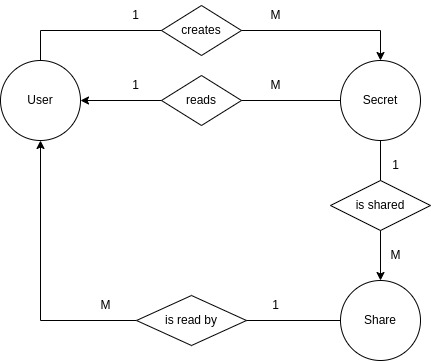

## Concept

This document will cover the process of building a secrets / password store web application, in Go. The main goals and features of the app are the following:

- exposing a key-value store for secrets (confidential data), where the keys are of type `string` and the values are of type `[]byte` (slice of bytes / byte array).
- basic IAM support, with multiple users being able to use the service independently and privately. Users login with a username+password combination
- ability to share secrets among users, optionally scoped for a certain period of time.

This document will cover the entire process of designing, building and deploying the Go backend for this app. This document was written with Go currently on version 1.19, on January 2023.

__________________

## Design 

This will be a monolith code-base with a touch of Domain-Driven Design (DDD) principles, to allow a readable structure and isolated responsibilities among the different packages. As a whole, the project's organization will focus on:

1. Separating transport, service and repositories. Each layer will have their own set of responsibilities.
2. Decoupling the implementations, so that they can be easily refactored and / or re-implemented with a different solution / technology stack.
3. Joining the different modules is deferred to the factory package. This allows a bigger focus on the package that we're working on focusing on inputs and returns.
4. No `pkg`, nor `util`, nor `helpers`, nor `models`; at least for the app's logic. This is done on the corresponding module.

### App structure

The entities in this model are simple, there are users who create secrets, and these secrets can be accessed by either the owner or other users if the secret is shared. The diagram below showcases this model:



Of course, the app will have a few other services to support authentication, authorization and encryption, for example. But these services are not the core-purpose of the app.

### Entities

Like the diagram above implies, at least two entities are necessary: User and Secret.

These entities determine the structure of the handled data.  

#### User

```go
package user

// User is a person (or entity) that uses the application to store
// secrets. They will have a unique username.
type User struct {
	ID        uint64    `json:"id"`
	Username  string    `json:"username"`
	Name      string    `json:"name"`
	Hash      string    `json:"-"`
	Salt      string    `json:"-"`
	CreatedAt time.Time `json:"created_at,omitempty"`
	UpdatedAt time.Time `json:"updated_at,omitempty"`
}
```

> A user object will store the user's ID and basic information, a hash of their (salted) password and the salt; as well as created / updated timestamps

#### Secret

```go
package secret

// Secret is a key-value pair where they Key is string type and Value
// is a slice of bytes. Secrets are encrypted then stored with a user-scoped
// private key
type Secret struct {
	ID        uint64    `json:"id"`
	Key       string    `json:"key"`
	Value     string    `json:"value"`
	CreatedAt time.Time `json:"created_at"`
}
```

> A secret object will hold its key-value data, as well as a timestamp value for when it was created

#### Shared

```go
package shared

// DefaultShareDuration sets a maximum of 30 days for shared secrets with no defined time limit
const DefaultShareDuration = time.Hour * 24 * 30

// Shared is metadata for a secret that a user (the owner) shares with a set of users
// optionally within a limited period of time
type Share struct {
	ID        uint64     `json:"id"`
	SecretKey string     `json:"secret_key"`
	Owner     string     `json:"owner"`
	Target    []string   `json:"shared_with"`
	Until     *time.Time `json:"until,omitempty"`
	CreatedAt time.Time  `json:"created_at"`
}
```

> Shared secrets will be objects containing a Secret's key, it's owner's username, and shares (slice of strings representing usernames). Optionally, a shared secret can be scoped for a period of time (a nullable value). For this application, I also define the default share duration (1 month) in case it's not defined by the caller.


### Database design

Storing this data could be easily done in a simple manner, in a relational database. This database would contain at least 3 tables, for users, secrets and shared_secrets. However, this specific implementation will use two types of databases:

1. A **SQLite database** to serve as a relational database for the users and secrets / shares metadata.
2. A **Bolt database** to serve as a key-value store, holding the sensitive information for the user's secrets, the user's private encryption key and any other type of sensitive information.

Please note below how do the entities and model above translate to an RDB table structure, for this project:

#### `users` table

col. name | type | PK | FK
:--:|:--:|:--:|:--:
`id` | INTEGER | Yes |
`username` | VARCHAR(50) | |
`name` | TEXT | |
`hash` | TEXT | |
`salt` | TEXT | |
`created_at` | TIMESTAMP | |
`updated_at` | TIMESTAMP | |

> *Users data will consist on the basic information they will supply when creating a user account (initially username, password and a name); however the database will not store the password -- but a salt generated when the account was created and the hash of the password with the salt appended to it*

#### `secrets` table

col. name | type | PK | FK
:--:|:--:|:--:|:--:
`id` | INTEGER | Yes |
`user_id` | INTEGER | | `users (id)`
`name` | VARCHAR(250) | |
`created_at` | TIMESTAMP | |

> *Secrets data will consist exclusively in secret metadata and its key (as "name"); the actual secret's value is stored in Bolt, encrypted with a key that is exclusive to the user (generated by the service when the user is created)*

#### `shared_secrets` table

col. name | type | PK | FK
:--:|:--:|:--:|:--:
`id` | INTEGER | Yes |
`owner_id` | INTEGER | | `users (id)`
`secret_id` | INTEGER | | `secrets (id)`
`shared_with` | INTEGER | | `users (id)`
`until` | TIMESTAMP | |
`created_at` | TIMESTAMP | |

> *Shared secrets table will hold the metadata about the share; such as from-to user IDs, the secret's ID and a time limit if set. If the secret is shared with multiple users, there will be multiple entries simliar to each other, with different `shared_with` values*

### Actions and operations

This application will require a CRUD implementation for both users and secrets, as well as added actions to share the secrets with one (or more) user(s).

As for the users repository, it will expose a complete set of CRUD operations (with `list`); but secrets will not contain an update operation -- its `create` operation will be designed to overwrite the secret if it already exists.

The shared repository will contain methods to share a secret with users -- optionally until a period in time, or for a certain duration. The removal of an expired shared secret is done when reading it; so if a user lists their secrets which currently include an expired shared secret, it will be removed before the read / list response is returned to the caller.

### Security

Initially, the users will login using a dedicated endpoint, using a username + password combination. The call returns a JWT if their credentials are valid, and the caller can use the JWT as an Authorization HTTP header calling users and secrets endpoints. JWT expire within one hour of being created.

Creating a user does not require authentication.

When a user is created, the service will create an encryption private key in the Bolt database that will be used to encrypt the user's secrets' values. Also, when created, a random 128-byte-long salt value is generated and appended to the user's password; and the resulting value is hashed. The SQLite database will store this salt and hash values, base64-encoded, and not the user's plaintext password.

A user can only access their own resources. A secret shared by user A with user B is perceived as a (new) secret owned by user B in a read operation; which will contain an expiry. However, the actual owner is in control of this secret -- as shared secrets are read-write only for the actual owner. Shared secrets have a different key in the format of `username:secretkey`.

While there is a reserved username (`root`) despite not having a roles / privileges model; the Bolt database will still store user secrets in buckets identified by the user's (internal) ID, and not their username. User secrets are encrypted with AES, using a 32-byte key generated and stored when the user is first created. Like passwords, secrets will not be stored in plaintext (beyond the database's own encryption).

### Product Format

The final application will be initially distributed as a web application, as a HTTP API. It could potentially have a CLI client that communicates with a configured secrets store server via HTTP (performing the same HTTP calls, but from a CLI app).

While there are no plans for an actual frontend with a UI, the simplest approach to doing so would be with a Flutter / Dart project which is simple and distributable on a number of platforms.

_______________

## Implementation

Having a general structure planned ahead is essential to organize the codebase before any code is written. Having the context on what we want from the above, it's easier to sketch out the entities and repositories for this application:

### The `user` package

This package will be a top-level folder in the project named `user`, with:

```
.
└─ user
    ├─ repository.go -- lists the actions supported by the repository
    └─ user.go -- describes the user entity
```

#### `user.go` - defining entities

Just like the snippet a few blocks above, this file is very straight-forward and will contain the user entity, which describes the basic elements of a user. Additionally it will already include the Session type, which is an authenticated user (user with a session token); since this is also within the realm of the *users*. 

While the entities expose the JSON tags which will be used later on in the HTTP responses, note how both the `Hash` and `Salt` fields are omitted.

```go
package user

import (
	"time"
)

// RootUsername is a reserved username for the admin deploying the application
const RootUsername = "root"

// User is a person (or entity) that uses the application to store
// secrets. They will have a unique username.
type User struct {
	ID        uint64    `json:"id"`
	Username  string    `json:"username"`
	Name      string    `json:"name"`
	Hash      string    `json:"-"`
	Salt      string    `json:"-"`
	CreatedAt time.Time `json:"created_at,omitempty"`
	UpdatedAt time.Time `json:"updated_at,omitempty"`
}

// Session is an authorized user, accompanied by a JWT
type Session struct {
	User  `json:"user"`
	Token string `json:"token"`
}
```

#### `repository.go` - defining the actions

The users repository will contain a set of actions which will target the `users` SQL table described in the Design chapter. This means that it does not contain methods related to login; only CRUD operations against actual users:

```go
package user

import "context"

// Repository describes the actions exposed by the users store
type Repository interface {
	// Create will create a user `u`, returning its ID and an error
	Create(ctx context.Context, u *User) (uint64, error)
	// Get returns the user identified by `username`, and an error
	Get(ctx context.Context, username string) (*User, error)
	// List returns all the users, and an error
	List(ctx context.Context) ([]*User, error)
	// Update will update the user `username` with its updated version `updated`. Returns an error
	Update(ctx context.Context, username string, updated *User) error
	// Delete removes the user identified by `username`, returning an error
	Delete(ctx context.Context, username string) error
}
```

> All repository methods accept a context as a first argument to allow retrieving more observability information, as covered further down this document.

#### Users recap

In a nutshell this is the domain abstraction of the data stored in the database. It allows for the persistence layer (the databases) to have different implementations -- while also deferring the responsibility of persisting those objects to a different module.

The domain entity and repository interface state what this object (the user) is and what we can do with it.

The exposed methods are pretty much CRUD operations (create-read-update-delete) with a list operation (which is basically a batch read).
____________

### The `secret` package

This package will be a top-level folder in the project named `secret`, with:

```
.
└─ secret
    ├─ repository.go -- lists the actions supported by the repository
    └─ secret.go -- describes the secret entity
```

#### `secret.go` - defining entities

Very similar to the user; the Secret type will contain the basic elements of a Secret. Note how a (basic) secret does not reference a user in it:

```go
package secret

import (
	"time"
)

// Secret is a key-value pair where they Key is string type and Value
// is a slice of bytes. Secrets are encrypted then stored with a user-scoped
// private key
type Secret struct {
	ID        uint64    `json:"id"`
	Key       string    `json:"key"`
	Value     string    `json:"value"`
	CreatedAt time.Time `json:"created_at"`
}
```


#### `repository.go` - defining the actions 

The `secret.Repository` will expose CRUD operations against the `secrets` SQL table, similar to `users.Repository` -- however it does not expose an Update method; as secrets' values are simply overwritten if the key already exists:

```go
package secret

import (
	"context"
)

// Repository describes the actions exposed by the secrets store
type Repository interface {
	// Create will create (or overwrite) the secret identified by `s.Key`, for user `username`,
	// returning its ID and an error
	Create(ctx context.Context, username string, s *Secret) (uint64, error)
	// Get fetches a secret identified by `key` for user `username`. Returns a secret and an error
	Get(ctx context.Context, username string, key string) (*Secret, error)
	// List returns all secrets belonging to user `username`, and an error
	List(ctx context.Context, username string) ([]*Secret, error)
	// Delete removes the secret identified by `key`, for user `username`. Returns an error
	Delete(ctx context.Context, username string, key string) error
}
```

> All repository methods accept a context as a first argument to allow retrieving more observability information, as covered further down this document.

#### Secrets recap

Very similar [to the User](#users-recap).

_______

### The `shared` package


This package will be a top-level folder in the project named `shared`, with:

```
.
└─ shared
    ├─ repository.go -- lists the actions supported by the repository
    └─ shared.go -- describes the secret entity
```

#### `shared.go` - defining entities

A Share type will represent a shared secret, holding the secret key, the username of the owner, and a list of target usernames that the secret is shared with. Optionally the object can include an `Until` value to scope the access of the secret until a certain point in time. This is a nullable field, but there is a default value whenever it is not populated (of 1 month).

A shared secret is usually returned in a list, even in a GET (read / list) operation.

```go
package shared

import (
	"time"
)

// DefaultShareDuration sets a maximum of 30 days for shared secrets with no defined time limit
const DefaultShareDuration = time.Hour * 24 * 30

// Shared is metadata for a secret that a user (the owner) shares with a set of users
// optionally within a limited period of time
type Share struct {
	ID        uint64     `json:"id"`
	SecretKey string     `json:"secret_key"`
	Owner     string     `json:"owner"`
	Target    []string   `json:"shared_with"`
	Until     *time.Time `json:"until,omitempty"`
	CreatedAt time.Time  `json:"created_at"`
}

```

#### `repository.go` - defining the actions

The `shared.Repository` is just as simple as the secrets': a set of CRUD operations without Update. The persistence layer (which implements the repository) will be solely responsible of saving the shared secrets state. Any features to this implementation (sharing for a duration of time, sharing until a point in time) will be handled by the service layer.

There are also two versions of the List operation, one for the shared secrets' owner, and one for the shared secrets' target user.

```go
package shared

import (
	"context"
)

// Repository describes the actions exposed by the shared secrets store
type Repository interface {
	// Create shares the secret identified by `secretName`, owned by `owner`, with
	// user `target`. Returns its ID and an error
	Create(ctx context.Context, s *Share) (uint64, error)
	// Get fetches the secret's share metadata for a given owner's username and secret key
	Get(ctx context.Context, owner, secretName string) ([]*Share, error)
	// List fetches all shared secrets for a given owner's username
	List(ctx context.Context, owner string) ([]*Share, error)
	// ListTarget is similar to List, but returns secrets that are shared with a target user
	ListTarget(ctx context.Context, target string) ([]*Share, error)
	// Delete removes the user `target` from the secret share
	Delete(ctx context.Context, s *Share) error
}
```


> All repository methods accept a context as a first argument to allow retrieving more observability information, as covered further down this document.

#### Shared recap

Very similar [to the User](#users-recap); but even simpler (and with two "list" operations) -- one lists the owner's shared secrets, while the other (`ListTarget`) lists the secrets that are shared with a certain target user.

___________

### The `keys` package

This package will be a top-level folder in the project named `keys` -- this will be a basic interface to the Bolt instance (as a key-value store), with:

```
.
└─ keys
    ├─ repository.go -- lists the actions supported by the repository
    └─ key.go -- contains constants used in the keys context, and 
	             domain-specific helper functions 
```


#### `key.go` - defining constants and identifiers

The key-value store is, as the name implies a database storing a value represented by a key. Bolt allows to nest these key-value pairs (a key that contains more key-value pairs) with buckets. 

A bucket can also be nested (buckets inside buckets). 

This use-case will be super simple where the service stores the user's secrets in a bucket identified by their ID (and a special prefix). This way, secrets are exclusive to a certain user, and other business-logic content can still be stored -- provided it is prefixed / named differently.

An alternative would be to have a bucket for secrets, that will store buckets for users, that will store key-value pairs for their secrets. To avoid this level of nesting, I've opted to go for the first approach.

Also -- as user secrets are encrypted with a unique key (which is generated on user creation), the key will also be stored in the user's bucket, under a unique key (`unique_identifier`).

Lastly, active JWT are stored in Bolt as well, under the user's bucket, with a unique key (`active-token`).

These constants are declared in this file, however it will be a secrets validator that will ensure that user-input secrets do not contain this key. More about validation further down this document.


```go
package keys

import "fmt"

const (
	UniqueID = "unique_identifier"
	TokenKey = "active-token"
)

// UserBucket formats the input user ID as a user bucket identifier (`uid:###`)
func UserBucket(id uint64) string {
	return fmt.Sprintf("uid:%d", id)
}
```


#### `repository.go` - defining the actions

The keys repository interface will be an *updateless CRUD* (CRD?); it also contains a `Purge()` method to destroy a bucket's contents completely.

```go
package keys

import "context"

// Repository describes the action exposed by the keys store
type Repository interface {
	// Set creates or overwrites a secret identified by `k` with value `v`, in
	// bucket `bucket`. Returns an error
	Set(ctx context.Context, bucket, k string, v []byte) error
	// Get fetches the secret identified by `k` in the bucket `bucket`,
	// returning a slice of bytes for the value and an error
	Get(ctx context.Context, bucket, k string) ([]byte, error)
	// Delete removes the secret identified by `k` in bucket `bucket`, returning an error
	Delete(ctx context.Context, bucket, k string) error
	// Purge removes all the secrets in the bucket `bucket`, returning an error
	Purge(ctx context.Context, bucket string) error
}
```

> All repository methods accept a context as a first argument to allow retrieving more observability information, as covered further down this document.

#### Keys recap

This section will be even simpler than the entities referred before, as it only handles actions against the (Bolt DB) key-value store. Since the data will always be a slice of bytes, there is no point in incrementing it much more than this; as it will be seen as a *plugin* in some packages to handle this type of (confidential content) storage.

___________

### Bolt DB implementation

The Bolt DB implementation will be placed in a top-level folder within the project, named `bolt`. This will be a very clean implementation considering how Bolt makes it simple to work with transactions -- meaning that you're able to issue a batch of operations to the database and rollback if an error is raised.

```
.
└─ bolt
    ├─ bolt.go -- exposes function(s) to initialize a Bolt DB instance
    └─ keys.go -- implements the keys.Repository interface
```

#### Initializing a Bolt DB instance

Initializing a Bolt DB instance simply takes a path to a file. This function is simply calling `bbolt.Open()`, but its signature will be common with the SQLite implementation (later in this document); which is useful for the factory functions -- it keeps a similar structure and signature:

```go
package bolt

import (
	"go.etcd.io/bbolt"
)

// Open will initialize a Bolt DB based on the `.db` file in `path`,
// returning a pointer to a bbolt.DB and an error
func Open(path string) (*bbolt.DB, error) {
	return bbolt.Open(path, 0600, nil)
}
```

#### Implementing `keys.Repository`

The keys repository will be very simple both thanks to Bolt's API and user experience -- but also because of the low complexity this feature has in the project. This repository is like a side-car to the rest of the application, as a means to isolate sensitive information in a key-value database.

Usually I start by laying down the type to represent this implementation, the methods that I need to implement and a function to initialize this type:

```go
package bolt

import (
	"context"

	"github.com/zalgonoise/x/secr/keys"
	"go.etcd.io/bbolt"
)

type keysRepository struct {
	db *bbolt.DB
}

// NewKeysRepository creates a keys.Repository from the Bolt DB `db`
func NewKeysRepository(db *bbolt.DB) keys.Repository {
	return &keysRepository{db}
}

// Get fetches the secret identified by `k` in the bucket `bucket`,
// returning a slice of bytes for the value and an error
func (ukr *keysRepository) Get(ctx context.Context, bucket, k string) ([]byte, error) {
	return nil, nil
}

// Set creates or overwrites a secret identified by `k` with value `v`, in
// bucket `bucket`. Returns an error
func (ukr *keysRepository) Set(ctx context.Context, bucket, k string, v []byte) error {
	return nil
}

// Delete removes the secret identified by `k` in bucket `bucket`, returning an error
func (ukr *keysRepository) Delete(ctx context.Context, bucket, k string) error {
	return nil
}

// Purge removes all the secrets in the bucket `bucket`, returning an error
func (ukr *keysRepository) Purge(ctx context.Context, bucket string) error {
	return nil
}
```

From here, it's much easier to isolate the task at hand and writing the logic. This is usually the format for my `unimplemented.go` files, if existing.

#### Implementing `keysRepository.Get`

Like mentioned before, the Bolt instance will contain buckets (for users, as an example) that will contain key-value pairs in them (for secrets). A `Get` call to this repository will be most likely for fetching secrets but it could also be to fetch the user's encryption key, and the user's active JWT. 

To ensure that the bucket and key are valid, this implementation will verify if the input strings are empty (otherwise it would be checked on the service level). Then, a read request is sent to the DB (with [`bbolt.View`](https://pkg.go.dev/go.etcd.io/bbolt#DB.View)), to read a key from an (assumed to be existing) bucket. The transaction will fail if the bucket does not exist.

```go
// Get fetches the secret identified by `k` in the bucket `bucket`,
// returning a slice of bytes for the value and an error
func (ukr *keysRepository) Get(ctx context.Context, bucket, k string) ([]byte, error) {
	if bucket == "" {
		return nil, ErrEmptyBucket
	}
	if k == "" {
		return nil, ErrEmptyKey
	}

	var v []byte

	err := ukr.db.View(func(tx *bbolt.Tx) error {
		b := tx.Bucket([]byte(bucket))
		if b == nil {
			return ErrEmptyBucket
		}
		v = b.Get([]byte(k))
		return nil
	})
	if err != nil {
		if errors.Is(err, ErrEmptyBucket) {
			return nil, err
		}
		return nil, fmt.Errorf("%w: %v", ErrDBError, err)
	}

	return v, nil
}
```

#### Implementing `keysRepository.Set`

Like `Get`; this call checks for empty values in the input. The `Set` call is a DB-write, thus using the [`bbolt.Update`](https://pkg.go.dev/go.etcd.io/bbolt#DB.Update) method. Since this call will be prepared to create new buckets and key-value pairs, it calls the [`tx.CreateBucketIfNotExists`](https://pkg.go.dev/go.etcd.io/bbolt#Tx.CreateBucketIfNotExists) method, accordingly.

The transaction returns an error if it fails when fetching / creating the bucket, or when storing the key-value pair.

```go
// Set creates or overwrites a secret identified by `k` with value `v`, in
// bucket `bucket`. Returns an error
func (ukr *keysRepository) Set(ctx context.Context, bucket, k string, v []byte) error {
	if bucket == "" {
		return ErrEmptyBucket
	}
	if k == "" {
		return ErrEmptyKey
	}
	if len(v) == 0 {
		return ErrEmptyValue
	}

	err := ukr.db.Update(func(tx *bbolt.Tx) error {
		b, err := tx.CreateBucketIfNotExists([]byte(bucket))
		if err != nil {
			return fmt.Errorf("failed to get / create bucket: %v", err)
		}

		err = b.Put([]byte(k), []byte(v))
		if err != nil {
			return fmt.Errorf("failed to set key-value: %v", err)
		}

		return nil
	})
	if err != nil {
		return fmt.Errorf("%w: %v", ErrDBError, err)
	}
	return nil
}
```


#### Implementing `keysRepository.Delete` and `keysRepository.Purge`

Both `Delete` and `Purge` calls are very similar, in the sense that the former removes a key-value pair while the latter removes the bucket entirely. These will be write operations, similar to the `Set` call, in which the `bbolt.Update` is called.

```go

// Delete removes the secret identified by `k` in bucket `bucket`, returning an error
func (ukr *keysRepository) Delete(ctx context.Context, bucket, k string) error {
	if bucket == "" {
		return ErrEmptyBucket
	}
	if k == "" {
		return ErrEmptyKey
	}

	err := ukr.db.Update(func(tx *bbolt.Tx) error {
		b := tx.Bucket([]byte(bucket))
		if b == nil {
			return ErrEmptyBucket
		}

		err := b.Delete([]byte(k))
		if err != nil {
			return fmt.Errorf("failed to delete key %s in the bucket %s: %v", k, bucket, err)
		}
		return nil
	})

	if err != nil {
		if errors.Is(err, ErrEmptyBucket) {
			return err
		}
		return fmt.Errorf("%w: %v", ErrDBError, err)
	}
	return nil
}
```

Even simpler, `Purge` doesn't even fetch the bucket:

```go
// Purge removes all the secrets in the bucket `bucket`, returning an error
func (ukr *keysRepository) Purge(ctx context.Context, bucket string) error {
	if bucket == "" {
		return ErrEmptyBucket
	}

	err := ukr.db.Update(func(tx *bbolt.Tx) error {
		err := tx.DeleteBucket([]byte(bucket))
		if err != nil {
			return fmt.Errorf("failed to delete the bucket %s: %v", bucket, err)
		}
		return nil
	})

	if err != nil {
		return fmt.Errorf("%w: %v", ErrDBError, err)
	}
	return nil
}
```

#### Defining errors and updating `import`s

Since the methods refer some error types that seem to be part of this package, they need to be defined; these are super simple errors to identify the issue better with, for example, `errors.Is()`.

```go
import (
	"context"
	"errors"
	"fmt"

	"github.com/zalgonoise/x/secr/keys"
	"go.etcd.io/bbolt"
)

var (
	ErrDBError     = errors.New("database error")
	ErrNotFoundKey = errors.New("couldn't find the key")
	ErrEmptyKey    = errors.New("key cannot be empty")
	ErrEmptyValue  = errors.New("username cannot be empty")
	ErrEmptyBucket = errors.New("empty bucket")
	ErrForbidden   = errors.New("unable to modify this resource")
)
```


___________

### SQLite implementation


___________

### Service preparation

#### Cryptography

#### Authorization


___________

### Service implementation


___________

### HTTP API implementation 

#### Handling endpoints that require auth
___________

### Setting up factories


___________

### The `cmd` package

#### App configuration

#### CLI flags

#### OS environment variables


___________

### Observability and middleware


___________

### Wrapping up


___________

### Final thoughts